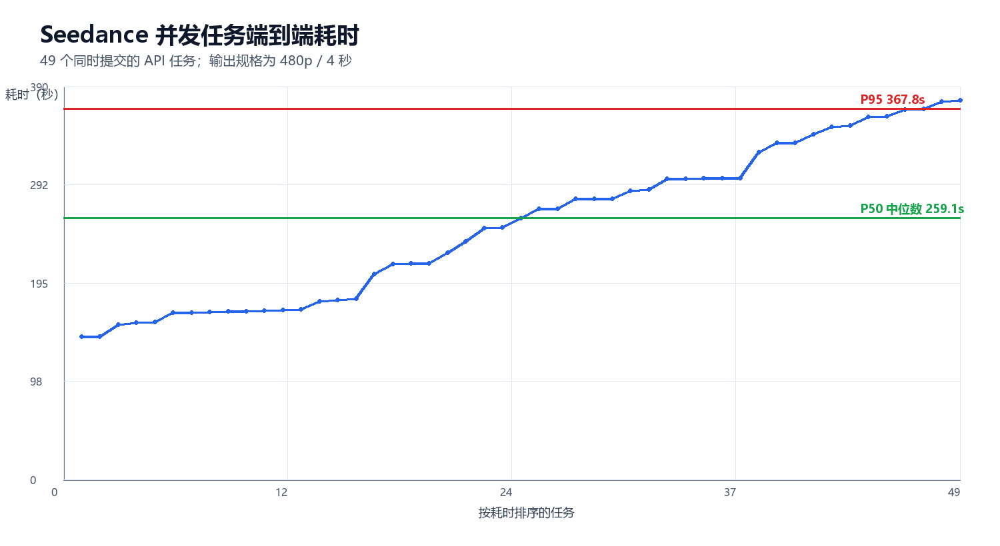
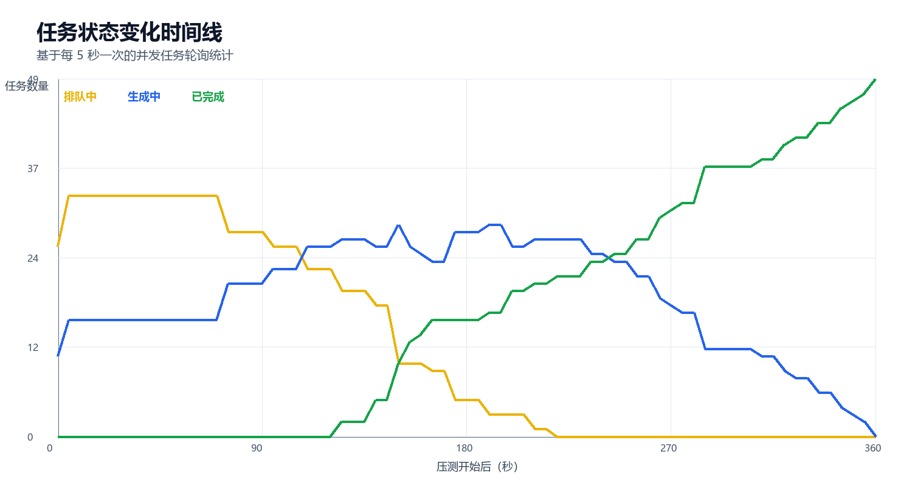
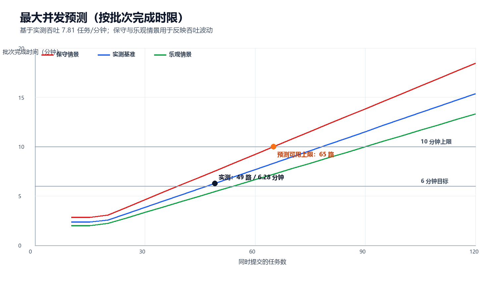
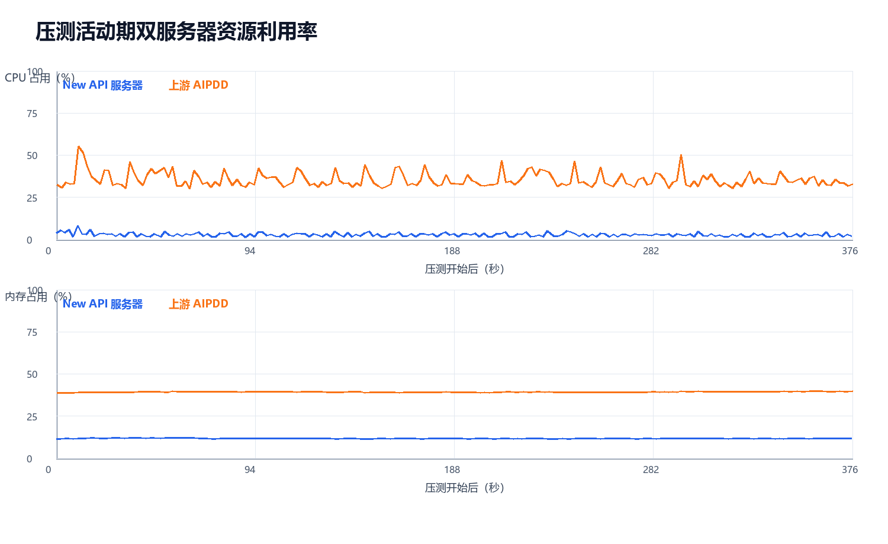
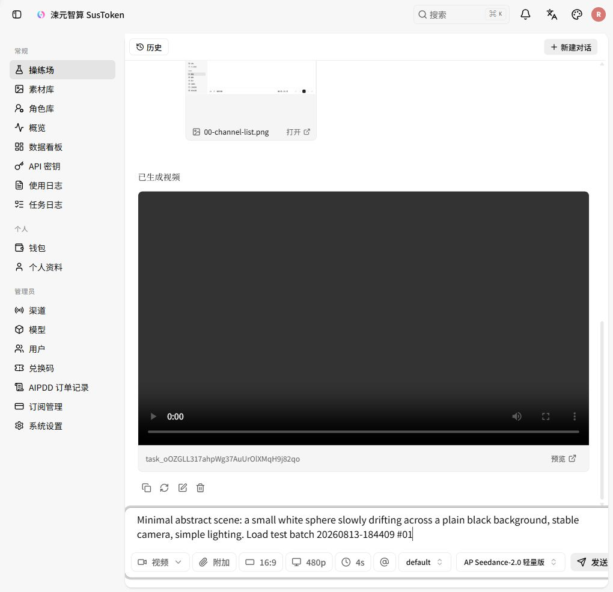
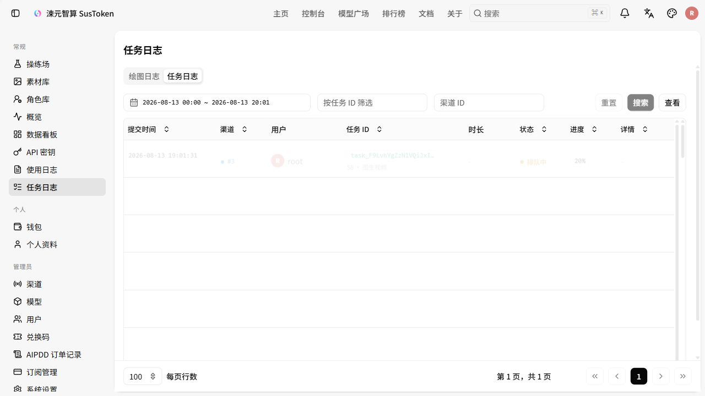
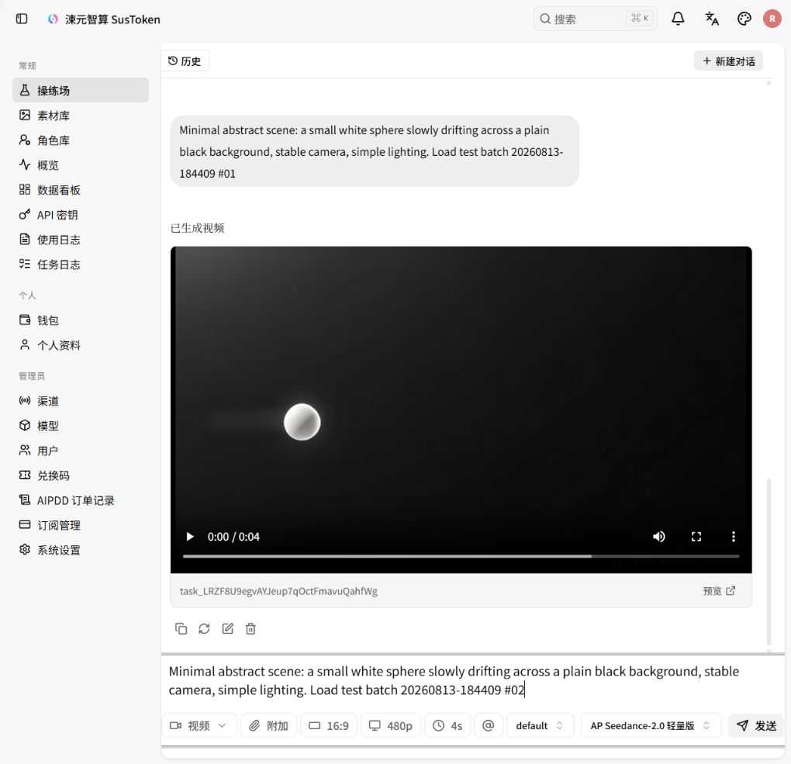

# Seedance 端到端压力测试报告

测试批次：`20260813-184409`
测试时间：2026-08-13 18:54–19:07（Asia/Shanghai）
目标站点：`https://susciyuan.com`
New API：`14.103.100.4`
上游 AIPDD：`8.219.81.18`

## 结论摘要

- 本批次共创建 50 个真实扣费任务，数据库任务 ID 为 193–242；最终 `SUCCESS 50 / FAILURE 0`，成功率 100%。
- 由于浏览器操练场会在单个会话中串行等待视频完成，实际压力波由 1 个浏览器探针任务和随后同时释放的 49 个 `/v1/videos` 请求组成。性能分位数以 49 个同时请求为样本。
- 49 个并发请求全部受理，提交任务/接口受理耗时 P50 8.30 秒、P95 10.67 秒、P99 12.04 秒，最大 12.13 秒；这只是返回任务 ID 的时间，不是视频生成时间。
- 端到端完成耗时 P50 259.12 秒、P95 367.76 秒、P99 375.99 秒；整个并发波在 376.58 秒内完成，等效吞吐 7.81 个任务/分钟。
- 队列等待 P50 约 116.82 秒；实际生成阶段 P50 约 138.55 秒。4 秒视频的生成耗时 P50 是视频时长的 34.64 倍。
- New API 主机资源充足：活动期 CPU 平均 2.84%、峰值 8.23%；内存平均 11.71%、峰值 12.18%；无 Swap。
- 上游 AIPDD 主机承担了更明显的计算/调度压力：CPU 平均 35.44%、峰值 55.19%；内存平均 39.32%、峰值 39.81%；无 Swap。该主机并不是实际 GPU 工作节点，因此这里反映的是上游网关、数据库和调度层资源。
- 余额从 ¥1,359.35 下降到 ¥1,295.35，实际扣费 ¥64.00，平均 ¥1.28/任务；请求计数从 35 增至 85，正好增加 50。



## 测试配置

| 项目 | 配置 |
|---|---|
| 模型 | AP Seedance-2.0 轻量版 |
| 分组 | default |
| 分辨率 | 480p |
| 画幅 | 16:9 |
| 视频时长 | 4 秒（页面允许的最短时长） |
| 标价 | ¥0.32 起/秒 |
| 输入 | 纯文本极简场景，不上传参考素材 |
| 并发释放 | 49 个请求通过同一公网 `/v1/videos` 路径同时释放 |
| 浏览器探针 | 1 个，通过内置浏览器操练场创建 |
| 任务轮询 | 5 秒一次 |
| 服务器采样 | 两台服务器每 2 秒一次 |

## 任务结果与生成速度

这里把四段时间明确区分开：

```text
发送请求 → 提交任务/接口受理 → 排队等待 → 视频生成 → 任务完成
              约 7–12 秒       平均约 101 秒   平均约 142 秒
```

- **提交任务耗时**：从客户端发出 `/v1/videos` 请求，到 New API 返回任务 ID、确认“已受理”为止。这个阶段只代表任务进入系统，**不代表视频已经生成**。本次平均 8.75 秒，P50 8.30 秒，P95 10.67 秒。
- **排队等待耗时**：任务已提交，但还没有进入实际视频生成阶段，等待上游调度/Worker 的时间。本次为近似值，平均 101.24 秒，P50 116.82 秒，P95 208.38 秒。
- **视频生成耗时**：任务真正开始生成后，到返回 `SUCCESS` 的时间，不包括前面的提交和排队。本次为近似值，平均 142.47 秒，P50 138.55 秒，P95 170.19 秒。
- **端到端完成耗时**：从最初发出请求，到视频最终完成的总时间，包含提交、排队、生成以及轮询边界。本次平均 252.46 秒，P50 259.12 秒，P95 367.76 秒。

因此，“约 8 秒一个视频”只描述**整个并发批次的输出吞吐**：49 路并发波的整体吞吐为 7.81 个/分钟，平均每隔约 7.68 秒完成一条。它不表示单个视频 8 秒生成；单个任务从请求发出到完成，通常需要几分钟。

| 指标 | 最小 | P50 | P95 | P99 | 平均 | 最大 |
|---|---:|---:|---:|---:|---:|---:|
| 提交任务/接口受理耗时 | 7.21s | 8.30s | 10.67s | 12.04s | 8.75s | 12.13s |
| 排队等待（近似） | 5.65s | 116.82s | 208.38s | 222.63s | 101.24s | 228.30s |
| 视频生成阶段（近似） | 100.15s | 138.55s | 170.19s | 197.91s | 142.47s | 209.59s |
| 端到端完成 | 141.77s | 259.12s | 367.76s | 375.99s | 252.46s | 376.58s |
| 生成耗时 ÷ 视频时长 | 25.04× | 34.64× | 42.55× | 49.48× | 35.62× | 52.40× |

并发波中最多观测到 33 个任务排队、29 个任务同时处于生成中。排队在约 220 秒后基本清空，随后上游持续释放完成结果。



## 最大并发预测

“最大并发”必须和可接受的完成时限一起定义。这里采用饱和吞吐排队模型：`批次完成时间 = max(生成时间下限, 并发任务数 ÷ 完成吞吐)`，以本次 49 路并发波的实测吞吐 7.81 个任务/分钟为基准，并使用 6.5 个任务/分钟作为保守情景、9.0 个任务/分钟作为乐观情景。

| 容量层级 | 预测值 | 含义 |
|---|---:|---|
| 上游稳态服务槽位（估算） | 18–22 路 | 由实测吞吐乘以生成阶段平均/P95 耗时推算；表示近似同时服务能力，不包含排队任务 |
| 推荐生产峰值 | 45 路 | 接近本次已验证的 49 路，按实测基准预计约 5.76 分钟清空，保留一定波动余量 |
| 预测可用上限 | **65 路** | 即使吞吐下降到保守的 6.5 个任务/分钟，预计仍可在 10 分钟内清空单批任务 |
| 实测基准理论上限 | 78 路 | 以 7.81 个任务/分钟线性外推的 10 分钟容量，不建议未经阶梯验证直接作为生产配置 |
| 高风险边界 | 100 路及以上 | 预计清空约 12.81 分钟；保守情景约 15.38 分钟，排队和超时风险明显增大 |

不同批次完成时限下的预测容量：

| 批次完成时限 | 保守 6.5/分钟 | 实测基准 7.81/分钟 | 乐观 9.0/分钟 |
|---|---:|---:|---:|
| 5 分钟 | 32 | 39 | 45 |
| 6 分钟 | 39 | 47 | 54 |
| 10 分钟 | **65** | 78 | 90 |

因此，本报告把 **45 路**作为当前推荐峰值，把 **65 路**作为有明确 10 分钟完成约束的预测可用上限。65 并不是接口的绝对拒绝点；超过它仍可能被受理，但队列持续时间会增长。该预测主要受上游生成吞吐约束，而不是 New API 服务器的 CPU 或内存约束。



## 服务器资源结果

### New API 服务器（14.103.100.4）

主机为 2 vCPU、约 8.2 GB 内存。压力前 60 秒 CPU 平均 2.37%，活动期 CPU 平均 2.84%、P95 4.65%、峰值 8.23%。内存从压力前平均 11.70% 变化到活动期平均 11.71%，峰值 12.18%，没有内存压力或 Swap。

活动期资源变化：

| 指标 | 结果 |
|---|---:|
| 1 分钟 Load 峰值 | 0.15 |
| 网络接收 | 13.98 MB |
| 网络发送 | 17.69 MB |
| 磁盘读取 | 0.16 MB |
| 磁盘写入 | 26.25 MB |
| Swap 峰值 | 0 B |

容器峰值：

| 容器 | CPU 峰值 | 内存峰值 | PID 峰值 |
|---|---:|---:|---:|
| new-api | 3.01% | 49.63 MB | 6 |
| new-api-postgres | 5.47% | 59.38 MB | 19 |
| new-api-redis | 0.31% | 13.61 MB | 7 |

### 上游 AIPDD 服务器（8.219.81.18）

主机为 4 vCPU、约 7.6 GB 内存。压力前 60 秒 CPU 平均 33.39%，活动期 CPU 平均 35.44%、P95 43.38%、峰值 55.19%。内存从压力前平均 38.74% 增至活动期平均 39.32%，峰值 39.81%，无 Swap。

活动期资源变化：

| 指标 | 结果 |
|---|---:|
| 1 分钟 Load 峰值 | 1.65 |
| 网络接收 | 55.53 MB |
| 网络发送 | 51.52 MB |
| 磁盘读取 | 1.88 MB |
| 磁盘写入 | 222.91 MB |
| Swap 峰值 | 0 B |

容器峰值：

| 容器 | CPU 峰值 | 内存峰值 | PID 峰值 |
|---|---:|---:|---:|
| new-api | 2.35% | 26.61 MB | 7 |
| new-api-postgres | 13.23% | 43.17 MB | 13 |
| new-api-redis | 2.25% | 14.51 MB | 9 |



## 成本与账务证据

| 项目 | 测试前 | 测试后 | 变化 |
|---|---:|---:|---:|
| 当前余额 | ¥1,359.35 | ¥1,295.35 | -¥64.00 |
| 历史使用 | ¥109.85 | ¥173.85 | +¥64.00 |
| 请求计数 | 35 | 85 | +50 |

数据库中本批次 50 行任务的原始配额合计为 4,383,550；数据库最终状态全部为 `SUCCESS`。实际扣费与最低标价 `¥0.32 × 4 秒 × 50 = ¥64.00` 完全一致。

## 证据链

本目录保留了以下可复核数据：

- `submission-results.jsonl`：49 个同时请求的提交时间、HTTP 状态、任务 ID 与响应。
- `polling-events.jsonl`：909 条任务状态轮询事件。
- `task-performance.csv`：逐任务提交、排队、生成和端到端耗时。
- `database-task-evidence.csv`：New API 数据库中的 50 条任务终态记录。
- `database-account-after.csv`：任务数、账户配额与请求计数的数据库证据。
- `server-metrics-newapi.jsonl`：New API 服务器 495 个资源样本。
- `server-metrics-upstream-aipdd.jsonl`：上游 AIPDD 服务器 495 个资源样本。
- `analysis-summary.json`、`server-analysis.json`：机器可读汇总结果。
- `capacity-forecast.json`、`capacity-forecast.csv`：容量预测模型、假设与不同时限下的并发预测值。
- `REPORT.html`、`REPORT.pdf`：可交互查看的 HTML 报告和便于归档/打印的 PDF 报告。
- `screenshots/`：模型价格、最低成本配置、测试前余额、执行中任务日志和浏览器探针成功截图。
- `charts/`：中文任务耗时、状态时间线、双服务器资源曲线和最大并发预测图。

关键截图：







## 判断与建议

1. 当前 49 路同时请求没有压满 New API 网关，网关 CPU、内存、容器 PID 与 Load 均有较大余量。
2. 性能瓶颈主要位于上游排队与视频生成；提交端虽然 100% 受理，但高并发下任务确认本身需要约 7–12 秒。
3. 当前单批结果证明 50 个总任务可稳定完成，但不能单独证明长时间生产负载下无资源泄漏。建议下一阶段增加 30–60 分钟持续压测。
4. 若要定位真正的生成算力上限，需要补充 AIPDD 后端 GPU 工作节点的显存、GPU 利用率、队列长度和单 Worker 并发指标；本次提供的两台服务器只暴露到网关/调度层。
5. 建议下一阶段先用 65 路真实任务验证预测上限，再按 80、100 路阶梯推进；每级设置错误率、P95、队列长度、10 分钟完成时限和余额预算等停止阈值，以确认容量拐点。

## 测试限制

- 浏览器操练场对单会话视频生成做串行等待，因此本次是 1 个浏览器探针 + 49 个同时 API 请求，而不是 50 个浏览器标签页同时点击。
- 排队和生成阶段边界根据 5 秒轮询近似，单任务误差约为一个轮询周期。
- AIPDD 的实际 GPU 工作节点不在所提供服务器范围内，因此没有 GPU/显存指标。
- 最大并发预测来自单次 49 路并发样本的排队模型外推，不等同于供应商承诺；上游限流、Worker 数量或调度策略变化都会改变结果。
