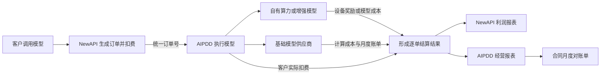
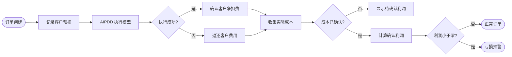
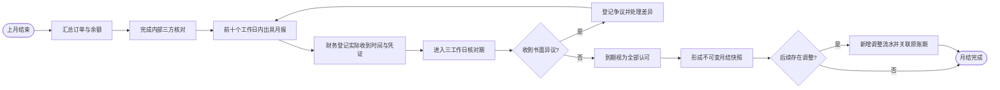

## AIPDD × NewAPI 成本、利润与合同对账业务说明书

> **已废止（2026-08-11）**：本文描述的复杂对账方案不再作为模型中转订单的实施依据。现行口径与实现以 [AIPDD × NewAPI 中转订单与 AIPDD 利润报表最终地图](./aipdd-newapi-transit-order-profit-report-final-map.zh_CN.md) 为准。充值、提现、存储等非模型财务业务不受此替换说明影响。
>
> 文档版本：V1.0  
> 编制日期：2026-08-08  
> 适用读者：管理层、财务、运营、产品、项目负责人  
> 文档性质：业务方案，不作为数据库或接口技术规格

### 一、方案结论

本项目需要建设的不是一张普通的“用量统计表”，而是一套能够回答以下问题的业务账务体系：

1. 某一笔 NewAPI 订单向客户收了多少钱？
2. 这笔订单在 AIPDD 实际消耗了多少 AWcoin？
3. AIPDD 为这笔订单实际支出了多少人民币？
4. 基础模型、AIPDD 模型或增强模型分别花了多少钱？
5. 订单退款后，上游已经发生的成本是否还在？
6. 这笔订单最终是盈利、亏损，还是仍待账单确认？
7. 一个月的订单、钱包流水、上游账单和合同对账单能否相互核对？

总体方案由三部分组成：

- **AIPDD 实际成本利润账**：记录 AIPDD 每笔业务订单的客户扣费、实际支出和利润。
- **NewAPI 利润镜像账**：只记录经由 AIPDD 提供的模型产品，并把 AIPDD 实际成本同步回 NewAPI。
- **合同月度对账**：按照合同规定出具月报、记录送达、管理异议期并形成不可修改的月结版本。

普通运行日志只能用于排查调用问题，不能作为财务账的唯一依据。财务数据需要独立保存，即使普通日志或原始用量记录被清理，历史账务仍应可以查询和复算。

### 二、业务目标

#### 2.1 管理层需要得到的结果

- 按天、周、月查看客户净消耗、实际成本和利润。
- 快速发现亏损订单、成本异常和长时间未确认的订单。
- 区分“预计利润”和“已确认利润”，避免把估算金额当成真实利润。
- 查看某个月已经关账时的正式数据，同时保留迟到账单后的最新重算结果。

#### 2.2 财务需要完成的工作

- 通过订单号、用户、API Key、NewAPI 令牌或模型查到一笔账。
- 核对 NewAPI 客户扣费与 NewAPI 扣费、退款流水。
- 核对 AIPDD 客户扣费与 AIPDD 钱包流水。
- 核对基础模型成本与火山等供应商账单。
- 导出完整 XLSX 对账文件，而不是只导出当前页面数据。
- 每月按合同客户出具模型消耗与预付余额对账单。

#### 2.3 运营需要处理的异常

- 订单已完成但成本尚未取得。
- 客户已经退款，但供应商仍然产生了成本。
- 上游账单金额与订单计算金额不同。
- AIPDD 或 NewAPI 短暂故障导致结算信息未及时同步。
- 合同客户在三工作日内提出书面异议。

### 三、适用范围

#### 3.1 包含范围

- NewAPI 中所有由 AIPDD 提供的模型产品。
- AIPDD 的同步模型和异步模型订单。
- 自有算力模型、超分模型及其他组合模型。
- 客户扣费、补扣、退款及可归属到订单的调整。
- 基础模型费用、AIPDD 模型费用、设备奖励和供应商成本。
- AIPDD 合同客户的预付余额和月度对账。
- 上线前 180 天内可取得证据的历史订单回填。

#### 3.2 不包含范围

- NewAPI 中非 AIPDD 渠道产生的订单。
- 充值、提现等与具体模型订单无关的流水，不计入订单利润；但充值会进入合同预付余额对账。
- 原始 API Key 明文展示或导出。
- CSV 导出。本方案统一使用 XLSX。
- 专门的移动端页面设计。本期以电脑端管理后台为准。

### 四、各方职责与数据依据

| 参与方或系统 | 主要职责 | 作为哪一类事实依据 |
| --- | --- | --- |
| NewAPI | 面向本地客户生成订单、扣费、补扣和退款 | 客户订单与本地净收入 |
| AIPDD | 实际执行模型、扣除 AWcoin、支付设备奖励、汇总成本 | 实际执行与实际支出 |
| 火山等供应商 | 提供基础模型能力并形成月度账单 | 外部供应商最终成本 |
| AIPDD 财务 | 核对差异、处理异常、出具合同月报 | 人工确认与月结凭证 |
| 合同客户 | 接收月报并在约定期限内核对或提出书面异议 | 客户侧确认状态 |

同一个金额可能经历“估算、计算、账单确认”三个阶段，页面必须明确显示当前阶段。

### 五、整体业务流程

这条流程的关键是：NewAPI 和 AIPDD 必须使用同一个统一订单号，并同时保留各自的用户、API Key、令牌和上游任务编号。这样才能从任何一侧查到同一笔业务。

### 六、单笔订单的结算流程

#### 6.1 失败与退款原则

订单失败后，客户净扣费可以变为零，但上游已经发生的费用不能被删除。例如基础模型已经生成内容、增强环节随后失败时，客户可能得到退款，但基础模型费用依然存在，因此该订单允许出现负利润。

#### 6.2 同步模型的分摊原则

AIPDD 当前可能把多次同步调用合并为一批进行扣费和设备奖励。为了实现逐单利润查询，系统保留批量结算方式，再按照固定、可复算的规则把以下金额分摊回每笔调用：

- 客户实际扣费 AWcoin；
- 设备实际奖励 AWcoin；
- 对应人民币金额；
- 因整数取整产生的尾差。

分摊后必须满足：**所有逐单金额之和严格等于批次总账金额**。

#### 6.3 基础模型账单原则

火山推理 API Key 不能直接提供逐笔人民币账单。因此基础模型成本采用两步确认：

1. 订单完成时，根据实际用量和订单发生时冻结的合同价格，生成“已计算成本”。
2. 月度供应商账单取得后，按客户、模型、实例和日期核对准确总额，并把差异以可审计的调整记录分配到订单。

系统不能把按合同价格计算出的订单成本伪装成“供应商逐笔返回的精确账单”。页面需要明确区分“已计算”和“账单已确认”。

### 七、金额口径

| 字段 | 业务含义 |
| --- | --- |
| 客户实际扣费 AWcoin | AIPDD 用户钱包最终净消耗的 AWcoin |
| 客户实际扣费人民币 | 客户实际扣费 AWcoin 按订单冻结汇率换算的人民币 |
| 实际支出 AWcoin | 自有算力模型实际支付给设备方的奖励；外部模型可以为空 |
| 基础模型费用 | 火山等基础模型产生的人民币成本 |
| AIPDD 模型费用 | AIPDD 自有模型、增强模型或超分环节产生的成本 |
| 实际支出人民币 | 基础模型费用、AIPDD 模型费用及其他可归属成本的合计 |
| 订单利润 | 客户实际扣费人民币减去实际支出人民币 |
| 预计利润 | 成本尚未取得最终账单时，根据冻结规则计算的利润 |
| 确认利润 | 上游成本完成确认并通过对账后的利润 |

确认利润汇总不能包含成本仍为待确认、不可验证或存在争议的订单。

### 八、报表设计

#### 8.1 NewAPI 利润报表

数据范围仅限 AIPDD 模型产品。

顶部汇总卡片：

- 客户净消耗人民币；
- 确认成本；
- 确认利润；
- 最新预计利润；
- 亏损订单数量；
- 待确认订单数量。

筛选条件：

- 日期区间；
- NewAPI 本地用户 ID或用户名；
- 令牌 ID、令牌名称或脱敏标识；
- 模型；
- 统一订单号；
- 结算和对账状态。

订单明细：

- 订单时间、用户、令牌、模型；
- 客户扣费额度和人民币；
- AIPDD 模型费用；
- 基础模型费用；
- 实际支出 AWcoin 和人民币；
- 订单利润；
- 成本确认状态；
- 异常和调整标识。

点击订单后，通过详情抽屉查看完整扣费、退款、成本、分摊、账单确认和修订过程。

#### 8.2 AIPDD 实际成本利润报表

在现有财务报表基础上增加：

- AIPDD 用户、API Key、NewAPI 实例、模型和统一订单号筛选；
- 客户扣费、设备奖励、基础模型费用、增强费用和实际利润；
- 负利润订单、待上游账单确认、成本差异等重点视图；
- 同步推理批次与逐单分摊关系；
- 上游账单证据和人工调整记录。

#### 8.3 XLSX 导出

导出由后台根据完整筛选条件生成，不受页面当前分页限制。建议包含以下工作表：

1. 汇总；
2. 订单明细；
3. 成本组成；
4. 扣费与退款流水；
5. 账单差异与调整；
6. 对账异常。

### 九、合同预付与月度对账

#### 9.1 预付规则

- 采用预充值结算模式。
- 甲方预先向 AIPDD 支付模型调用额度。
- 模型调用时实时扣减预付余额。
- AIPDD 实时监控余额，余额不足时第一时间发送预警。
- 单次预充值最低金额为人民币 5000 元。

充值本身不计入模型订单利润，但必须进入预付余额台账和合同月报。

#### 9.2 月报范围

每个 AIPDD 合同客户每月出具一份总对账单，向下拆分到：

- AIPDD API Key；
- NewAPI 实例；
- NewAPI 本地用户和令牌；
- 模型类别；
- 具体订单。

月报至少列明：

- 各类模型原始消耗金额；
- 合同约定折扣；
- 当月实际扣减金额；
- 期初余额；
- 当月充值和调整；
- 期末预付余额。

#### 9.3 月结与异议流程

工作日按照中国法定工作日历计算，包括节假日和调休上班日；时间统一使用 Asia/Shanghai。

财务发送月报后，需要登记：

- 报表编号和版本；
- XLSX 文件校验值；
- 出具时间；
- 实际收到时间；
- 接收人和发送渠道；
- 送达凭证；
- 异议内容及书面附件。

三工作日从“实际收到时间”开始计算。期限内没有书面异议时，系统自动标记为视为认可。

### 十、月结后的数据处理

系统同时保留两种视图：

- **正式月结视图**：展示当时已经确认的不可变数据，用于合同和历史审计。
- **最新重算视图**：纳入迟到的上游账单、退款和人工调整，反映当前最新经营结果。

已经确认的月结文件不得被直接覆盖。后续差异必须生成新的调整流水或新版本，并关联原始订单和原账期。

### 十一、异常与风险控制

#### 11.1 自动恢复

如果 AIPDD 或 NewAPI 短暂不可用，系统需要持续重试结算同步。每次结算都有唯一编号和版本，同一条记录重复到达时不能重复计费或重复记账。

#### 11.2 敏感信息保护

- 报表不展示原始 API Key。
- 只展示 API Key 内部编号、名称和脱敏前缀。
- 火山账单 AK/SK 与推理 API Key 分开保存，并限制为最小账单查询权限。
- 实际成本不得混入普通模型调用响应返回给最终用户。

#### 11.3 历史数据可信度

上线前 180 天内的数据可以回填，但必须标记来源：

- **精确**：存在完整钱包或账单证据；
- **规则推导**：根据当时价格、用量和汇率复算；
- **不可验证**：关键证据缺失，不进入确认利润。

### 十二、验收标准

#### 12.1 单笔订单验收

任选一笔成功、失败、退款和补扣订单，都能够从统一订单号追溯到：

1. NewAPI 客户订单；
2. NewAPI 扣费和退款流水；
3. AIPDD 实际执行记录；
4. AIPDD 钱包扣费；
5. 设备奖励或外部模型成本；
6. 最终利润和计算依据。

#### 12.2 汇总验收

- NewAPI 订单净扣费合计等于 NewAPI 扣费减退款流水。
- AIPDD 客户扣费合计等于 AIPDD 钱包净消耗。
- 同步模型逐单分摊合计等于对应批次总账。
- 基础模型月度成本合计等于供应商确认账单及调整。
- 已确认订单利润之和等于报表确认利润。
- XLSX 汇总与相同筛选条件下的页面汇总一致。

#### 12.3 合同验收

- 能在每月前 10 个中国法定工作日内生成上月完整月报。
- 能登记实际收到时间和送达凭证。
- 能准确计算三工作日异议期限。
- 无书面异议时自动视为认可。
- 已确认月结不可覆盖，后续只能通过调整或新版本处理。

### 十三、建议上线顺序

#### 第一阶段：先保证每笔订单可关联

- 为 NewAPI 与 AIPDD 建立统一订单号、实例号和执行尝试号。
- 建立独立财务订单和资金变动记录。
- 建立结算失败自动重试和漏账检查。

#### 第二阶段：补齐 AIPDD 实际成本

- 建立同步模型逐单分摊。
- 补齐自有模型设备奖励成本。
- 补齐超分基础模型费和 AIPDD 模型费。
- 接入火山合同价格计算和月度账单核对。

#### 第三阶段：上线两侧报表

- 上线 AIPDD 实际成本利润报表。
- 上线 NewAPI 的 AIPDD 利润报表。
- 上线详情抽屉、亏损预警和完整 XLSX 导出。

#### 第四阶段：上线合同月结

- 建立合同客户和模型折扣规则。
- 建立预付余额与不足预警。
- 建立月报、送达、异议、认可和月结快照流程。

#### 第五阶段：历史回填与正式切换

- 回填最近 180 天数据。
- 对比旧用量数据、钱包流水和新财务台账。
- 完成至少一个完整月度对账周期后再作为正式利润依据。

### 十四、实施前需要提供的业务资料

1. 每个合同客户的模型价格和折扣附件。
2. 一份真实火山账单样本。
3. 合同客户与 AIPDD 用户、API Key 的对应关系。
4. 余额不足预警的接收人和通知渠道。
5. 月报接收人、认可的送达渠道及凭证要求。
6. 预计每月最大订单数量，用于确定报表导出和归档策略。

### 十五、最终业务原则

- 先记录事实，再计算利润。
- 客户退款不等于上游成本消失。
- 估算成本不能冒充确认成本。
- 每一个调整都必须留下原因、证据和版本。
- 已确认月结不得覆盖。
- 页面汇总、订单明细、资金流水、上游账单和合同月报必须能够相互复算。
