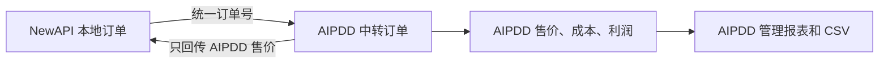
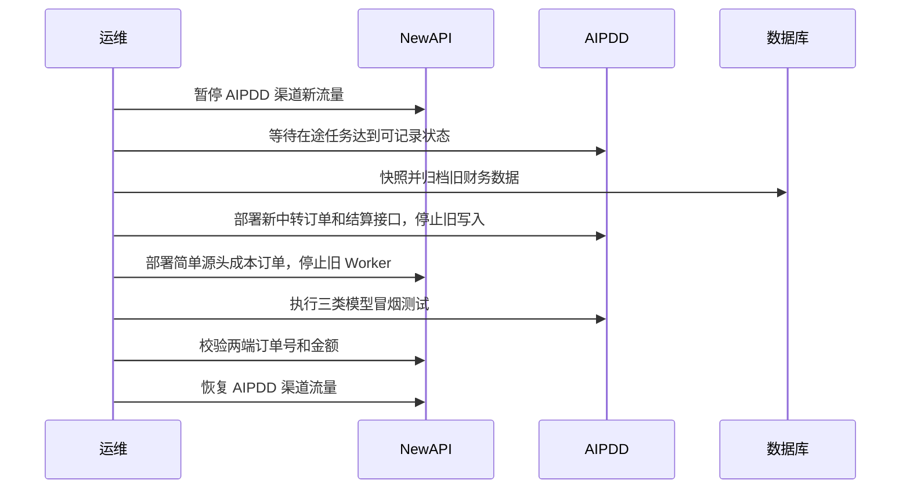

# AIPDD × NewAPI 中转订单与利润报表执行方案

> 状态：第一版代码实施完成（生产切换待执行）  
> 制定日期：2026-08-11  
> 需求基线：[AIPDD × NewAPI 中转订单与 AIPDD 利润报表最终地图](./aipdd-newapi-transit-order-profit-report-final-map.zh_CN.md)  
> 说明：本文记录从复杂财务实现迁移到第一版简单中转订单的执行过程。代码工作包已完成；生产备份、部署和真实流量核验仍按维护窗口执行。

## 1. 执行结果

实施完成后应只存在两份职责清晰的订单记录：

1. **AIPDD 中转订单**：AIPDD 售价、AIPDD 成本、AIPDD 利润的唯一事实来源。
2. **NewAPI AIPDD 源头成本订单**：保存 NewAPI 本地客户归属及 AIPDD 最终售价；不保存 AIPDD 内部成本和利润。

跨系统只传递统一订单号和 AIPDD 最终售价。异步任务从任务终态响应取售价；Chat 在请求结束后通过一次极简的按订单结算查询取得售价。



## 2. 当前状态与改造方向

| 当前实现 | 当前问题 | 执行方向 |
|---|---|---|
| AIPDD `finance_business_event` 旧业务事件账 | 混合充值、提现、存储、模型等业务 | 完整归档后移除 |
| AIPDD `finance_order_ledger`、attempt、movement、outbox | 逐单账仍包含尝试、事件、修订、投影 | 新建简单中转订单表，切换后移除 |
| AIPDD 合同计费与月结表 | 与第一版中转订单目标无关，并侵入运行时计费 | 核对活跃数据后归档并移除 |
| AIPDD 旧账与逐单账双写、再投影 | 同一任务可能重复统计 | 切换时一次性停止所有旧写入 |
| NewAPI `aipdd_finance_order` 及 movement/inbox/outbox/cursor/export | 镜像和同步体系过重 | 替换为一张简单源头成本订单表 |
| NewAPI finance worker | 事件游标、毒消息、多 Key 跳过 | 删除；Chat 只做按订单直接查询 |
| AIPDD/NewAPI XLSX 导出 | 与最终 CSV 口径冲突 | 改为同步流式 CSV |
| NewAPI 多 Key AIPDD 渠道 | 当前直接跳过财务记录 | 按请求实际选中的 Key 建账 |
| Chat 流结束后才异步批量扣费 | 最长可能等待调度周期，不能立即取得售价 | 增加按统一订单定向结算能力，由极简查询触发/读取 |
| 上游号池流式回落当前 Token 为 0 | 无法正确计算售价和号池成本 | 补齐流式 usage 采集及可靠兜底计量 |

## 3. 实施原则

1. **先加新链路，后切流，最后删旧代码和表**，但不做长期双写。
2. **切换窗口内只有一套写入生效**；旧表在清理前只读保留，不再参与报表。
3. **统一订单号全局唯一且幂等**；AIPDD 内部重试不产生财务子账。
4. **金额在业务终态冻结**；后续调价不得改写历史记录。
5. **缺成本即拒绝执行**；不能产生虚假零成本利润。
6. **完整 API Key 只用于请求内哈希定位**；不得进入 URL、日志、数据库、响应或 CSV。
7. **NewAPI 数据库继续同时支持 SQLite、MySQL、PostgreSQL**。
8. **清理只通过新的向前迁移完成**；不修改已执行的历史迁移。
9. **现有工作树改动必须原样保留**；实施前先确认 AIPDD Java 财务 Mapper/Test 本地改动和 NewAPI 无关前端改动的归属。

## 4. 目标数据模型

### 4.1 AIPDD：单一中转订单

建议新建独立表，避免在现有 `finance_order_ledger` 上继续兼容历史复杂字段。表名可在实现时遵循 AIPDD 现有命名规范，字段能力必须满足：

| 字段 | 类型建议 | 约束/说明 |
|---|---|---|
| `id` | UUID | 主键 |
| `platform_order_id` | VARCHAR(191) | 全局唯一、不可变、幂等键 |
| `instance_id` | UUID | 绑定发起请求的 NewAPI 实例 |
| `aipdd_request_id` | VARCHAR | AIPDD 任务 ID 或 inference usage ID，可空到任务建立后补齐 |
| `user_id` | UUID | AIPDD API Key 所属用户 |
| `api_key_id` | BIGINT | 实际使用的 API Key ID |
| `model` | VARCHAR | 实际模型 |
| `order_status` | VARCHAR | `PROCESSING`、`COST_PENDING`、`SETTLED`、`FAILED`、`REFUNDED` |
| `charge_awcoin` | BIGINT | 最终净售价积分，可空 |
| `charge_rmb` | NUMERIC(18,6) | 最终净售价人民币，可空 |
| `cost_awcoin` | BIGINT | 最终成本积分，可空 |
| `cost_rmb` | NUMERIC(18,6) | 最终成本人民币，可空 |
| `profit_awcoin` | BIGINT | `charge_awcoin - cost_awcoin`，可空/可负 |
| `profit_rmb` | NUMERIC(18,6) | `charge_rmb - cost_rmb`，可空/可负 |
| `created_at` | TIMESTAMP | 第一次收到订单的时间 |
| `settled_at` | TIMESTAMP | 售价、成本均确定的时间，可空 |
| `updated_at` | TIMESTAMP | 最后更新时间 |

约束：

- 同一个 `(instance_id, platform_order_id)` 只能有一条记录。
- `SETTLED` 必须同时具备售价、成本、利润和 `settled_at`。
- `COST_PENDING` 必须已经有最终售价，但成本、利润、`settled_at` 为空。
- 金额更新、退款和重复回调必须在数据库事务内幂等完成。
- 不新建 attempt、movement、event、revision、inbox、outbox 表。

### 4.2 成本冻结位置

最终订单只保存最终金额；计算最终金额所需的单位成本在实际业务记录中冻结：

- 自有算力：复用任务上的设备奖励金额和实际奖励账本。
- 超值模型：任务创建时冻结命中的规格及单位成本，终态按实际时长/规格计算。
- 上游号池：成功选中渠道时，在 inference usage 或等价运行记录上冻结渠道 ID、输入/输出/缓存单位成本；终态按实际 usage 计算。

不得在报表查询时读取“当前价格”重新计算历史成本。

### 4.3 NewAPI：简单源头成本订单

建议新建 `aipdd_transit_order`（最终名称以代码规范为准），不继续扩展现有复杂 `aipdd_finance_order`：

| 字段 | 类型建议 | 说明 |
|---|---|---|
| `id` | BIGINT/现有主键策略 | 由 GORM 管理 |
| `platform_order_id` | VARCHAR(191) | 全局唯一 |
| `user_id` | BIGINT | NewAPI 客户 ID |
| `token_id` | BIGINT | NewAPI Token ID |
| `channel_id` | BIGINT | 实际 AIPDD 渠道 |
| `aipdd_key_slot` | VARCHAR/可空 | 多 Key 场景实际选中 Key 的内部槽位标识，不保存原始 Key |
| `model` | VARCHAR | 实际模型 |
| `request_id` | VARCHAR | NewAPI 请求日志关联标识 |
| `status` | VARCHAR | `PENDING`、`SETTLED`、`FAILED`、`REFUNDED` |
| `source_charge_awcoin` | BIGINT/可空 | AIPDD 最终售价积分，仅作核对 |
| `source_cost_rmb_mic` | BIGINT/可空 | AIPDD 最终售价人民币微元，即 NewAPI 源头成本 |
| `created_at` | 时间 | 创建时间 |
| `settled_at` | 时间/可空 | AIPDD 售价确定时间 |
| `updated_at` | 时间 | 更新时间 |

NewAPI 不保存 AIPDD 成本、AIPDD 利润、执行者奖励、成本分项或汇率。

## 5. 跨系统协议

### 5.1 请求头

保留并简化现有跨系统身份：

- `X-AIPDD-Order-ID`：必填，NewAPI 生成的统一订单号。
- `X-AIPDD-Instance-ID`：必填，必须与当前 AIPDD API Key 已登记的 NewAPI 实例一致。

不再把 `attempt_id`、NewAPI 用户 ID、NewAPI Token ID 作为 AIPDD 中转订单协议必需字段；这些客户归属只保存在 NewAPI 本地。

### 5.2 结算响应

统一响应对象：

```json
{
  "platform_order_id": "01J...",
  "settlement": {
    "status": "settled",
    "charged_points": 1000,
    "charged_rmb": "2.000000"
  }
}
```

状态未就绪时：

```json
{
  "platform_order_id": "01J...",
  "settlement": {
    "status": "pending"
  }
}
```

金额使用字符串或整数传输，禁止用 JSON 浮点数表达人民币。

### 5.3 接口

- 异步任务终态查询：在现有任务响应中增加 `settlement`。
- Chat 定向结算：新增 `GET /api/transit/v1/orders/{platformOrderId}/settlement`。
- 结算查询必须校验当前 API Key、NewAPI 实例和订单归属，不能仅凭订单号读取。
- Chat 查询命中尚未结算的 usage 时，由 AIPDD 执行该订单的定向、幂等结算后返回；不能等待最长 10 分钟的通用批处理周期。
- 定向结算失败返回明确可重试状态；NewAPI 只做有上限的退避重试，不落事件游标和同步任务表。

建议 NewAPI 默认重试预算：首次立即查询，随后 250 ms、500 ms、1 s、2 s、4 s；总预算可配置，但不得无限重试。超过预算后保留 `PENDING` 并在订单详情显示明确错误，不静默记 0。

## 6. 分阶段工作包

### WP0：基线、契约和数据保护

任务：

1. 将最终地图和本执行方案纳入版本控制。
2. 分别记录 NewAPI、AIPDD Java、AIPDD Web 的当前 commit、分支和工作树状态。
3. 保护现有未提交改动，不把无关改动混入本次提交。
4. 固化跨系统 JSON 契约和状态枚举，先建立双方共享的 fixture 文件或等价合同测试数据。
5. 统计所有旧财务表行数、容量、外键和活跃合同数据。
6. 确认生产环境 AIPDD 渠道中单 Key、多 Key、空 BaseURL、流式 Chat、Seedance、Shared Task 的实际配置样本。

退出门槛：

- 双方对相同 fixture 的字段、金额精度、状态和错误码断言一致。
- 旧表清单、归档范围和生产配置样本已形成可审计记录。

### WP1：AIPDD 简单中转订单核心

任务：

1. 新增向前迁移，创建单一中转订单表和必要索引。
2. 新建轻量 domain、mapper/repository、service；不要复用旧事件投影逻辑。
3. 将跨系统上下文简化为实例 ID + 统一订单号。
4. 在 Shared Task、Seedance、Chat 三个入口幂等创建订单。
5. 在 API Key 鉴权完成后写入真实 `user_id` 和 `api_key_id`。
6. 建立简单状态转换和数据库约束。
7. 增加退款、失败、重复回调的幂等单元与 SQL 集成测试。

建议模块：

- `work.aipdd.core.transitorder.domain`
- `work.aipdd.core.transitorder.mapper`
- `work.aipdd.core.transitorder.service`
- `work.aipdd.core.transitorder.controller`

退出门槛：

- 三类入口都能以同一订单号只创建一条中转订单。
- AIPDD 原生请求不携带合法上下文时不进入该表。

### WP2：AIPDD 三类成本适配

#### WP2.1 自有算力和设备推理

1. Shared Task 以实际 `REWARD` 账本确认值写成本。
2. Chat 设备推理以实际奖励账本确认值写成本。
3. 低信誉延迟奖励期间订单保持 `COST_PENDING`。
4. 奖励从 pending 变为 confirmed 时，直接回填对应中转订单并完成利润结算。

#### WP2.2 超值模型/Seedance

1. 创建任务前验证命中规格存在成本。
2. 在任务记录中冻结本体/增强的实际命中成本，不在报表层拆分展示。
3. 任务终态按实际规格、时长计算总成本积分和人民币。
4. BYOK 或特殊路径也必须使用已确认的业务成本规则；不能无条件把成本设为 0。

#### WP2.3 上游号池

1. 由最终成功渠道返回实际 `channel_id`。
2. 冻结该渠道当时的输入/输出/缓存成本配置。
3. 非流式解析上游 `usage`。
4. 流式累计最终 usage；优先请求并解析上游最终 usage，缺失时使用项目统一的本地 Token 计量兜底。
5. 如果某渠道无法提供也无法可靠本地计算 usage，则不能作为对 NewAPI 开放的计费渠道。
6. 故障切换只采用最终成功渠道的成本，失败渠道不计入。

#### WP2.4 成本完整性门禁

1. AIPDD 动态目录生成时过滤缺少成本的模型/渠道。
2. 请求执行前再次校验，防止配置在目录同步后被删除。
3. 返回稳定错误码 `cost_not_configured`，NewAPI 将本地订单标为失败而不是成本 0。

退出门槛：

- 三类执行路径都能从真实任务数据或现有冻结配置得到唯一成本。
- 调价、故障切换、延迟奖励和缺成本场景均有自动化测试。

### WP3：AIPDD 售价结算与极简查询

任务：

1. 从钱包最终净扣费/退款账本写入 AIPDD 售价积分和人民币。
2. 将 Chat 的现有批量结算能力拆出“按 platform order 定向结算”的幂等入口。
3. 定向结算必须保持现有计费精度、余额 carry 和钱包幂等语义。
4. Chat 请求完成并落 usage 后，结算查询可以立即处理或读取该 usage。
5. 实现订单归属校验后的极简结算查询。
6. 异步任务终态响应加入同一 `settlement` DTO。
7. 售价确定后即可返回 NewAPI；AIPDD 成本仍 pending 时不泄露内部状态和字段。

退出门槛：

- Chat 不依赖通用 10 分钟调度周期即可在重试预算内取得最终售价。
- 全额退款、部分退款和重复查询不会重复扣费。
- 响应中不存在 AIPDD 成本和利润字段。

### WP4：NewAPI 简单源头成本订单

任务：

1. 新增跨数据库兼容的简单订单 GORM 模型。
2. 从 `model/main.go` 的普通和快速迁移列表加入新模型。
3. 在确定实际 AIPDD 渠道和实际 Key 后创建订单，不在渠道选择前创建错误归属记录。
4. 生成全局唯一平台订单号，并向 OpenAI/Chat、Seedance、Shared Task 三类适配器发送统一头。
5. 删除当前 multi-key 跳过逻辑，记录实际选中的 Key 槽位。
6. 异步任务解析终态 `settlement` 并更新本地订单。
7. Chat 请求结束后调用极简结算查询，按有限退避更新本地订单。
8. 失败、未扣费、退款按最终净额更新；查询超预算保持 pending，不记 0。
9. 普通用量日志只保留跳转到本地订单的关联，不复制 AIPDD 内部字段。

NewAPI 数据库要求：

- 使用 GORM 及项目通用 JSON 包装。
- SQLite、MySQL 5.7.8+、PostgreSQL 9.6+ 均通过迁移和查询测试。
- 金额继续用人民币微元整数，避免浮点误差。

退出门槛：

- 三类执行路径和 multi-key 渠道均不漏单。
- NewAPI 本地源头成本严格等于 AIPDD 返回售价人民币。
- 代码中不再依赖 inbox/outbox/cursor/event worker。

### WP5：AIPDD 管理报表、API Key 查询与 CSV

#### 后端

1. 新建管理员汇总、列表、详情和 CSV 接口，只查询中转订单表。
2. 已结算汇总使用 `settled_at >= start AND settled_at < end`。
3. 待结算面板因没有 `settled_at`，使用同一选择区间内的 `created_at` 查询，并在页面明确标注口径。
4. 用户过滤支持用户 UUID/ID 和现有用户名展示需求。
5. 完整 API Key 使用 POST JSON 请求体提交，避免进入 URL、浏览器历史和访问日志。
6. 后端通过现有 Key 哈希机制查到 `api_key_id`，原始 Key 变量用完即释放，不写日志。
7. CSV 直接流式输出 UTF-8；使用游标/分批读取，避免把全量结果加载进内存。
8. CSV 和页面复用同一 filter、query 和金额格式化逻辑。

建议接口：

- `POST /api/admin/transit-orders/search`
- `POST /api/admin/transit-orders/summary`
- `GET /api/admin/transit-orders/{id}`
- `POST /api/admin/transit-orders/export.csv`

#### AIPDD Web

1. 直接改造现有“中转站订单记录”页面。
2. 删除成本确认、差异、修订、同步、投影和 XLSX 控件。
3. 展示已结算汇总、待结算数量/明细、订单列表。
4. 完整 Key 输入使用密码样式，提交后立即清空，不写入路由 query 和本地持久化状态。
5. CSV 下载由同步接口直接返回。

退出门槛：

- 页面、CSV、数据库 SQL 三者金额逐笔一致。
- 完整 Key 不出现在 URL、响应、日志、数据库和 CSV。

### WP6：删除 NewAPI 旧财务镜像界面和运行逻辑

任务：

1. 删除 `service/aipdd_finance_worker.go` 及启动入口、唤醒逻辑、kill switch。
2. 删除 movement/inbox/outbox/cursor/export job 模型和服务。
3. 删除同步状态、重试、毒消息、孤儿、异步导出 API。
4. 删除当前 NewAPI `aipdd-finance` 管理页面、路由、侧栏入口及渠道列表同步状态列。
5. 如果 NewAPI 仍需要查看本地源头成本，仅保留简单订单列表/日志跳转；AIPDD 利润报表不在 NewAPI 展示。
6. 从普通和快速 AutoMigrate 列表移除旧模型。

退出门槛：

- 全仓搜索不再存在 settlement event cursor、poison event、orphan outbox、XLSX finance export 的运行引用。
- NewAPI 启动时不再启动 AIPDD 财务 Worker。

### WP7：删除 AIPDD 旧财务运行逻辑

任务：

1. 删除旧 source adapters、projection、recovery、backfill、issue、upstream cost、export job 等运行逻辑。
2. 从 PayService、WithdrawService、AssetService、ComputeResultValidationService、BillingService、Seedance 服务移除旧适配器依赖与调用。
3. 特别处理 `AssetService` 对 `DigitalStorageFinanceSourceAdapter` 的构造器强依赖，避免 Spring 启动失败。
4. 移除逐单旧 `FinanceOrderLedgerService`、projection 和 settlement outbox。
5. 移除合同运行时定价与月结服务前，先确认没有活跃合同；如有，必须先转为标准定价或完成业务终止。
6. 删除旧管理员 API、菜单、页面、国际化文本和定时任务。
7. 保留新的 transit order 模块及其必要业务回调。

退出门槛：

- AIPDD 应用上下文完整启动。
- 充值、提现、存储等非模型业务仍能正常运行，但不再写模型利润报表。
- 同一模型任务只有一条中转订单写入。

### WP8：归档、切换与清理迁移

此工作包按第 9 节维护窗口执行。旧表清理必须在新链路稳定观察并完成恢复验证后进行。

## 7. 代码改造清单

### 7.1 NewAPI 重点文件/模块

需要替换或删除：

- `model/aipdd_finance.go`
- `model/aipdd_finance_report.go`
- `service/aipdd_finance.go`
- `service/aipdd_finance_worker.go`
- `service/aipdd_finance_export.go`
- `controller/aipdd_finance.go`
- `router/api-router.go` 中当前 `/aipdd-finance` 复杂接口
- `model/main.go` 中旧模型迁移项
- `web/default/src/features/aipdd-finance/`
- 渠道列表中的财务同步状态列
- 当前同步、毒消息、孤儿、XLSX 相关国际化文案

需要保留并简化接入：

- `relay/channel/openai/adaptor.go`
- `relay/channel/task/aipdd/adaptor.go`
- `controller/relay.go`
- 任务终态解析和普通用量日志订单跳转

建议新增：

- 简单 AIPDD transit order model/service/controller
- Chat settlement client
- 三类适配器的统一 settlement DTO
- 跨数据库模型与协议测试

### 7.2 AIPDD Java 重点文件/模块

需要替换或解耦：

- `work.aipdd.core.finance` 下旧事件账、逐单账、投影、恢复、导出、合同相关模块
- `ComputeTaskController`
- `OpenPlatformSeedanceController` / `OpenPlatformSeedanceProxyService`
- `ChatCompletionsController` / `InferenceService` / `BillingService`
- `InferenceSettlementService`
- `UpstreamFailoverService`
- 动态目录与成本校验服务
- Pay、Withdraw、Asset 等非模型业务中的旧财务适配器调用

建议新增：

- `work.aipdd.core.transitorder` 单一模块
- 统一订单上下文解析
- 三类成本结算适配
- 按订单 Chat 定向结算服务
- 管理查询和同步 CSV 输出

### 7.3 AIPDD Web

需要直接改造：

- `aipdd-web/src/views/admin/financial/components/FinanceOrderLedgerTab.vue`
- 对应 request 类型/API 文件
- 管理财务路由和菜单
- 中文及其他项目实际支持语言的文案

## 8. 测试与验收矩阵

| 最终地图验收项 | 主要自动化证据 | 负责工作包 |
|---|---|---|
| 1. NewAPI/AIPDD 一一对应 | 跨仓 E2E：创建后两库各一条 | WP1、WP4、WP6 |
| 2. 重复订单幂等 | AIPDD SQL 集成测试、并发重复请求 | WP1 |
| 3. Shared Task 金额正确 | 钱包扣费、奖励账本、两端订单断言 | WP2.1、WP3、WP4 |
| 4. 超值模型成本正确 | 多规格/时长成本参数化测试 | WP2.2 |
| 5. 号池最终渠道成本 | 首渠道失败、第二渠道成功 E2E | WP2.3 |
| 6. 流式/非流式 Chat 回写 | SSE/非流式 + 定向结算合同测试 | WP2.3、WP3、WP4 |
| 7. 延迟奖励 | pending → confirmed 状态测试 | WP2.1 |
| 8. 缺成本拒绝 | 目录过滤 + 运行时 `cost_not_configured` | WP2.4 |
| 9. 退款与失败净额 | 全退、部分退、失败有成本测试 | WP1、WP3 |
| 10. 多 Key 不漏单 | 两 Key 轮换/故障切换 E2E | WP4 |
| 11. 三类查询条件 | AIPDD repository/controller 测试 | WP5 |
| 12. 完整 Key 不泄露 | 日志捕获、响应/DB/CSV/URL 扫描测试 | WP5 |
| 13. 待结算不进利润 | 汇总 SQL 集成测试 | WP5 |
| 14. CSV 与页面一致 | 同 filter 的 API/CSV 逐项比对 | WP5 |
| 15. 旧系统停止双写 | 全仓引用扫描 + 一次任务写入计数 | WP6、WP7 |
| 16. 跨仓合同测试 | 共享 fixture + 实际 HTTP E2E | WP0、WP6 |

### 8.1 必跑测试层级

AIPDD Java：

- transit order service 单元测试；
- PostgreSQL SQL 集成测试；
- Shared Task、Seedance、Chat 服务集成测试；
- Spring 应用上下文启动测试；
- 管理报表和 CSV 控制器测试。

AIPDD Web：

- `pnpm` 类型检查、测试和生产构建；
- 页面查询、待结算、API Key 清空、CSV 下载交互测试。

NewAPI：

- 新 model/service/adaptor/controller 的 Go 测试；
- SQLite、MySQL、PostgreSQL 三库迁移与查询测试；
- `go test ./...` 或项目可执行的完整测试集；
- `web/default` 使用 Bun 完成类型检查、测试、i18n 同步和生产构建。

跨仓：

- 使用真实 HTTP、数据库和钱包结算链路的 E2E，不允许只手造 settlement JSON 就宣称互通完成。

## 9. 数据归档和生产切换

### 9.1 切换前归档

必须同时具备：

1. AIPDD 和 NewAPI 数据库的时间点快照。
2. 所有旧财务表的结构、数据、行数和校验和导出。
3. 对象存储或独立备份位置，不与生产数据库同盘。
4. 至少一次抽样恢复或恢复演练记录。
5. 活跃合同、未完成导出、pending outbox、pending reward、未结算任务清单。

归档完成标准不是“命令执行成功”，而是能够从备份恢复并核对行数、校验和。

### 9.2 推荐切换方式：短维护窗口



切换要求：

- 维护窗口内不允许新旧系统同时对同一任务双写。
- 已在途异步任务必须有明确处理清单：旧任务留在归档中，新订单只接收切换点后的请求。
- 新报表默认从切换时间开始统计，不把旧事件账强行转换后混入。
- 切换点、首个新订单号和最后一个旧订单号必须记录。

### 9.3 稳定观察

恢复流量后至少观察：

- 三类模型订单创建成功率；
- AIPDD 售价回写成功率和延迟；
- `PENDING`/`COST_PENDING` 数量及年龄；
- 多 Key 订单覆盖率；
- 钱包扣费与订单售价差异；
- 负利润、零成本成功单、重复订单；
- CSV 与页面汇总一致性。

观察期间旧表只读保留，不运行旧 Worker、投影或报表。

### 9.4 旧表清理

AIPDD 必须按子表到父表顺序清理，至少覆盖：

- 合同 statement order/category/movement 等子表；
- 合同 account/rule/mapping/customer 等父表；
- `finance_settlement_outbox`；
- `finance_order_movement`；
- `finance_order_attempt`；
- 旧 `finance_order_ledger`；
- `finance_export_job`、`finance_query_snapshot`；
- `finance_reconciliation_issue`、wallet link、upstream cost、cost item/rule；
- `finance_business_event`；
- backfill 等其余旧财务表。

NewAPI 旧表至少覆盖：

- `aipdd_finance_movement`；
- `aipdd_finance_inbox`；
- `aipdd_finance_outbox`；
- `aipdd_finance_cursor`；
- `aipdd_finance_export_job`；
- 旧 `aipdd_finance_order`。

清理要求：

- AIPDD 使用新的 Flyway 向前迁移，不修改 V172/V190/V191 等已应用文件。
- 清理迁移还必须检查 V196、V197 等后续迁移对合同表新增的列、索引和关联，不能只按 V191 初始表结构编写。
- NewAPI 使用兼容三种数据库的显式清理步骤；执行前检查表存在，避免启动失败。
- 破坏性清理只在归档恢复验证、新链路验收和稳定观察全部通过后执行。

## 10. 回滚方案

### 10.1 代码切换前

- 任一 WP 未达到退出门槛，不进入维护窗口。
- 跨仓 E2E 未通过，不部署任一端的破坏性删除版本。

### 10.2 维护窗口内

- 冒烟失败时保持流量暂停，回滚 AIPDD 和 NewAPI 二进制到切换前版本。
- 恢复切换前数据库快照或回滚尚未产生业务数据的新增迁移。
- 验证旧链路恢复后再开放流量。

### 10.3 恢复流量后

- 旧表未删除前，回滚以代码版本和新增订单表为边界；禁止让旧系统补写切换后的订单，避免再次双账。
- 若必须整体回退，应重新进入维护窗口，保存新订单增量，恢复旧快照，并对维护窗口后的订单做人工清单处理。
- 旧表删除后只能通过已验证的归档恢复，因此删除前必须获得明确发布批准。

## 11. 提交与发布拆分

建议按可审查工作单元提交，不把两仓全部改动压在一个提交中：

1. 文档、协议 fixture 和测试骨架。
2. AIPDD 新表与 transit order 核心。
3. AIPDD 三类执行路径和成本结算。
4. AIPDD 极简结算接口和管理报表后端。
5. NewAPI 简单订单、三类适配器和 Chat 查询。
6. AIPDD Web 报表与 CSV 交互。
7. NewAPI 旧 Worker/复杂页面清理。
8. AIPDD 旧财务依赖和页面清理。
9. 归档脚本、向前清理迁移和发布操作手册。

每个提交只包含本需求文件，保留当前工作树中的无关改动。

## 12. 完成定义

只有同时满足以下条件，执行方案才算完成：

- 最终地图 16 项验收标准均有直接测试或运行证据；
- Shared Task、Seedance、Chat 流式/非流式、多 Key、退款均完成跨仓 E2E；
- AIPDD 报表只使用单一中转订单表，页面与 CSV 一致；
- NewAPI 源头成本等于 AIPDD 售价，且未接收 AIPDD 内部成本；
- 缺成本模型不会执行，成功订单不存在无依据的零成本；
- 完整 API Key 无泄露；
- 旧 Worker、事件投影、双写和 XLSX 运行入口已删除；
- 旧数据已归档且完成恢复验证；
- 新增与清理迁移均在目标数据库版本验证；
- 两端生产冒烟、监控和回滚演练通过；
- 代码、测试、迁移、前端和发布手册全部进入版本控制。

在上述证据齐全前，不能以“主流程可以运行”替代完整交付。
