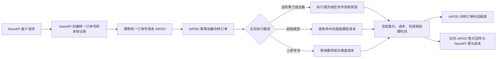
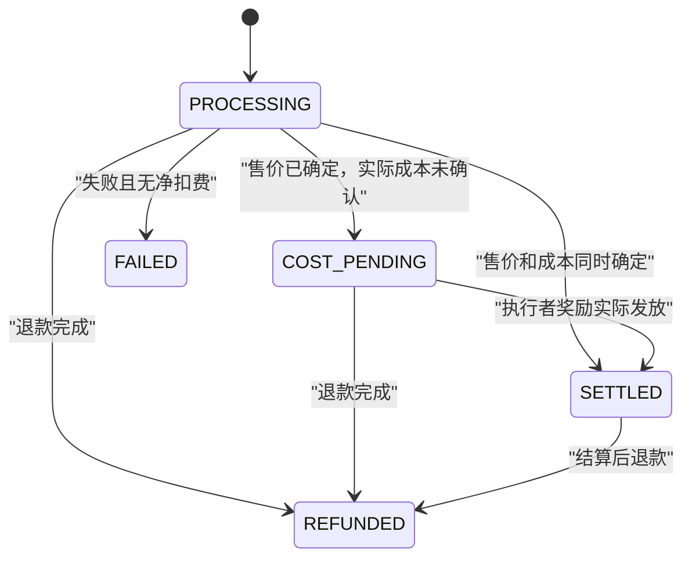

# AIPDD × NewAPI 中转订单与 AIPDD 利润报表最终地图

> 状态：第一版代码实施与本地全链路验证完成（尚未生产部署）  
> 确认日期：2026-08-12  
> 实施日期：2026-08-11  
> 适用范围：AIPDD 利润报表，以及为该报表必需的 NewAPI → AIPDD 订单映射和结算回传  
> 执行方案：[AIPDD × NewAPI 中转订单与利润报表执行方案](./aipdd-newapi-transit-order-profit-report-execution-plan.zh_CN.md)  
> 说明：本文既是最终产品口径，也是本轮代码实施结果地图。若旧财务/对账文档与本文冲突，以本文为准。

## 1. 目标

只为实际经过 AIPDD 渠道执行的模型请求建立一条统一、可核对的中转订单链路：

1. NewAPI 在请求 AIPDD 前创建统一订单号和本地订单记录。
2. AIPDD 接收统一订单号，为该任务创建一条中转订单记录。
3. AIPDD 记录自己的实际售价、任务成本和利润，金额统一保存积分与人民币结果。
4. AIPDD 的售价就是 NewAPI 的源头成本。
5. AIPDD 只向 NewAPI 回传售价，不回传 AIPDD 内部成本和利润。
6. 管理员在 AIPDD 的一个简单报表中查看汇总、明细、待结算订单并导出 CSV。

第一版追求单订单、单账本、单一利润口径，不建设通用财务平台。

## 2. 最终业务链路



## 3. 统一订单规则

### 3.1 创建范围

- 仅当 NewAPI 实际选中 AIPDD 渠道时创建统一订单。
- AIPDD 只记录携带合法统一订单号、确实来自 NewAPI 的模型请求。
- AIPDD 原生直调、充值、提现、存储等业务不进入本报表。
- Shared Task、超值模型/Seedance、OpenAI 兼容 Chat（流式与非流式）全部纳入第一版。
- AIPDD 多 Key/号池场景必须按本次请求最终实际使用的 API Key 归属订单，不能因为渠道配置了多个 Key 而跳过记账。

### 3.2 幂等与重试

- 统一订单号由 NewAPI 在第一次请求 AIPDD 前生成。
- AIPDD 以统一订单号作为跨系统幂等标识；同一订单号重复到达时更新原订单，不新建重复订单。
- AIPDD 内部重试、设备调度重试和上游号池故障切换仍属于同一笔订单。
- NewAPI 客户重新发起的一次独立请求应生成新的统一订单号。
- 不为内部重试建立复杂的财务 attempt、movement、event 或 revision 子账。

## 4. AIPDD 中转订单数据

每笔 AIPDD 中转订单至少保存以下字段：

| 字段 | 口径 |
|---|---|
| 统一订单号 | NewAPI 创建的跨系统订单号，唯一 |
| AIPDD 任务/请求 ID | AIPDD 内部任务或推理请求标识 |
| AIPDD 用户 ID | 实际使用 API Key 的所属用户 |
| API Key ID | 仅保存内部 ID，不保存完整 Key |
| 模型 | 实际执行的模型 |
| 订单状态 | 处理中、成本待结算、已结算、失败、已退款 |
| 售价积分 | AIPDD 对 NewAPI API Key 的最终净扣费积分 |
| 售价人民币 | 上述最终净扣费对应的人民币结果 |
| 成本积分 | 按实际执行路径得到的任务成本积分 |
| 成本人民币 | 上述任务成本对应的人民币结果 |
| 利润积分 | 售价积分减成本积分 |
| 利润人民币 | 售价人民币减成本人民币 |
| 创建时间 | AIPDD 第一次接收该统一订单的时间 |
| 结算时间 | 售价和成本都最终确定的时间 |

### 4.1 汇率字段

- 订单、接口、页面和 CSV 都不增加汇率字段。
- 结算时沿用 AIPDD 当时已有的积分/人民币换算规则，直接冻结积分和人民币结果。
- 后续汇率或价格配置变化不能改写历史订单金额。

## 5. 售价、成本和利润口径

### 5.1 售价

- AIPDD 售价等于该任务对 NewAPI 所使用 AIPDD API Key 的最终净扣费。
- 全额退款后售价为 0。
- 部分退款后售价为扣费减退款后的净额。
- 售价一旦最终确定，即可回传给 NewAPI；不必等待 AIPDD 内部成本完成结算。

### 5.2 成本来源

成本按实际执行路径确定，不再额外接入逐单上游账单系统：

| 实际执行路径 | 成本口径 |
|---|---|
| 自有算力/设备推理 | 实际确认发给执行者的奖励积分及对应人民币 |
| 超值模型/Seedance | 命中的超值模型成本配置 × 最终任务规格、时长等实际用量 |
| 上游号池 | 最终成功渠道的输入、输出、缓存成本配置 × 实际 Token 用量 |

补充规则：

- 发生上游故障切换时，只采用最终成功执行渠道的成本配置。
- 配置型成本应在订单执行时冻结对应成本快照，并在最终用量产生后计算订单成本。
- 成本配置后续被修改，不得重新计算历史订单。
- 如果模型或渠道没有合法成本配置，则不得向 NewAPI 发布或执行该模型，必须返回明确的“成本未配置”错误。
- 缺失成本不得默认为 0。
- 任务失败或退款后，如果 AIPDD 已真实发生执行成本，成本仍按实际发生值保留，允许出现负利润。

### 5.3 延迟奖励

- 部分自有算力或 Chat 设备奖励可能因低信誉等规则延迟确认。
- 客户扣费已完成但执行者奖励尚未真正发放时，订单进入“成本待结算”。
- 不把应付奖励伪装成实际成本，也不提前计算最终利润。
- 奖励实际确认发放后，再写入成本、利润和结算时间。

### 5.4 利润

```text
AIPDD 利润积分 = AIPDD 售价积分 - AIPDD 成本积分
AIPDD 利润人民币 = AIPDD 售价人民币 - AIPDD 成本人民币
```

## 6. AIPDD 返回给 NewAPI 的数据

AIPDD 只返回自己的最终售价，因为该售价就是 NewAPI 的源头成本：

```json
{
  "platform_order_id": "统一订单号",
  "settlement": {
    "status": "settled",
    "charged_points": 1000,
    "charged_rmb": "2.000000"
  }
}
```

明确不返回：

- AIPDD 成本积分或成本人民币；
- AIPDD 利润；
- 执行者奖励；
- 超值模型成本组成；
- 上游号池成本配置；
- 汇率。

### 6.1 回传方式

- Shared Task、超值模型/Seedance 等异步任务：在任务最终查询响应中附带 `settlement`。
- OpenAI 兼容 Chat（流式和非流式）：请求结束后，NewAPI 按统一订单号调用一次极简结算查询；未就绪或临时失败时只做有限次数的直接重试。
- Chat 结算查询只返回该统一订单的售价结算，不返回 AIPDD 内部成本和利润。
- 不为此建设事件游标、消息收件箱/发件箱、事件投影或通用财务同步 Worker。

### 6.2 NewAPI 本地记录

- NewAPI 在调用前先创建 `PENDING` 订单。
- AIPDD 返回最终售价后，NewAPI 将售价人民币写为该订单的源头成本；售价积分可作为核对字段保存。
- AIPDD 内部成本是否仍在待结算，不影响 NewAPI 已获得并保存 AIPDD 售价。
- 请求在 AIPDD 接收前失败时，NewAPI 应把本地订单标为失败，源头成本为 0。
- AIPDD 已产生净扣费时，以 AIPDD 返回的最终净扣费为准。

## 7. AIPDD 管理报表

### 7.1 页面范围与权限

- 仅管理员可访问。
- 直接改造现有“中转站订单记录”页面，不新增第三套财务页面。
- 页面只查询本文定义的 AIPDD 中转订单表。

### 7.2 查询条件

- 结算时间范围；
- AIPDD 用户 ID；
- 完整 API Key。

完整 API Key 查询规则：

1. 前端允许管理员粘贴完整 Key 作为查询条件。
2. 后端只在请求内对完整 Key 计算哈希，并查出对应 `api_key_id`。
3. 中转订单只保存 `api_key_id`。
4. 完整 Key 不写入订单、不写入日志、不回显、不进入 CSV。
5. 页面和 CSV 只展示 API Key 名称与脱敏前缀。

### 7.3 汇总

按结算时间范围统计已结算订单：

- 已结算订单数；
- 总售价积分、总售价人民币；
- 总成本积分、总成本人民币；
- 总利润积分、总利润人民币。

待结算订单不进入上述利润汇总。同一页面额外显示：

- 待结算订单数量；
- 待结算订单明细。

### 7.4 订单明细

明细至少展示：

- 统一订单号；
- AIPDD 任务/请求 ID；
- 用户 ID/用户名；
- API Key 名称与脱敏前缀；
- 模型；
- 状态；
- 售价积分/人民币；
- 成本积分/人民币；
- 利润积分/人民币；
- 创建时间；
- 结算时间。

### 7.5 导出

- 导出格式统一为 CSV。
- CSV 使用与当前查询相同的过滤条件和金额口径。
- CSV 不包含完整 API Key、汇率、内部财务事件、重试事件或成本修订记录。

## 8. 单一状态模型

第一版只保留业务需要的简单状态：



退款后重新计算最终净售价和利润即可，不引入通用 revision/event 体系。

## 9. 明确不做

第一版不做以下内容：

- 不把 AIPDD 内部成本返回给 NewAPI；
- 不拆分“基础模型费用”和“AIPDD 模型费用”；
- 不接入火山或其他上游逐单真实账单查询；
- 不建立通用财务业务事件、成本确认、人工修订和凭证体系；
- 不建立双账、投影账或把新订单再次投影到旧报表；
- 不建立跨系统事件游标、收件箱、发件箱和毒消息处理；
- 不建立异步 XLSX 导出任务，第一版只导出 CSV；
- 不展示或保存汇率字段；
- 不保存、回显或导出完整 API Key；
- 不把 AIPDD 原生直调、充值、提现、存储等业务混入模型订单利润报表；
- 不在本阶段扩展 NewAPI 客户利润报表，NewAPI 侧只完成源头成本订单记录。

## 10. 旧系统处置

旧财务系统与逐单台账原本存在并行写入、投影和重复统计风险。本轮只替换“NewAPI 来源模型订单”链路，不破坏充值、提现、存储等独立财务业务：

1. NewAPI 已删除旧模型财务 worker、movement/inbox/outbox/cursor/export、管理员 API 和页面。
2. AIPDD 主业务路径已停止写入旧模型事件账和旧逐单账；旧逐单服务与结算接口只在显式 `legacy-aipdd-finance` Profile 下存在，默认不加载。
3. 旧模型来源已从自动恢复和新建手工回填范围中移除，不能再产生新的旧模型财务记录。
4. 充值、提现、存储等非模型财务记录继续按原业务运行，不进入本中转订单利润报表。
5. 已执行过的历史迁移和历史表不回改、不自动删除；物理归档/删表必须在生产维护窗口备份后另行执行。
6. 新利润报表只查询 `new_api_transit_order`，历史数据不会混入或重复统计。

## 11. 四象限最终地图

### 11.1 已知且已确认

- AIPDD 售价等于 NewAPI 源头成本。
- AIPDD 内部成本和利润不返回 NewAPI。
- 所有 AIPDD 模型执行路径均纳入第一版。
- 成本直接复用自有算力奖励、超值模型配置和上游号池配置。
- 订单保存积分和人民币，不保存汇率。
- 报表按结算时间统计，待结算订单单独展示。
- 管理员可以通过完整 API Key 安全查询，但系统不保存完整 Key。
- 导出使用 CSV。

### 11.2 原本未知、现已决策

- Chat 无法依赖任务最终响应：改为请求结束后按订单号做极简查询。
- 执行者奖励延迟：实际发放前保持成本待结算。
- 缺少成本配置：禁止向 NewAPI 提供该模型，不按 0 处理。
- 多 Key 渠道：按每次请求实际选中的 Key 建账，不能跳过。
- 旧复杂财务系统：先完整归档，再直接替换和清理。

### 11.3 代码中已有、应直接复用

- AIPDD API Key 已有哈希查找机制，可安全支持管理员粘贴完整 Key 查询。
- 超值模型管理已有人民币/积分成本及成本矩阵。
- 上游号池已有输入、输出、缓存三档成本配置。
- 自有算力和推理设备已有奖励结算记录。
- NewAPI 与 AIPDD 已具备跨系统统一订单头和三类执行入口的基础代码。

### 11.4 已发现并纳入防护的隐患

- 当前旧账与逐单账并行，可能重复统计。
- 当前部分 Seedance 成本被当成已确认实际成本，语义不准确。
- 当前 NewAPI 多 Key AIPDD 渠道会跳过财务记录。
- 当前 Chat 在流结束时尚未完成最终扣费，不能直接在 SSE 中可靠返回结算。
- 当前推理奖励可能延迟，任务成功不等于实际成本已经支付。
- 当前系统使用 XLSX，与本轮确认的 CSV 不一致。
- 当前跨仓协议只有静态代码对齐，缺少真正的跨仓端到端合同测试。

## 12. 第一版验收标准

至少覆盖以下验收场景：

1. NewAPI 调用 AIPDD 前成功创建统一订单，AIPDD 只生成一条对应记录。
2. 同一统一订单号重复请求不会生成重复订单。
3. Shared Task 成功后，售价正确回写 NewAPI，AIPDD 成本和利润正确。
4. 超值模型按实际规格/时长和冻结成本计算。
5. 上游号池按最终成功渠道及实际 Token 计算，不使用失败渠道成本。
6. 流式和非流式 Chat 均能通过极简查询把最终售价回写 NewAPI。
7. 自有设备奖励延迟时订单进入成本待结算，实际发放后才进入利润汇总。
8. 缺少成本配置时请求在执行前失败，且不产生虚假零成本利润。
9. 全额退款、部分退款和已发生成本的失败订单均按最终净额计算。
10. 多 Key AIPDD 渠道按实际使用 Key 记录订单，不漏单。
11. 管理员按结算时间、用户 ID、完整 API Key 均能正确查询。
12. 完整 API Key 不出现在数据库订单、响应、日志、页面和 CSV 中。
13. 待结算订单单独展示且不进入已结算利润汇总。
14. CSV 金额与页面汇总、订单明细一致。
15. 旧财务系统停止双写，旧报表不会与新订单重复统计。
16. NewAPI 与 AIPDD 增加跨仓端到端合同测试，验证字段、状态、幂等和退款行为。

## 13. 后续扩展边界

以下内容等第一版稳定后再单独立项：

- NewAPI 客户售价、源头成本和 NewAPI 利润报表；
- 上游真实账单与配置成本差异对账；
- 成本人工调整、差异审批与审计凭证；
- 更复杂的合同价、账期和月度结算；
- XLSX、多工作表或财务系统集成导出。

这些扩展不得改变第一版的核心关系：**AIPDD 售价 = NewAPI 源头成本，AIPDD 内部成本与利润只留在 AIPDD。**

## 14. 2026-08-11 实施落点

### 14.1 NewAPI

- 新增单表 `aipdd_transit_order`，只保存统一订单、本地客户归属、本地扣费、AIPDD 售价积分/人民币、创建与结算时间。
- OpenAI Chat、Seedance、Shared Task 请求只发送 `X-AIPDD-Order-ID` 和 `X-AIPDD-Instance-ID`。
- multi-key 渠道记录本次实际选中的 Key 槽位，不再跳过订单。
- 异步任务从终态响应读取售价；Chat 通过单订单接口做有限直接重试。
- 删除旧复杂财务模型、worker、事件同步 API、XLSX 导出和管理页面，并移除 Excelize 依赖。
- NewAPI 已提供简版 AIPDD 中转订单记录页面；该页面只展示 NewAPI 客户扣费与 AIPDD 源头成本，不展示 AIPDD 内部成本和利润。

### 14.2 AIPDD

- 新增 `new_api_transit_order` 与 V200/V201 向前迁移；V201 可修复已记录 V200 但缺表的环境。
- Shared Task、Seedance、Chat 三类入口幂等创建并关联同一统一订单。
- 自有算力使用确认奖励，超值模型使用已有冻结成本，号池使用最终成功渠道三档 Token 成本。
- 缺少合法成本时在请求上游前返回 `cost_not_configured`，不生成零成本利润。
- 售价确定但奖励未确认时进入 `COST_PENDING`；成本确认后再计算利润和结算时间。
- 单订单结算接口和异步任务响应只暴露售价积分、售价人民币，不暴露 AIPDD 成本与利润。
- 原“中转站订单记录”页面已改为已结算汇总、待结算明细、完整 Key 安全查询和同步 CSV。

### 14.3 已完成验证

- NewAPI：`go test ./...` 全仓通过。
- NewAPI Web：`bun run build` 通过。
- AIPDD Java：中转订单、PostgreSQL SQL 和 Seedance BYOK 成本夹具专项回归共 16 项，16 项通过。
- AIPDD Web：`bun run build` 通过，只有既有的大分块体积警告。
- AIPDD Java 全仓实际执行 579 项；原始全仓结果为 2 项失败、5 项错误、3 项跳过。3 项 Seedance BYOK 错误来自测试夹具缺少新规则要求的成本，补齐成本后已在上述 16 项专项回归中通过。其余失败/错误属于虚拟角色响应契约、LTX 2.3 输入样例、远程测试库残留数据污染和既有调度补偿，不属于中转订单链路；本轮不扩大范围修改这些模块。

### 14.4 上线前环境验收

- 使用真实 NewAPI AIPDD 单 Key与 multi-key 渠道各完成一笔 Chat、Seedance、Shared Task 请求。
- 对照两端数据库确认统一订单一一对应，且 NewAPI 源头成本人民币等于 AIPDD 售价人民币。
- 验证生产管理员页面的完整 Key 查询、待结算转已结算和 CSV 金额。
- 上线前备份旧财务表；本轮代码不会自动删除历史数据。

## 15. 2026-08-12 本地全链路实测记录

### 15.1 测试环境

- NewAPI 本地服务：`http://127.0.0.1:6070`。
- AIPDD 本地服务：`http://127.0.0.1:1688`。
- AIPDD 管理前端：`http://127.0.0.1:16888`。
- 使用独立测试用户、两个独立 AIPDD API Key 和独立上游号池渠道；验收后已全部禁用，未删除测试订单。
- 为避免成功结果受外部供应商波动影响，除真实上游请求外，增加了一个仅在本机监听的确定性 OpenAI 兼容上游，固定返回实际 Token 用量；验收后已停止并删除。

### 15.2 成功订单金额核对

确定性上游固定返回输入 `100000` Token、输出 `20000` Token。按测试号池冻结的售价和成本配置，单笔订单结果为：

| 位置 | 售价/源头成本 | AIPDD 内部成本 | AIPDD 内部利润 |
|---|---:|---:|---:|
| AIPDD 中转订单 | 360 AWcoin / ¥3.600000 | 240 AWcoin / ¥2.400000 | 120 AWcoin / ¥1.200000 |
| NewAPI 中转订单 | 360 AWcoin / ¥3.600000 | 不接收 | 不接收 |

代表订单：`20260811160524468788300dah61qTF8lWngZoL`。两端统一订单号一致，NewAPI 源头成本人民币与 AIPDD 售价人民币精确相等。

同一订单的极简结算查询连续调用 3 次，均只返回 `status`、`charged_points`、`charged_rmb`，没有返回 AIPDD 成本或利润；AIPDD 钱包扣费流水仍只有 1 条，证明结算查询和扣费幂等。

### 15.3 multi-key 与流式

- multi-key 轮询连续两笔请求分别实际使用 API Key ID `256` 和 `257`，订单号分别为 `20260811160908269487800XiSRSULvaYjppQ1h`、`20260811160923955506700XiSRSULvXDXUvg9S`。
- 两笔订单均在 AIPDD 和 NewAPI 生成唯一记录，均结算为 360 AWcoin / ¥3.600000，未出现 multi-key 漏单。
- 流式代表订单 `20260811161107327238700XiSRSULvYbLcgxla` 返回 3 个 SSE 事件，包含正文、usage 和且仅一个 `[DONE]`；流结束后两端均结算成功，金额与非流式订单一致。

### 15.4 真实外部链路与失败退款

- 真实 Chat 请求曾成功到达外部号池并暴露“只记录号池成本、未按号池售价扣 AIPDD 用户”的缺陷；现已改为按最终实际 usage 同时计算号池售价和成本，并通过上述确定性成功链路复验。
- 修复后的真实 Chat 再测遇到两个外部渠道均 120 秒超时：AIPDD 订单为 `FAILED`，NewAPI 返回 503 且不记源头成本，未产生虚假利润。
- 真实 Seedance 标准与 VIP 请求均到达火山，但测试供应商账号返回 `ModelNotOpen`：AIPDD 记录失败，NewAPI 预扣全额退回。
- Shared Task 当前目录没有可用执行设备：请求在执行前被拒绝，NewAPI 预扣全额退回。
- 因外部账号权限和本地无在线算力设备，本轮没有获得真实 Seedance 成功单和真实 Shared Task 成功单；其成本算法、门禁、结算和退款由 Java 专项/集成测试覆盖，不能把外部失败写成成功验证。

### 15.5 管理报表与 CSV

- AIPDD “中转站订单记录”页面实测展示已结算、失败和待结算状态，显示统一订单号、用户、脱敏 Key、模型、来源、售价、成本、利润、创建时间和结算时间。
- 5 笔已结算测试单页面汇总：总售价 1440 AWcoin / ¥14.40，总成本 960 AWcoin / ¥9.60，总利润 480 AWcoin / ¥4.80。
- 使用完整 API Key 查询后输入框被清空，结果仍正确过滤；完整 Key 未出现在页面正文和响应展示中。
- CSV 实测 HTTP 200、UTF-8 BOM、16 列，包含售价/成本/利润的 AWcoin 与人民币、创建时间和结算时间；不包含汇率和完整 API Key。
- CSV 文件名按 `Asia/Shanghai` 日期生成，修复了上海时区午夜后仍使用前一天 UTC 日期的问题。

### 15.6 收尾状态

- 两个测试 API Key、测试用户和临时上游号池渠道均已禁用。
- 修复前遗留的一条测试 `PROCESSING` 订单已按实际结果关闭为 `FAILED`，不再污染待结算数量。
- NewAPI AIPDD 渠道已恢复生产地址、生产单 Key 和非 multi-key 配置。
- AIPDD 与 NewAPI 已使用最新代码重新启动；`/actuator/health` 与 `/api/status` 均返回 HTTP 200。
- 全量与专项日志统一保存在 `E:\AIPDD\runtime-e2e-logs`，便于后续追溯。

## 16. 2026-08-12 NewAPI 简版中转订单记录页面

NewAPI 已提供简版 AIPDD 中转订单记录页面；该页面只展示 NewAPI 客户扣费与 AIPDD 源头成本，不展示 AIPDD 内部成本和利润。

### 16.1 范围

- 管理员专用页面路径：`/aipdd-transit-orders`（侧边栏名称：AIPDD 订单记录）。
- 管理员查询接口：`GET /api/aipdd-transit-orders`（`middleware.AdminAuth()`）。
- 只查询本地表 `aipdd_transit_order`，不恢复旧 finance worker、movement、event、cursor、inbox/outbox、XLSX 或复杂对账系统。
- 页面支持创建时间范围、统一订单号、用户 ID、Token ID、渠道 ID、模型、状态过滤，以及分页、刷新和清空筛选。
- 空的源头成本字段显示为“待结算”，不显示为 0。

### 16.2 金额口径

| 展示字段 | 来源 |
|---|---|
| NewAPI 客户扣费 quota | `customer_charge_quota` |
| NewAPI 客户扣费人民币 | `customer_charge_rmb_mic / 1_000_000` |
| AIPDD 源头成本 AWcoin | `source_charge_awcoin`（NULL = 待结算） |
| AIPDD 源头成本人民币 | `source_charge_rmb_mic / 1_000_000`（NULL = 待结算） |

不接收、不展示：AIPDD 内部成本、内部利润、执行者奖励、上游号池成本组成、汇率。

### 16.3 本地验收摘要（2026-08-12）

- `GET /api/aipdd-transit-orders` 在管理员登录后返回本地库现有 **11** 条订单（SETTLED 5、REFUNDED 3、FAILED 2、PENDING 1）。
- `source_charge_*` 为 NULL 的订单在接口中返回 `null`，前端展示为“待结算”。
- `go test ./...` 与 `web/default` 的 `bun run typecheck` / `bun run build` 均通过。
