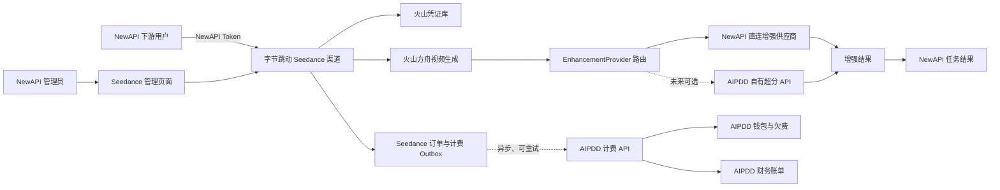
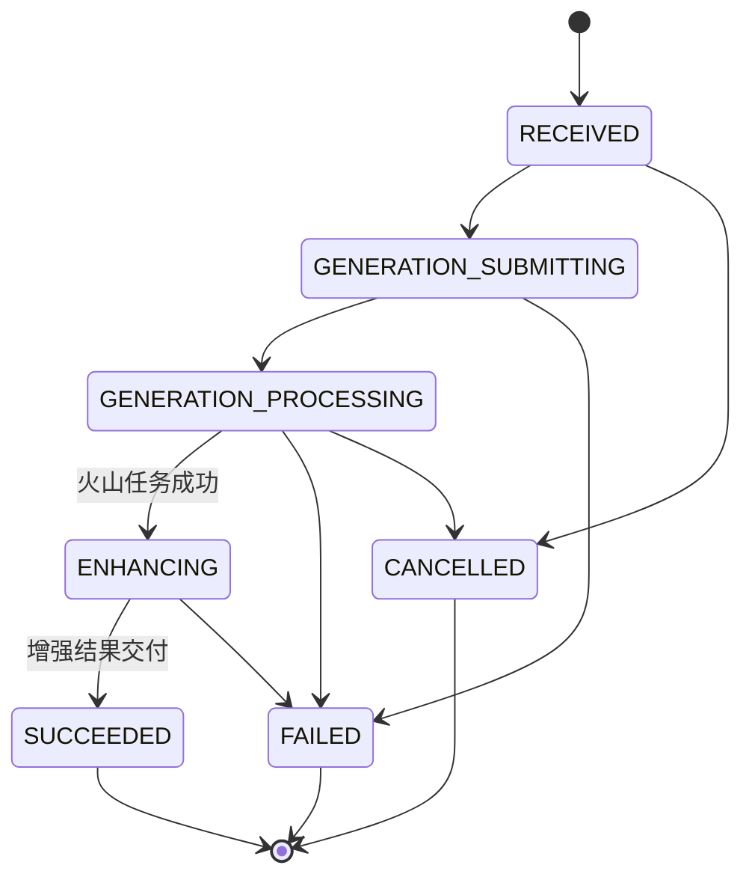

# 字节跳动 Seedance 独立渠道与 AIPDD 异步后付费设计方案

> 状态：设计基线  
> 确认日期：2026-09-03  
> 主要实施仓库：`new-api`、`aipdd-java`  
> 适用范围：新创建的 Seedance 视频任务、可插拔视频增强（含未来 AIPDD 自有超分）、火山成本核算、AIPDD 异步扣费与利润报表  
> 兼容原则：AIPDD Java 中现有 Seedance 调用链暂不删除，继续服务历史任务和旧入口；新业务不再依赖该链路

## 1. 决策摘要

本方案采用以下最终边界：

1. NewAPI 新增独立的“字节跳动 Seedance”渠道和仅管理员可访问的 Seedance 管理页面。
2. Seedance 模型管理、火山凭证、任务创建与查询、火山调用、增强编排、售价计算、火山成本核算和订单事实全部由 NewAPI 负责；具体增强执行通过可插拔 `EnhancementProvider` 完成。
3. 第一阶段 AIPDD 不参与 Seedance 生成或增强执行，只根据 AIPDD API Key 异步扣除增强服务售价并形成财务账单。未来 AIPDD 自有超分可作为一种增强 Provider 被 NewAPI 调用，但仍不拥有 Seedance 订单和生成任务状态。
4. NewAPI 与 AIPDD 使用各自独立的数据库，不跨库查询或写入，不使用分布式事务。
5. AIPDD 计费 API 或财务数据库不可用时，NewAPI 继续执行任务；待计费面恢复后，通过本地事务 outbox 自动补扣。若某订单选择 AIPDD 自有超分作为执行 Provider，则其执行服务不可用属于增强阶段故障，按增强重试、降级或失败策略处理，不能与计费故障混为一谈。
6. Seedance 不进入 Token 市场，不同步到 AIPDD 渠道；普通用户看不到渠道实现方式，也不出现 `BYOK` 等术语。
7. 每个逻辑订单由 NewAPI 生成一个全局统一订单号。任务重试、火山任务和增强任务均挂在同一订单下。
8. 视频增强、超分及其 Provider 属于内部实现细节。普通用户、公共 API 和用户账单只看到一次 Seedance 模型调用及统一售价，不得直接或间接暴露系统执行过超分。
9. Seedance 官方兼容和 OpenAI 兼容协议以 `aipdd-java` 中已经跑通的实现及测试为行为基线。NewAPI 只做等价迁移、薄协议适配和本文明确要求的边界调整，不自行重新设计请求、响应、默认值、状态、错误或回调语义。

一句话定义：

> NewAPI 是 Seedance 的业务编排和订单事实源；增强执行方是可替换的 Provider；AIPDD 默认是按 API Key 提供授信后付费的钱包与财务账本，未来也可以独立承担超分执行，但两种角色使用不同协议和故障边界。

## 2. 目标与非目标

### 2.1 目标

- 管理员可以在 NewAPI 独立页面配置火山账户连接、Seedance 模型、下游模型售价、增强 Provider、AIPDD 增强服务售价，以及 NewAPI 直连 Provider 的供应商成本。
- 在使用 NewAPI 直连增强 Provider 时，NewAPI 能独立完成 Seedance 全生命周期，AIPDD 计费故障不阻塞任务提交、轮询、增强和结果查询。
- NewAPI 能记录下游模型实际售价、AIPDD 增强服务售价、直连 Provider 的供应商成本，或 AIPDD 自有超分返回的用量与服务费证据，以及火山成本和订单收益；AIPDD 内部成本不复制到 NewAPI。
- AIPDD 能按站点/API Key 幂等补扣，并记录增强调用时间、成本、售价、收益和欠费状态。
- 任意跨系统重试都不会重复扣费、重复退款或创建重复财务订单。
- 普通用户无法从任务状态、字段、文案、错误、账单拆项、结果地址或媒体元数据得知内部存在增强/超分阶段。
- Seedance 官方协议和 OpenAI 兼容协议在 NewAPI 上通过 Java 基线的契约回归测试，不因语言和框架迁移产生无依据的行为差异。
- 旧 Java Seedance 任务可以继续查询，不要求迁移历史任务。

### 2.2 非目标

- 不把 Seedance 重新包装为 Token 市场模型。
- 不让 AIPDD Java 代理新的 Seedance 生成请求；未来的 AIPDD 超分接口是独立媒体服务，不是 Seedance 代理。
- 不在 AIPDD 保存或解密客户火山 API Key、AK/SK。NewAPI 直连增强供应商所需密钥只保存在 NewAPI；AIPDD 自有超分的内部供应商或基础设施密钥只保存在 AIPDD。
- 不要求火山账单在任务完成瞬间提供逐任务实付成本。
- 不通过共享数据库实现 NewAPI 与 AIPDD 的一致性。
- 不在第一阶段迁移旧 Seedance 任务、旧价格和旧凭证。
- 不把超分、增强 Provider、AIPDD 服务费用项或内部处理阶段作为普通用户可见的产品能力或可选参数。
- 不为迁移而另造“更通用”的视频协议、字段别名、状态枚举或错误包装；Java 未覆盖的需求必须先确认，不以抽象完整性为由自行扩展公共契约。

## 3. 系统边界



### 3.1 NewAPI 独占职责

- Seedance 渠道、模型和规格配置。
- 管理员页面和访问权限。
- 火山 Ark API Key、AK/SK 的加密存储、验证、轮换和停用。
- 视频生成请求校验、提交、轮询、回调、取消和结果管理。
- 增强 Provider 的选择、统一调用、回调/轮询、重试、降级和用量证据记录。
- 下游模型售价、AIPDD 增强服务售价、直连 Provider 的供应商成本证据、AIPDD 自有超分的用量/服务费证据和任务创建时的价格快照。
- 火山成本估算、账单同步、确认和分摊。
- NewAPI 下游用户扣费及退款。
- 统一订单、任务尝试、财务事件和 outbox。
- NewAPI 侧订单收益与对账页面。

### 3.2 AIPDD 独占职责

- AIPDD API Key 的认证、归属、状态和权限。
- API Key 所属账户的钱包余额、授信额度和欠费状态。
- 来自 Seedance 等业务订单的通用服务后付费扣款、调整和退款流水。
- AIPDD 视角的成本、售价、收益和财务报表。
- 幂等事件收件箱、账单修订和异常对账。
- 当未来启用 AIPDD 自有超分时，独占该超分服务的实现、内部凭证、执行任务状态、实际用量和内部成本事实；只通过稳定的超分 API 向 NewAPI 暴露任务状态和结算证据。

AIPDD 不拥有 NewAPI 的 Seedance 任务状态。AIPDD 财务记录中的任务字段只是不可反向驱动业务的快照和证据。

### 3.3 增强执行面与计费面

增强执行和异步计费必须是两个独立边界：

```text
增强执行面：NewAPI -> EnhancementProvider -> 增强任务/结果/用量证据
异步计费面：NewAPI Outbox -> AIPDD Finance API -> 钱包/应收/财务账本
```

- `EnhancementProvider` 的首期实现是 NewAPI 直连现有增强供应商。
- 未来的 `AipddSuperResolutionProvider` 通过 AIPDD 独立超分 API 提交、查询和取消任务，不复用财务事件接口。
- AIPDD 超分执行成功不等于财务扣款成功；财务事件仍由 NewAPI 本地订单事务和 outbox 驱动。
- AIPDD 计费面故障不得影响任何 Provider 的执行；AIPDD 超分执行面故障只影响选择了该 Provider 的增强阶段。
- Seedance 订单终态始终由 NewAPI 根据火山和增强阶段结果决定，AIPDD 不得通过财务状态反向修改任务。

## 4. 用户语言、能力隐藏与产品呈现

### 4.1 普通用户与公共 API

超分/增强是内部执行步骤，不是用户可感知的独立能力。普通用户侧不得出现 `BYOK`、`byok_price`、`billing_mode=BYOK`、`customer_key`，也不得出现或可推断出以下内部概念：

```text
enhancement / enhance
super_resolution / super-resolution / upscale / SR / 超分 / 增强
enhancement_provider / provider_type / service_code
enhancement_task_id / execution_task_id
AIPDD 自有超分、增强供应商名称和内部服务费用项
```

统一使用以下用户文案：

| 场景 | 用户文案 |
|---|---|
| 渠道名称 | 字节跳动 Seedance |
| 厂商 | 字节跳动（火山引擎） |
| 用户价格 | 模型调用费（单一总价） |
| 任务处理中 | 视频处理中 |
| 内部增强失败 | 视频处理失败，请稍后重试 |
| 结果 | 视频生成结果 |

对普通用户必须遵守：

- 模型列表、模型名称、能力描述和请求参数不得包含“超分”“增强”“upscale”“SR”等提示内部处理方式的命名；输出分辨率可以作为最终模型能力描述，但不得说明其实现手段。
- 两套公共协议分别保持 Java 基线已有的状态值、大小写和响应位置，不强行统一成新的状态枚举。内部 `GENERATION_*` 和 `ENHANCING` 都映射为该协议在 Java 中已有的普通非终态（例如原有 running/processing 语义），不得新增可识别增强阶段的状态。
- 公共响应不得包含 Provider、内部阶段、服务代码、服务费用项、增强 attempt 或执行任务号。
- 普通用户的消费记录、订单详情和导出只展示聚合后的 `model_sale_amount`，不得单列视频增强服务费、AIPDD 扣费或内部成本。
- 用户可见错误保持对应 Java 协议的 HTTP 状态、错误 envelope 和既有 code；只有会暴露增强、超分或供应商的信息改写成同一结构下的通用“视频处理失败”文案。详细原因只进入受限内部日志。
- 结果文件名、对象存储 key、签名下载域名、HTTP Header 和非必要媒体 metadata 不得包含 AIPDD、供应商、`enhance`、`upscale`、`super_resolution` 等标识。必要时由 NewAPI 复制到中性对象路径并清理非必要 metadata 后再交付。
- 不在公共 API 中加入“是否开启超分”开关。是否执行内部增强由管理员发布的模型配置和价格快照决定，同一模型版本对用户保持稳定语义。

### 4.2 管理员与内部系统

- “连接火山引擎账户”、凭证状态、增强 Provider、服务费用项、成本和收益只允许 NewAPI 系统管理员及授权财务/运维角色查看。
- AIPDD 超分执行 API、通用财务 API、回调和内部 DTO 均属于服务间接口，不进入普通用户 API 文档或前端网络请求。
- 如 AIPDD 存在面向普通终端用户的账单或通知，同样只展示聚合后的模型调用费；只有 NewAPI 站点所有者或授权财务角色才能查看服务费用项。
- 权限校验必须在后端完成，不能只依赖前端隐藏菜单；内部字段的序列化 DTO 与公共 DTO 必须分开。

内部仍优先使用明确且中性的字段命名，并通过独立 DTO 防止字段意外透传到公共 API：

```text
credential_source = connected_account
provider_billing = external_account
volcengine_credential_id
enhancement_provider_id
enhancement_service_code
```

### 4.3 防泄漏自动化测试

- 对模型列表、任务创建/查询、消费记录、订单详情、通知和导出建立公共 DTO 快照测试，递归检查 JSON key 与用户可见 value 不包含第 4.1 节的禁用词和内部字段。
- 使用普通用户身份访问所有管理员、超分执行、回调和财务路由，必须返回 `404` 或 `403`，且错误体本身不得暴露路由用途。
- 分别注入火山失败、直连 Provider 失败、AIPDD Provider 失败、超时和降级，断言用户看到的状态与错误结构一致。
- 对最终文件名、对象 URL、`Content-Disposition`、响应 Header 和媒体 metadata 做产物扫描；发现 Provider 或超分标识即判定验收失败。
- 公共 DTO 测试使用显式允许列表作为主断言，禁用词扫描只作为第二道防线，避免未知内部字段换名后漏出。

## 5. NewAPI 渠道设计

### 5.1 渠道类型

新增独立渠道类型：

```text
ChannelTypeSeedance
```

渠道展示信息：

```text
名称：字节跳动 Seedance
厂商：字节跳动（火山引擎）
内部执行协议：seedance_official
Seedance 官方兼容入口：/api/v3/contents/generations/tasks
OpenAI 兼容入口：/v1/videos
```

两个公共协议入口只负责鉴权、解析、校验和响应映射，随后进入同一 Seedance 工作流、订单和 attempt，不得各自复制一套生成、增强或计费逻辑。

不直接复用普通 `ChannelTypeVolcEngine`，因为普通火山渠道是单次上游转发，而本渠道包含生成、轮询、增强、成本确认和异步后付费，是一个完整工作流。

不复用 AIPDD 渠道，避免以下问题：

- AIPDD 目录同步覆盖或删除本地 Seedance 模型。
- 同一渠道内同时存在“转发 Java”和“Go 本地执行”两套语义。
- AIPDD 渠道 Key、客户火山凭证和平台增强凭证混淆。
- Token 市场定价与 Seedance 独立售价互相污染。

### 5.2 模型可见性

- 只有管理员发布且渠道凭证验证通过的模型可以进入 NewAPI 模型能力表。
- 普通用户只看到模型名称、最终能力、聚合售价和业务调用参数，不看到渠道凭证、成本、增强配置或实现过程。
- 未连接火山账户、凭证失效或成本配置不完整时，渠道不得发布模型。
- Seedance 模型不出现在 AIPDD Token 市场目录，也不依赖 AIPDD 目录同步。

### 5.3 管理页面

新增仅管理员可访问的 Seedance 管理页面，至少包含：

1. **账户连接**：Ark API Key、AK/SK、凭证状态、最近验证时间、轮换操作。
2. **增强 Provider**：Provider 类型、增强方案/服务代码、执行位置、凭证状态、单位成本或服务售价、超时、重试和降级策略。
3. **模型管理**：展示名称、火山模型 ID、分辨率、时长、增强方案、启停状态。
4. **定价管理**：下游模型售价、AIPDD 增强服务售价、最低收费、价格版本、生效时间和价格预览。
5. **订单与收益**：下游模型售价、增强服务成本、火山成本、预计/确认收益和成本证据。
6. **AIPDD 同步**：待同步事件、最近成功时间、失败原因、人工重试和死信处理。

价格和凭证修改必须留下管理员、时间、前后版本和非敏感变更摘要。

### 5.4 增强 Provider 抽象

Seedance 编排层只依赖统一能力，不直接依赖某个供应商 SDK 或 AIPDD 实现：

```text
EnhancementProvider
├── Submit(input, specification, idempotency_key) -> execution_task_id
├── Query(execution_task_id) -> status/result/usage_evidence
└── Cancel(execution_task_id) -> result

首期：DirectEnhancementProvider
未来：AipddSuperResolutionProvider
```

Provider 必须满足以下约束：

- `Submit` 接受 NewAPI 生成的 `attempt_id` 作为跨系统幂等键；网络重发不得创建重复增强任务。
- `Query` 或可信回调必须返回稳定的任务状态、结果引用、实际用量和证据摘要。
- Provider 选择在订单创建时冻结；自动降级到其他 Provider 必须新建 attempt，并保留原失败尝试。
- Provider 专属参数通过版本化 specification 保存，公共任务状态和财务字段不得依赖供应商私有响应结构。
- 第一阶段只要求实现 `DirectEnhancementProvider`；`AipddSuperResolutionProvider` 是已定义边界内的后续扩展，不阻塞本期上线。

### 5.5 代码与协议迁移规则：以 Java 已跑通实现为行为基线

凡是 Java 已经跑通、且本文没有明确要求改变的行为，默认做等价迁移。设计或编码前先找对应 Java 实现和测试，不重新发明 Seedance 官方协议、OpenAI 兼容视频协议、模型映射、回调、媒体交付或错误处理。

协议层只采用两个薄 Adapter，共享第 8 节的内部工作流：

```text
SeedanceOfficialAdapter  -> SeedanceWorkflow
OpenAiVideoAdapter       -> SeedanceWorkflow
```

本期代码抽象控制在以下最小边界：

```text
Router/Controller -> Protocol Adapter -> SeedanceWorkflow
                                     -> EnhancementProvider
                                     -> Repository + Local Outbox
```

- 遵循 NewAPI 现有 `Router -> Controller -> Service -> Model` 分层，不因为 Java 类较多而逐类照搬，也不另起一套框架。
- 除两个协议 Adapter、一个 Seedance 工作流和一个最小 `EnhancementProvider` 接口外，不为假设中的未来需求引入通用工作流 DSL、插件系统、事件溯源、分布式 Saga 或多层 Adapter 工厂。
- 能直接移植并用测试覆盖的 Java 判断逻辑，优先等价移植；只有凭证归属、异步计费、数据持久化和 Provider 拆分等本文已改变的边界才按 NewAPI 重新实现。
- 共享逻辑只在两套 Adapter 确实重复且语义相同时下沉；不能为了“统一”而制造一个同时容纳两种协议所有字段的超大 DTO。

Java 参考范围：

| 契约范围 | `aipdd-java` 行为参考 |
|---|---|
| Seedance 官方路由、创建/查询/列表/删除、回调与响应 | `openplatform/seedance/controller/OpenPlatformSeedanceController.java`、`service/OpenPlatformSeedanceProxyService.java` |
| 火山请求发送、任务查询和取消 | `openplatform/seedance/service/SeedanceArkClient.java`、`DefaultSeedanceArkClient.java` |
| Seedance 错误结构和 HTTP 状态 | `openplatform/seedance/controller/OpenPlatformSeedanceErrorAdvice.java`、`service/SeedanceProxyException.java` |
| OpenAI 兼容视频创建、查询、内容下载和删除 | `inference/controller/TokenMarketMediaController.java`、`tokenmarket/service/TokenMarketMediaService.java` |
| OpenAI 兼容请求映射、端点和任务 ID 处理 | `tokenmarket/service/OpenAiCompatibleMediaAdapter.java`、`TokenMarketMediaUpstreamClient.java` |
| 可执行契约 | 对应的 `OpenPlatformSeedanceProxyServiceTest`、`OpenPlatformSeedanceErrorAdviceTest`、`TokenMarketMediaService*Test`、`TokenMarketMediaUpstreamClientTest` 和路由测试 |

实施规则：

1. 开始编码前记录 `java_reference_commit`；若基线依赖 Java 未提交改动，必须先固化该改动或保存可审计 patch，不能凭开发者记忆迁移。
2. 先从 Java 测试和实际跑通样本整理请求/响应 golden fixtures，再写 Go Adapter；不得先设计一套“理想 DTO”再让 Java 行为迁就它。
3. 保持 Java 已验证的路由、HTTP method/status、请求字段、显式零值、缺省值、模型映射、多模态 content/role、回调替换与转发、列表结构、任务状态、错误 code/message 形状、任务 ID 编码、视频内容下载及 Range 语义。
4. Java 采用透传的未知官方字段，NewAPI 原则上也透传；Java 会删除、改写或拒绝的字段，NewAPI 保持一致。除安全、账务和本文显式规则外，不增加猜测性校验、字段别名、自动纠错或兼容分支。
5. OpenAI 兼容入口保持 Java 已跑通的 `/v1/videos`、`/v1/videos/{taskId}`、`/v1/videos/{taskId}/content` 和 DELETE 行为；Seedance 官方入口保持 `/api/v3/contents/generations/tasks` 的创建、查询、列表和删除行为。
6. 两套 Adapter 只负责协议转换，不包含增强选择、成本计算、钱包扣费或任务持久化的第二套实现。
7. 如果发现 Java 行为有缺陷，先补 Java 回归测试并明确修正后的期望，再同步到 Go；禁止只在 Go 中静默“修好”导致两边契约漂移。
8. Java 没有覆盖的公共行为视为待确认项。优先保持最小透传或拒绝，不为追求通用性自行添加新状态、字段或接口。
9. 对外契约迁移完成后，按 NewAPI 规则先更新 `docs/openapi/public.json`，再同步 Apifox；Java 源码和本文是迁移依据，OpenAPI/Apifox 是上线后的公共文档入口。

Java 基线只约束外部协议行为，不要求复制旧系统架构。以下是本文明确批准的差异，优先级高于 Java 旧行为：

- NewAPI 成为新 Seedance 订单和编排事实源，AIPDD 不再代理新的 Seedance 生成请求。
- 使用新的凭证边界、Provider 抽象、outbox 和异步后付费协议，不复制 Java 旧 BYOK、同步预扣或旧财务耦合。
- OpenAI 兼容只复用 Java 的 wire contract 和已验证行为，不复制 Token 市场的目录同步、选路、计价或业务归属；两个协议最终都进入本方案的独立 Seedance 渠道。
- 普通用户不得知道内部执行过增强/超分。因此 Java 中任何会暴露增强的字段、状态、错误或 `/enhance-retry` 路由不得进入 NewAPI 公共契约；需要重试时由内部编排或管理员操作完成。
- 内部数据库主键、表结构、租约和并发控制可以按 Go/NewAPI 技术栈实现，但最终外部可观察行为必须通过 Java golden fixtures。

除上述批准差异外，每个协议差异都必须在实现 PR 中列出“Java 行为、NewAPI 行为、差异原因和回归测试”。没有明确理由和测试的差异不得合入。

## 6. 凭证设计

### 6.1 火山 Ark API Key

- 用于创建、查询和取消 Seedance 任务。
- 只在 NewAPI 中加密保存。
- 任务只保存 `credential_id + credential_version`，不得复制凭证明文或密文。
- 凭证轮换后，旧版本在所有关联任务终结前保持可用；任务终结后再销毁。

### 6.2 火山 AK/SK

- 用于调用火山费用中心 OpenAPI，查询账单与成本数据。
- 应使用独立 IAM 子账号，只授予费用中心只读权限，不使用主账号高权限 AK/SK。
- 官方提供 `ListBillDetail` 等账单明细接口，但公开账单维度主要是账号、产品、实例和计费项，不能默认每条账单都带 Seedance `task_id`。
- 第一阶段必须通过真实账户样本验证账单字段和出账延迟，再确定逐单匹配或分摊规则。

参考：

- [火山引擎费用中心 OpenAPI](https://www.volcengine.com/docs/6269/1165275?lang=zh)
- [火山引擎云上成本分摊与账单维度](https://www.volcengine.com/docs/84627/1321508?lang=zh)
- [火山引擎费用中心权限管理](https://www.volcengine.com/docs/6269/1186807?lang=zh)

### 6.3 视频增强密钥

- Provider 凭证属于执行方的基础设施凭证，不与客户火山凭证共表。
- `DirectEnhancementProvider` 的供应商密钥优先从 Secret Manager、Vault 或部署环境注入 NewAPI 增强 Worker；如必须动态管理，只能进入 NewAPI 独立加密表。
- `AipddSuperResolutionProvider` 在 NewAPI 只保存 AIPDD 服务凭证引用和授权范围；AIPDD 内部使用的模型、供应商或基础设施密钥不得返回或复制到 NewAPI。
- 两侧管理页面都只显示自身拥有凭证的配置状态、指纹、版本和最近验证时间，不回显完整密钥。

### 6.4 加密与审计

- 使用信封加密；数据密钥加密业务密文，主密钥不得保存在业务数据库。
- 每条凭证保存不可逆指纹和末四位，供轮换、去重和审计使用。
- 日志、错误、订单、outbox、报表和导出中不得出现完整密钥。
- 解密只发生在实际调用上游前的最短时间窗口，完成后立即释放内存引用。

## 7. 统一订单与任务身份

### 7.1 订单号

NewAPI 在接受一次独立业务请求时生成 UUIDv7：

```text
platform_order_id
```

约束：

- 一次逻辑订单全生命周期保持不变。
- 客户主动重新创建是新订单，生成新订单号。
- 系统重试不创建新订单，只增加 attempt。
- AIPDD 使用 `api_key_id + instance_id + platform_order_id` 标识来源订单；具体服务费用项再增加 `service_line_item_id` 作为唯一范围。
- 原始 AIPDD API Key 不进入订单、事件或报表。

### 7.2 任务与尝试

```text
newapi_task_id          NewAPI 对外任务号
generation_task_id      火山生成任务号
enhancement_execution_task_id  当前增强 Provider 任务号
attempt_id              platform_order_id:stage:attempt_no
```

同一订单允许存在多个火山或增强尝试。每次真实外部提交使用新的 `attempt_id`；同一次提交的网络重发复用原 `attempt_id`。增强 attempt 还必须保存 `provider_type + provider_id + service_code + specification_version`，使 Provider 切换后仍可准确查询历史任务。

## 8. NewAPI 任务状态机



该状态机仅供内部编排、管理页面和运维使用。公共任务 DTO 必须按第 5.5 节的 Java 协议基线分别显式映射；生成处理中和增强处理中对外使用该协议原有的同一个普通非终态。禁止直接序列化内部订单或 attempt 对象作为公共响应，也禁止为了共用 DTO 而改变任一协议的 wire shape。

计费同步状态与任务状态分离：

```text
PENDING -> READY -> SENDING -> SYNCED
                         \-> RETRY_WAIT
                         \-> DEAD_LETTER
```

火山成本状态独立：

```text
ESTIMATED -> PARTIAL -> CONFIRMED
                     \-> RECONCILIATION_REQUIRED
```

任务成功不需要等待火山成本确认，也不需要等待 AIPDD 扣费成功。若选择 AIPDD 自有超分，仍必须等待其增强执行成功；等待的是执行面，不是计费面。

## 9. 金额与利润口径

### 9.1 金额字段

必须区分以下金额。相同金额在不同系统中的角色不同，禁止都命名为 `sale` 或 `cost`：

| 字段 | 含义 |
|---|---|
| `model_sale_amount` | NewAPI 向自己的下游用户收取的模型实际售价 |
| `enhancement_charge_amount` | AIPDD 向 NewAPI 站点出售增强服务的售价；也是 AIPDD 对站点 API Key 的异步扣费金额 |
| `enhancement_provider_cost` | 增强实际执行方产生的真实成本。NewAPI 直连时由 NewAPI 根据供应商证据记录；AIPDD 自有超分时由 AIPDD 自行记录，NewAPI 不得代报其内部成本 |
| `volcengine_cost_estimated` | 任务完成时按冻结火山价格规则计算的预计成本 |
| `volcengine_cost_actual` | 通过火山账单确认或分摊后的成本 |
| `newapi_profit_estimated` | NewAPI 下游售价减增强服务售价和预计火山成本 |
| `newapi_profit_actual` | NewAPI 下游售价减增强服务售价和确认火山成本 |
| `aipdd_service_profit` | AIPDD 增强服务售价减经验证的外部供应商成本或 AIPDD 自有超分内部成本 |

以上拆分金额仅供管理员、授权财务和服务间结算使用。普通用户始终只看到聚合后的 `model_sale_amount`，不得看到其他金额字段或可据此推断内部超分的账单项目。

NewAPI 站点经营利润：

```text
NewAPI预计收益 = model_sale_amount
               - sum(service_charge_amount)
               - volcengine_cost_estimated

NewAPI确认收益 = model_sale_amount
               - sum(service_charge_amount)
               - volcengine_cost_actual
```

AIPDD 增强服务利润：

```text
AIPDD单项服务收益 = service_charge_amount
                  - verified_provider_or_internal_cost
```

当使用 `DirectEnhancementProvider` 时，NewAPI 将供应商成本证据随财务事件提供给 AIPDD；当使用 `AipddSuperResolutionProvider` 时，AIPDD 必须以自身执行账本中的实际用量和内部成本计算收益，忽略 NewAPI 对内部成本的任何声明。两种模式下，NewAPI 经营利润都只依赖已冻结的各项 `service_charge_amount`，不依赖 AIPDD 内部成本。

若火山成本尚未确认，页面和 AIPDD 报表必须显示“预计收益”，不得显示为最终利润。

### 9.2 价格快照

任务创建时冻结：

- 模型售价版本和售价规则。
- 增强 `provider_type`、`provider_id`、`service_code`、specification 版本和选择策略。
- AIPDD 增强服务售价及价格版本；使用直连 Provider 时同时冻结供应商成本版本。
- 火山模型、分辨率、时长、参考输入等成本事实。
- 估算火山成本所用单价版本。
- 涉及币种转换时的汇率版本。

后续配置修改不得重算历史下游售价、增强服务售价和已冻结的成本规则。AIPDD 自有超分的实际内部成本由 AIPDD 执行账本确认，不回写覆盖 NewAPI 的价格快照。火山实际账单可以通过更高成本修订更新实际成本和确认收益，但不能静默改写原估算证据。

### 9.3 金额精度

- NewAPI 数据库统一保存人民币微元 `int64`：1 元 = 1,000,000 微元。
- 跨系统 JSON 使用十进制定点字符串，例如 `"12.345600"`。
- AIPDD 使用 `NUMERIC(24,6)` 或等价定点类型。
- 禁止使用 `float32/float64` 作为财务持久化或跨系统金额格式。

## 10. 火山成本确认

### 10.1 第一阶段策略

1. 任务完成时，根据模型、分辨率、时长和冻结单价计算 `volcengine_cost_estimated`。
2. AK/SK 账单 Worker 周期性调用费用中心 OpenAPI，按账期拉取新增或修订账单明细。
3. 如果账单提供可稳定关联到订单的实例或明细标识，写入逐单 `volcengine_cost_actual`。
4. 如果账单只能按时间、产品、实例和计费项聚合，则按经过验收的分摊规则分配到候选订单。
5. 无法可靠匹配或分摊时进入 `RECONCILIATION_REQUIRED`，不得把预计成本冒充实际成本。

### 10.2 分摊约束

- 分摊批次必须保存账单行 ID、账期、原始金额、候选订单、权重和余数处理方式。
- 候选订单必须已经进入 `SUCCEEDED`、`FAILED` 或 `CANCELLED` 终态；不得把账单成本分摊到仍在推进的订单，以免终态事务和成本修订并发改写订单财务版本。
- 同一账单金额不能重复分摊。
- 所有订单分摊金额之和必须严格等于账单行金额。
- 修订账单通过新 revision 调整，不删除旧证据。
- 在真实账单样本验证前，不承诺 `generation_task_id -> bill_detail` 一对一关联。

## 11. AIPDD 超分执行与异步后付费协议

### 11.1 可选的超分执行协议

本接口是未来 `AipddSuperResolutionProvider` 的边界，不属于第一阶段交付：

```http
POST /api/media/v1/super-resolution/tasks
Authorization: Bearer {AIPDD_API_KEY}
X-NewAPI-Instance-ID: {instance_uuid}
Idempotency-Key: enhancement:{attempt_id}
Content-Type: application/json
```

```json
{
  "schema_version": 1,
  "platform_order_id": "0199-...",
  "attempt_id": "0199-...:enhancement:1",
  "service_code": "video_sr_4k_v1",
  "price_version": "sr-price-2026-09",
  "input": {
    "url": "https://signed.example/input.mp4",
    "sha256": "sha256:..."
  },
  "specification": {
    "target_resolution": "3840x2160"
  },
  "callback_url": "https://newapi.example/internal/enhancement/callback"
}
```

- AIPDD 以 `api_key_id + instance_id + attempt_id` 幂等创建执行任务，返回 `execution_task_id`、接受的服务/价格版本和初始状态。
- NewAPI 通过查询接口或带签名回调获取状态；取消接口必须使用同一个 `execution_task_id`。具体 GET、取消和回调 DTO 在启用该 Provider 前单独版本化。
- 输入和输出使用短期签名对象引用；AIPDD 不获得火山凭证，NewAPI 也不获得 AIPDD 内部增强凭证。
- `callback_url` 必须匹配该 NewAPI 实例预登记的 HTTPS 地址或允许列表，AIPDD 不得请求任意调用方提供的内网或非受信地址。
- AIPDD 完成记录是实际用量、最终服务费和内部成本的事实源；NewAPI 保存返回的用量、服务费、结果哈希和证据哈希，不代报 AIPDD 内部成本。
- NewAPI 发布使用该 Provider 的模型前，必须已有可用的版本化价格目录；提交时携带并校验 `price_version`，禁止任务完成后无版本依据地改变售价。

### 11.2 可用性原则

- NewAPI 不在任务创建前调用 AIPDD 财务接口冻结或校验余额。
- 使用 `DirectEnhancementProvider` 时，AIPDD 不在 Seedance 执行关键路径上；计费面不可用只会累积待同步账单。
- 使用 `AipddSuperResolutionProvider` 时，只有 AIPDD 超分执行面处于增强关键路径；AIPDD 财务接口和财务数据库仍不在关键路径上。
- AIPDD 超分提交出现结果未知时，必须使用原 `attempt_id` 查询或幂等重试；未确认原任务失败前不得自动切换 Provider，以免重复执行和重复成本。
- AIPDD 计费面恢复后按事件顺序补扣。异步后付费只向受信任的 NewAPI 站点/API Key 开启。

### 11.3 通用服务计费接口

财务接口按“服务费用项”建模，不绑定 Seedance，供未来超分、插帧等媒体服务复用。该接口是受限的服务间接口，不得注册到普通用户路由或公开到用户 API 文档：

```http
POST /api/finance/v1/service-usage-events
Authorization: Bearer {AIPDD_API_KEY}
X-NewAPI-Instance-ID: {instance_uuid}
Idempotency-Key: service-usage:{platform_order_id}:{service_line_item_id}:{revision}
Content-Type: application/json
```

请求示例：

```json
{
  "schema_version": 1,
  "event_id": "0199-...",
  "event_type": "SERVICE_SETTLEMENT_UPDATED",
  "revision": 2,
  "occurred_at": "2026-09-03T15:30:00+08:00",
  "source_order": {
    "source_type": "NEWAPI_SEEDANCE",
    "source_revision": 3,
    "platform_order_id": "0199-...",
    "newapi_task_id": "task_...",
    "channel_id": 18,
    "model": "doubao-seedance-2-5-260628",
    "status": "SUCCEEDED",
    "model_sale_rmb": "8.000000",
    "volcengine_cost_status": "CONFIRMED",
    "volcengine_cost_estimated_rmb": "2.900000",
    "volcengine_cost_actual_rmb": "3.000000"
  },
  "service_usage": {
    "service_line_item_id": "0199-...:video-super-resolution",
    "service_type": "VIDEO_SUPER_RESOLUTION",
    "provider_type": "DIRECT_EXTERNAL",
    "service_code": "video_sr_4k_v1",
    "execution_task_id": "enh_...",
    "status": "SUCCEEDED",
    "started_at": "2026-09-03T15:25:10+08:00",
    "completed_at": "2026-09-03T15:29:30+08:00",
    "charge_rmb": "1.800000",
    "provider_cost_rmb": "1.200000",
    "price_version": "sr-price-2026-09",
    "pricing_snapshot_hash": "sha256:aaaaaaaaaaaaaaaaaaaaaaaaaaaaaaaaaaaaaaaaaaaaaaaaaaaaaaaaaaaaaaaa",
    "usage_evidence_hash": "sha256:bbbbbbbbbbbbbbbbbbbbbbbbbbbbbbbbbbbbbbbbbbbbbbbbbbbbbbbbbbbbbbbb"
  }
}
```

该接口只接收终态结算事件：订单与费用项状态必须为 `SUCCEEDED`、`FAILED` 或 `CANCELLED`；`started_at/completed_at` 必填且完成时间不得早于开始时间；证据哈希必须是规范的 `sha256:` 加 64 位小写十六进制。所有将落入定长数据库列的字符串都在 inbox 写入前校验长度。

顶层 `revision` 只属于当前 `service_line_item_id`；`source_order.source_revision` 是订单售价、状态和火山成本快照的独立单调版本。AIPDD 只能用更高的 `source_revision` 更新来源订单，不能横向比较两个费用项各自的 revision。旧事件缺少该字段时，AIPDD 仅为升级兼容回退到顶层 revision；新事件必须发送独立订单版本。

AIPDD 根据已认证 API Key 解析 `api_key_id` 和账户，不接受请求体指定用户或钱包。`provider_type=AIPDD_INTERNAL` 时，`execution_task_id` 必须关联到同一 API Key、实例和订单的 AIPDD 执行记录，服务费和内部成本以该执行记录为准；请求中的 `provider_cost_rmb` 必须为 `null` 或省略。`provider_type=DIRECT_EXTERNAL` 时，AIPDD 才接收 NewAPI 提供的供应商成本和证据。

AIPDD 根据金额组成自行计算两侧收益，不能直接信任请求中的 profit：

```text
newapi_profit = model_sale
              - sum(service_charge)
              - confirmed_volcengine_cost

aipdd_service_profit = service_charge
                     - verified_provider_or_internal_cost
```

### 11.4 响应

```json
{
  "accepted": true,
  "duplicate": false,
  "ledger_line_item_id": "fli_...",
  "api_key_id": 123,
  "revision": 2,
  "debit_status": "CHARGED",
  "charged_rmb": "1.800000",
  "balance_status": "NORMAL"
}
```

`accepted=true` 表示 AIPDD 已持久化事件和扣费结果。NewAPI 只有收到该结果后才能将 outbox 标记为 `SYNCED`。

### 11.5 扣费与修订

- 每个服务费用项首次到达可计费终态时创建账单并扣除 `charge_amount`。
- 火山实际成本的后续修订只更新订单经营成本和收益，不重复扣服务售价。
- 退款或售价调整使用独立 movement 和更高 revision，不覆盖已存在流水。
- AIPDD 对 `(api_key_id, instance_id, platform_order_id, service_line_item_id)` 建唯一约束；一个订单可以包含多个不同服务费用项。
- 每笔金额变动以独立 `movement_id/idempotency_key` 唯一去重。
- 对 AIPDD 自有超分，财务账单必须引用执行记录；执行、费用项和钱包流水三者可追溯，但不得用钱包状态反向修改执行任务。

### 11.6 余额不足

服务已经交付后，AIPDD 不能因余额不足丢弃账单：

1. 账单和应收必须成功落库。
2. 在授信额度内允许形成负余额。
3. 超出授信额度时标记 `ARREARS`，并向 NewAPI 返回欠费状态。
4. NewAPI 收到明确欠费状态后，可以暂停该站点后续新任务；已完成任务不回滚。
5. AIPDD 计费面不可用本身不应被误判为余额不足；AIPDD 超分执行面的认证或容量错误也不得伪装成余额不足。

## 12. NewAPI Outbox 与恢复

### 12.1 本地原子性

在同一个 NewAPI 数据库事务中完成：

1. 更新 Seedance 订单和对应的 `media_service_usage`。
2. 写入或提升该服务费用项的 revision。
3. 插入不可变财务事件。
4. 插入待发送 outbox。

禁止先调用 AIPDD、再写本地订单。

### 12.2 重试策略

- 网络超时、连接失败和 AIPDD 5xx：复用原 `event_id` 和幂等键重试。
- 429：遵循 `Retry-After`，否则指数退避并加随机抖动。
- 401/403：暂停该 API Key 的发送队列并告警，不反复撞击接口。
- 400/422：进入死信，展示字段级错误，必须人工修复后生成更高 revision。
- 已接受但响应丢失：原幂等键重试，由 AIPDD 返回 duplicate 成功结果。

### 12.3 Outbox 租约

- Worker 领取记录时写入 `lease_owner` 和 `lease_until`。
- 进程崩溃后，租约到期可由其他 Worker 继续处理。
- 发送成功与 `SYNCED` 状态更新必须在 NewAPI 本地事务中提交。
- 提供按站点、API Key、订单号查看积压和手动重放的管理员工具。

## 13. 数据模型建议

### 13.1 NewAPI

建议新增或扩展：

#### `seedance_channel_config`

```text
channel_id PK/FK
instance_id
aipdd_billing_credential_ref
aipdd_enhancement_credential_ref NULL
volcengine_credential_id
default_enhancement_provider_id
status
last_verified_at
created_at / updated_at
```

#### `seedance_volcengine_credential`

```text
id
channel_id
version
ark_api_key_ciphertext
access_key_id_ciphertext
secret_access_key_ciphertext
fingerprint
masked_suffix
status
validated_at
retire_after
created_by / created_at
```

#### `seedance_model_offering`

```text
id
channel_id
display_name
provider_model_id
resolution_rules
duration_rules
enhancement_provider_id
enhancement_service_code
enhancement_specification_version
sale_pricing_rule
pricing_version
enabled
published_at
```

#### `seedance_order`

```text
id
platform_order_id UNIQUE
newapi_task_id UNIQUE
newapi_user_id / token_id
channel_id / instance_id
volcengine_credential_id / credential_version
model / request_facts
order_status / volcengine_cost_status / sync_status
model_sale_micro_rmb
service_charge_total_micro_rmb
volcengine_estimated_micro_rmb
volcengine_actual_micro_rmb NULL
newapi_estimated_profit_micro_rmb
newapi_actual_profit_micro_rmb NULL
pricing_snapshot / pricing_snapshot_hash
generation_started_at / generation_completed_at
created_at / completed_at
```

#### `media_enhancement_provider`

Provider 配置不使用 `seedance_*` 命名，使未来其他视频工作流可以复用：

```text
id
provider_type                 DIRECT_EXTERNAL / AIPDD_INTERNAL
display_name
service_endpoint_ref
credential_ref
capabilities
status
timeout_policy / retry_policy / fallback_policy
created_at / updated_at
```

#### `media_service_usage`

每次增强形成独立服务费用项，不把超分字段固化在 Seedance 订单宽表中：

```text
id
service_line_item_id UNIQUE
platform_order_id
service_type                  VIDEO_SUPER_RESOLUTION
provider_type / provider_id
service_code / specification / specification_version
attempt_id / execution_task_id
status
charge_micro_rmb / price_version
provider_cost_micro_rmb NULL
usage_facts / usage_evidence_hash
started_at / completed_at
```

`provider_type=AIPDD_INTERNAL` 时，`provider_cost_micro_rmb` 在 NewAPI 必须为 `NULL`；AIPDD 内部成本只存在 AIPDD 执行和财务账本中。

该表及其管理接口属于内部数据面，不得复用为普通用户订单 DTO；用户订单只能从 `seedance_order` 的聚合售价和公共状态投影生成。

#### `seedance_attempt`

```text
id
platform_order_id
attempt_id UNIQUE
stage
attempt_no
provider_type / provider_id
service_code / specification_version
external_task_id
status
request_hash / response_evidence_hash
started_at / completed_at
```

#### `seedance_volcengine_bill_item` 与 `seedance_cost_allocation`

保存火山账单原始非敏感字段、账单 revision、分摊批次、订单权重和实际分配金额。

#### `service_billing_event` 与 `service_billing_outbox`

事件按服务费用项生成且不可变，`event_id` 唯一；outbox 保存发送状态、尝试次数、下次重试时间和租约。Seedance 订单通过 `platform_order_id` 与通用费用项关联。

### 13.2 AIPDD

建议在现有中转订单/财务账本基础上拆分“来源订单”和“服务费用项”，避免创建 Seedance 专用财务系统：

```text
source_type = NEWAPI_SEEDANCE
source_revision
api_key_id
instance_id
platform_order_id
order_status
model
downstream_model_sale_rmb
volcengine_cost_status
volcengine_cost_rmb
newapi_business_profit_rmb
occurred_at / settled_at
```

每个来源订单可关联一个或多个通用服务费用项：

```text
service_line_item_id
api_key_id / instance_id / platform_order_id
latest_revision
service_type / provider_type / service_code
execution_task_id NULL
service_sale_awcoin / service_sale_rmb
verified_provider_or_internal_cost_awcoin / rmb
service_profit_awcoin / service_profit_rmb
debit_status / balance_status
pricing_snapshot_hash / usage_evidence_hash
occurred_at / settled_at
```

未来启用 AIPDD 自有超分时，另建独立的超分执行任务/尝试表；财务费用项以 `execution_task_id` 外键或稳定引用关联执行事实，但不与钱包事务共用状态机。

另建事件 inbox 或等价表，至少以 `event_id` 唯一，并保存 payload hash、处理结果和接收时间。服务费用项对 `(api_key_id, instance_id, platform_order_id, service_line_item_id)` 建唯一约束。

## 14. 失败处理矩阵

| 场景 | NewAPI 行为 | AIPDD 行为 |
|---|---|---|
| AIPDD 计费 API/财务数据库不可用 | 任务继续，outbox 重试 | 恢复后补扣 |
| AIPDD 超分执行服务明确失败 | 按增强 Provider 重试/降级策略处理；新提交使用新 attempt | 保存失败执行事实，不产生成功服务费 |
| AIPDD 超分提交结果未知 | 使用原 attempt 查询或幂等重试，不立即切换 Provider | 以 attempt 幂等返回原任务 |
| 火山任务提交失败 | 订单失败，不执行增强 | 无可计费事件或记录零售价失败单 |
| 火山成功、增强失败 | 按最终产品退款策略处理，保留实际成本证据 | 接收退款/调整事件；允许负收益 |
| AIPDD 接受财务事件但响应丢失 | 原幂等键重试 | 返回 duplicate，禁止重复扣款 |
| 火山账单延迟 | 使用预计成本，收益标记预计 | 成本状态保持待确认 |
| 火山账单无法逐单匹配 | 进入分摊或人工对账 | 不把预计成本标记为确认 |
| AIPDD 余额不足 | 不回滚已完成任务 | 形成欠费并返回 `ARREARS` |
| 仅计费权限/API Key 失效 | 业务任务仍保留，暂停财务发送并告警 | 拒绝未认证事件 |
| AIPDD 超分执行权限/API Key 失效 | 仅影响选择 AIPDD Provider 的增强阶段 | 拒绝任务并返回明确认证错误 |
| NewAPI Worker 崩溃 | 租约到期后恢复 | 幂等吸收重复发送 |

“火山成功、增强失败”的最终售价/退款规则必须在实施前固化为自动化测试。本设计默认：未交付增强结果时，NewAPI 下游模型售价和 AIPDD 增强服务售价均按退款规则调整；已经真实发生的火山和增强执行成本仍保留，允许订单出现负收益。

无论内部失败发生在哪个 Provider 或阶段，普通用户只接收通用视频处理错误；详细失败原因、Provider 和成本只在管理员页面、受限日志和对账记录中出现。

## 15. 安全边界

- Seedance 管理页面仅系统管理员角色可访问。
- AIPDD API Key、火山凭证和各 Provider 增强密钥不得出现在前端响应、浏览器日志、服务日志和 tracing baggage。
- AIPDD 超分和计费接口只接受 HTTPS；生产环境建议增加固定出口 IP、mTLS 或请求签名作为 API Key 之外的第二层保护。
- AIPDD API Key 只用于认证；订单归属使用解析后的 `api_key_id/account_id`。超分执行和财务写入应使用可独立授予及轮换的 scope，避免执行凭证天然拥有财务管理权限。
- 超分输入/输出签名 URL 必须短期有效、限制对象和 HTTP 方法；AIPDD 回调必须签名并防重放，NewAPI 不得盲目抓取任意回调 URL。
- 火山 AK/SK 使用最小只读账单权限，Ark API Key 与账单 AK/SK 分开轮换。
- 所有管理员凭证操作写安全审计日志，但只记录指纹和掩码。
- 订单请求、价格快照和成本证据保存 SHA-256，防止异步同步期间被静默篡改。
- 公共 DTO 使用显式允许列表，禁止通过隐藏字段、通用 map 或数据库模型直出方式携带增强 Provider、服务费用项和内部任务字段。
- 用户可访问的日志、审计导出、通知和 tracing 查询必须经过同样的脱敏投影；仅隐藏前端文案不视为满足要求。

## 16. 兼容与迁移

### 16.1 旧链路

- AIPDD Java 原有 `/api/v3/contents/generations/tasks` 和历史任务表暂时保留。
- 旧任务继续由 Java 查询和结算，不迁移、不双写。
- 旧 NewAPI AIPDD 渠道仍可查询旧任务。
- 新渠道使用新的任务命名空间或可判别前缀，避免查询路由歧义。

### 16.2 新链路

- NewAPI 的“字节跳动 Seedance”渠道同时提供与 Java 行为一致的 Seedance 官方兼容和 OpenAI 兼容入口，二者进入同一订单与工作流。
- 新模型只发布到该独立渠道，不进入 AIPDD 认证目录。
- 第一阶段 AIPDD Java 只新增通用服务计费事件接收和财务报表能力，不新增 Seedance 任务代理代码。
- 未来 AIPDD 自有超分通过独立 `/api/media/v1/super-resolution/tasks` 接入；不得复活“NewAPI 将整个 Seedance 请求转发给 Java”的旧链路。
- NewAPI 运行时不依赖 Java；Java 仅作为迁移期间的行为基线和差分测试参照。

### 16.3 与旧文档关系

对于新 Seedance 渠道，本设计取代以下旧假设：

- NewAPI 从 AIPDD 认证目录同步 Seedance 价格。
- NewAPI 将 Seedance 请求转发给 AIPDD Java。
- AIPDD Java 决定火山凭证和执行模式。
- AIPDD 与 NewAPI 在任务关键路径同步结算。

历史文档 `aipdd-seedance-pricing-sync-update.zh_CN.md` 仅作为旧链路记录，不再指导新渠道实现。现有 AIPDD Token 市场目录同步逻辑保持不变。

## 17. 分阶段实施

### 阶段 0：外部能力验证

1. 使用真实火山账户验证费用中心 AK/SK 权限。
2. 获取 Seedance 账单样本，确认出账延迟和可用关联维度。
   自动拉取必须同时配置已验证的产品代码与账单 `configuration_code` 精确白名单；只按 `ark_bd` 等产品代码拉取会混入其他 Seedance 型号，必须拒绝启用。
3. 验证首期增强供应商的幂等、回调、成本和失败语义，并冻结 `EnhancementProvider` 最小契约。
4. 固化“增强失败”、Provider 提交结果未知和 Provider 降级时的售价、退款与重复成本规则。
5. 记录 `java_reference_commit`，从 Java 已跑通测试和真实样本生成 Seedance 官方/OpenAI 兼容 golden fixtures 及允许差异清单。

### 阶段 1：NewAPI 业务闭环

1. 新增 `ChannelTypeSeedance`、管理员页面和凭证库。
2. 按 Java golden fixtures 实现 `SeedanceOfficialAdapter` 和 `OpenAiVideoAdapter`，共同接入独立渠道。
3. 实现任务、尝试、`EnhancementProvider`、`DirectEnhancementProvider`、通用服务费用项和本地订单。
4. 完成 NewAPI 本地下游扣费、退款和价格快照。
5. 实现独立公共 DTO、公共状态映射、聚合价格展示、通用错误和中性结果交付路径。
6. 运行 Java 与 Go 差分契约测试；除允许差异清单外，请求、响应、错误、回调和下载行为必须一致。
7. 暂不连接 AIPDD，先验证 NewAPI 可独立完成任务。

### 阶段 2：AIPDD 异步扣费

1. AIPDD 增加可信站点后付费开关、授信和通用 `/api/finance/v1/service-usage-events` 接口。
2. AIPDD 增加幂等扣费、欠费、退款和财务字段。
3. NewAPI 实现 billing event、outbox、重试、死信和管理页面。
4. 注入 AIPDD 计费面故障，验证任务不受影响且恢复后只扣一次。

### 阶段 3：火山实际成本

1. 实现账单拉取游标和原始账单落库。
2. 优先实现可验证的逐单关联；否则实现守恒的分摊模型。
3. 区分预计收益和确认收益。
4. 增加成本异常和人工对账队列。

### 阶段 4：灰度切换

1. 只向内部管理员和测试站点开放新渠道。
2. 按 NewAPI 实例灰度启用异步后付费。
3. 比对 NewAPI 订单、AIPDD 扣费和火山账单总额。
4. 对模型列表、任务接口、消费记录、错误、导出、下载地址和成品 metadata 做一次用户侧泄漏审计。
5. 稳定后停止向新客户开放 Java 旧 Seedance 链路。

### 阶段 5：可选的 AIPDD 自有超分

该阶段按实际业务需要启动，不是 Seedance 新渠道上线的前置条件：

1. AIPDD 实现独立超分任务、attempt 幂等、查询/取消、签名回调、用量和内部成本账本。
2. 建立版本化超分服务目录和价格版本；NewAPI 仅发布已有有效价格版本的组合。
3. NewAPI 实现 `AipddSuperResolutionProvider`，不修改 Seedance 主状态机和订单身份模型。
4. 验证执行记录、服务费用项和钱包流水可以通过订单、attempt 和 execution task 三向对账。
5. 注入 AIPDD 执行面故障与计费面故障，分别验证增强降级/失败和 outbox 补扣，禁止用一种故障测试代替另一种。
6. 复用同一套公共 DTO 泄漏测试，确保切换到 AIPDD Provider 后用户响应和账单呈现没有任何新增超分痕迹。

## 18. 可观测性与告警

至少提供以下指标：

```text
seedance_tasks_total{status,model}
seedance_generation_latency_seconds{model}
media_enhancement_latency_seconds{provider_type,service_code}
media_enhancement_failures_total{provider_type,service_code,reason}
media_enhancement_unknown_submissions_total{provider_type}
seedance_billing_outbox_pending
seedance_billing_outbox_oldest_age_seconds
seedance_billing_sync_failures_total{status_code}
seedance_volcengine_cost_pending
seedance_volcengine_cost_reconciliation_required
seedance_aipdd_arrears_total
```

这些指标、标签和对应 trace 仅允许内部监控及授权运维访问，不得出现在用户控制台、用户可下载诊断包或面向用户的状态接口中。

关键告警：

- outbox 最老事件超过目标时延。
- AIPDD API Key 失效。
- AIPDD 超分执行面不可用、回调验签失败或结果未知尝试长时间未收敛。
- 火山 AK/SK 权限不足或账单游标停止推进。
- 预计成本与确认成本偏差超过阈值。
- 同一订单出现重复扣费尝试。
- 欠费或授信额度超限。

## 19. 验收标准

- [ ] 用户和公共 API 中不出现 `BYOK`，也不出现 `enhancement`、`super_resolution`、`upscale`、`SR`、超分、增强、Provider、服务代码或内部执行任务字段。
- [ ] 两套协议各自的公共任务状态与 Java 基线一致；内部生成和增强阶段映射到协议原有的同一个普通非终态，无法从状态或错误中区分。
- [ ] 普通用户的模型页、订单、消费记录、导出和通知只展示一次模型调用及聚合后的 `model_sale_amount`，不存在增强服务拆项。
- [ ] 用户收到的文件名、对象路径、下载域名、响应 Header 和非必要媒体 metadata 不包含超分、AIPDD 或增强供应商标识。
- [ ] AIPDD 超分执行和通用财务接口只存在于服务间路由及内部文档，不出现在普通用户 API 文档、前端请求或可发现的用户能力列表中。
- [ ] 已记录可复现的 `java_reference_commit`，Seedance 官方和 OpenAI 兼容 golden fixtures 均来自该基线的测试或真实跑通样本。
- [ ] `/api/v3/contents/generations/tasks` 与 `/v1/videos` 两套 Adapter 通过 Java/Go 差分契约测试，并共享同一 Seedance 工作流、订单和 attempt。
- [ ] 除本文批准差异外，HTTP method/status、字段、缺省值、显式零值、状态、错误、回调、列表、任务 ID、内容下载和 Range 行为与 Java 基线一致。
- [ ] NewAPI 没有为“通用化”新增 Java 不存在的公共字段、字段别名、状态、自动纠错或兼容分支；所有差异均有清单、理由和回归测试。
- [ ] 实际公共契约已写入 `docs/openapi/public.json` 并按仓库流程同步到 Apifox，普通用户文档不包含内部增强信息。
- [ ] 只有管理员能够访问 Seedance 管理页面和凭证操作。
- [ ] 火山 API Key、AK/SK 和各 Provider 增强密钥只由实际使用方以密文或外部 secret reference 保存，不跨系统复制。
- [ ] 使用 `DirectEnhancementProvider` 时，NewAPI 可以在完全无法访问 AIPDD 计费面的情况下完成 Seedance 任务。
- [ ] Seedance 编排只依赖 `EnhancementProvider`；Provider 选择和版本进入快照，切换 Provider 不修改主订单号。
- [ ] AIPDD 计费面恢复后所有待同步服务费用项自动补扣，重复发送不重复扣费。
- [ ] 每个订单有稳定的统一订单号，重试使用独立 attempt。
- [ ] NewAPI 和 AIPDD 不跨库查询或写入。
- [ ] AIPDD 以认证后的 `api_key_id + instance_id + platform_order_id + service_line_item_id` 幂等记账。
- [ ] 两个系统共同呈现的 NewAPI 下游售价、AIPDD 增强服务售价、经验证的外部供应商成本或 AIPDD 内部成本、火山预计/确认成本和两侧收益口径互不混淆，且内部成本不跨边界复制。
- [ ] 火山成本未确认时只能展示预计收益。
- [ ] 火山账单分摊严格守恒且有可追溯证据。
- [ ] 余额不足形成欠费，不丢账、不回滚已完成任务。
- [ ] Seedance 不进入 Token 市场或 AIPDD 渠道目录。
- [ ] Java 旧任务仍可查询，新旧任务不双写。
- [ ] AIPDD 计费故障和 AIPDD 超分执行故障被分别处理；响应丢失、重复事件、乱序 revision、Worker 崩溃和不同 scope 的 API Key 失效均有自动化测试。

## 20. 实施前必须冻结的最后规则

以下规则应在编码前由产品和财务确认，并写成测试常量或版本化配置：

1. 火山成功但视频增强失败时的最终售价、退款和已发生成本处理。
2. AIPDD 增强服务售价的计价维度、最低收费、价格版本、退款和调整规则。
3. Provider 选择、提交结果未知、自动重试、跨 Provider 降级以及降级后重复结果的裁决规则。
4. 不同 Provider 的成本事实源：NewAPI 直连成本由何种证据确认，AIPDD 自有超分内部成本如何与执行记录关联。
5. 欠费后的 NewAPI 自动停用阈值和恢复条件；欠费是否同时禁止新的 AIPDD 超分执行。
6. 火山实际账单无法逐单关联时采用的分摊维度和余数规则。
7. AIPDD API Key 分 scope 及轮换期间，执行任务和积压 outbox 的认证、查询连续性和账户归属规则。
8. 普通用户可见的模型命名、最终分辨率描述、聚合售价、通用错误、结果文件命名和 metadata 清理规则，确保任何 Provider 实现都不暴露超分事实。
9. `java_reference_commit`、Java golden fixtures 和唯一允许的协议差异清单；未列入清单的行为一律按 Java 基线实现。

除上述显式规则外，任何实现不得静默改变本文定义的服务边界、金额口径和可用性原则。
