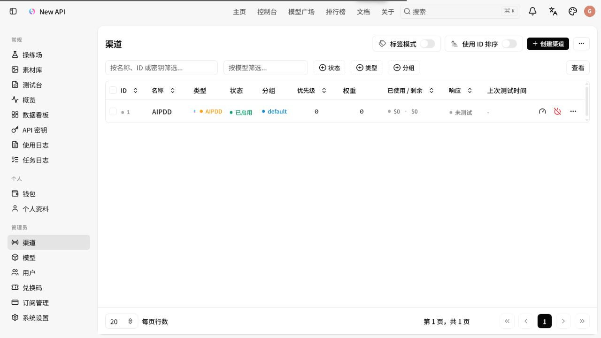
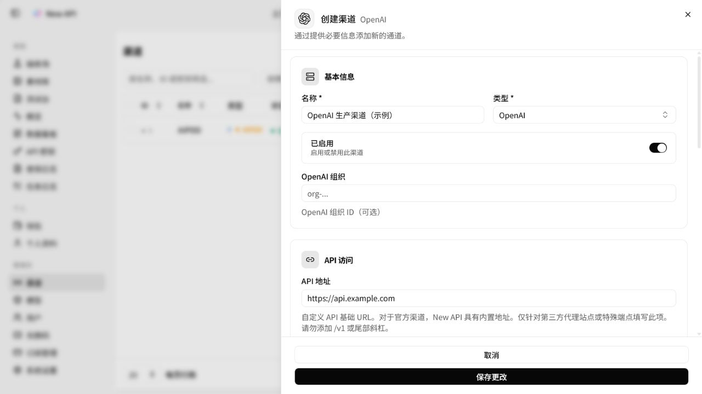
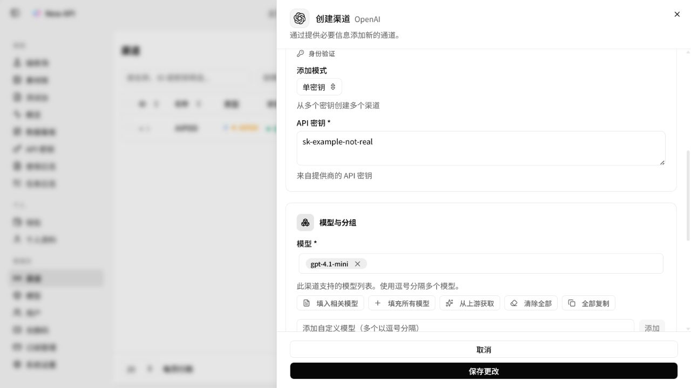
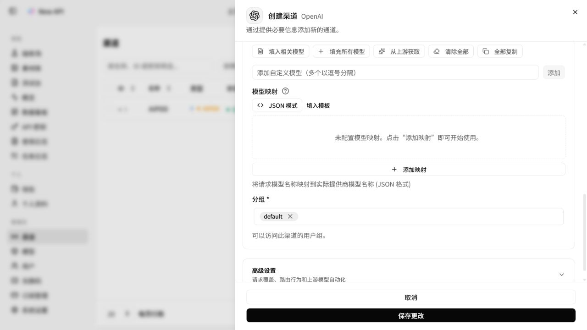
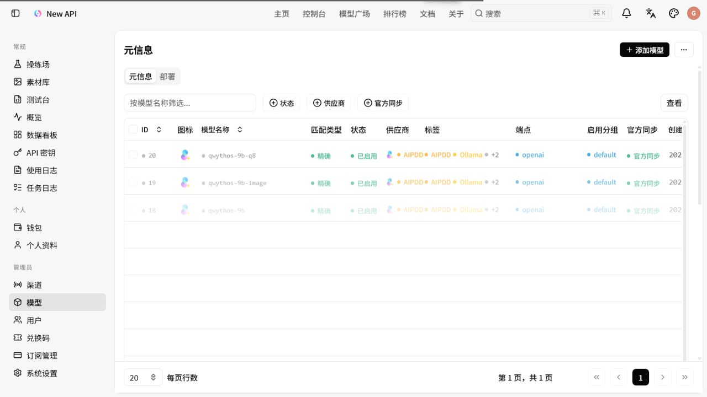
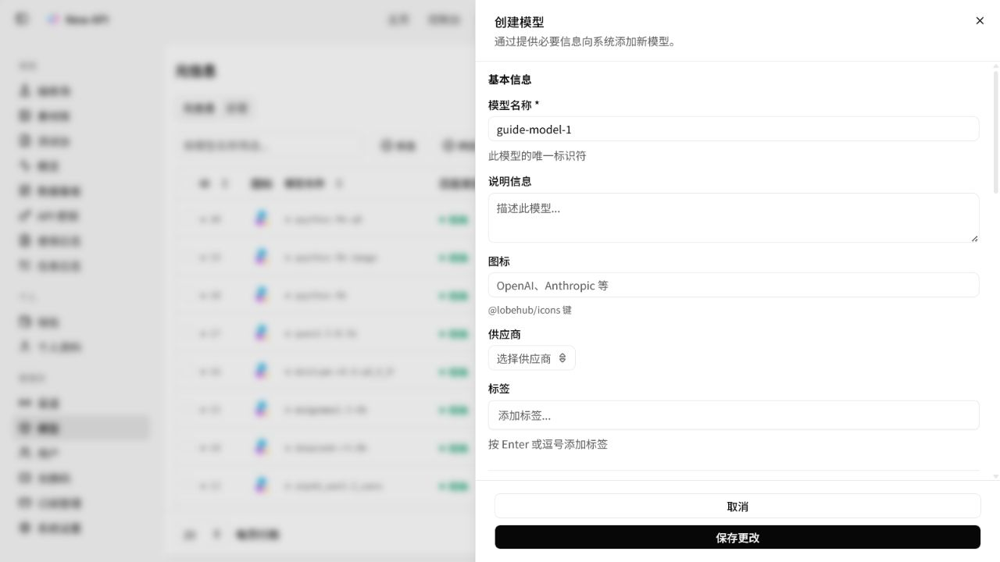
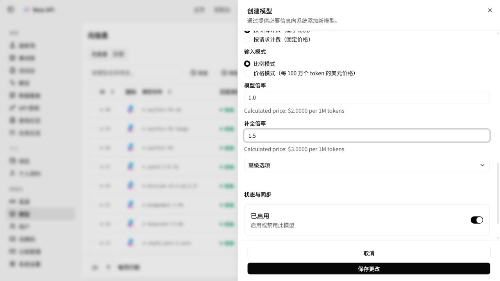
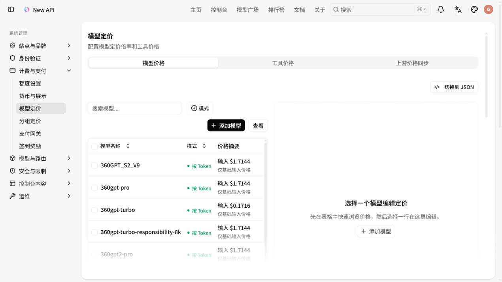
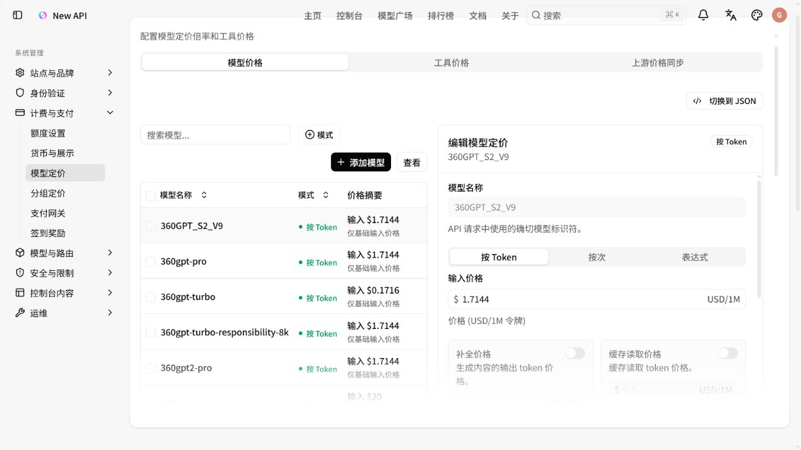
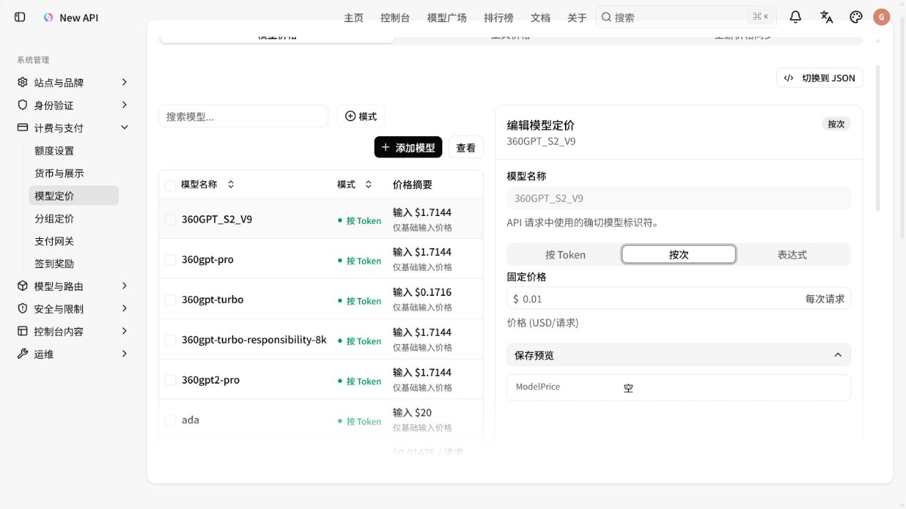

# New API 管理员用户手册

> 适用范围：管理员日常配置渠道、添加模型、设置端点、调整价格和排查调用问题。
>
> 截图基于当前版本后台生成。截图中的 `api.example.com` 和 `sk-example-not-real` 都是示例占位值，不是真实上游地址或密钥。

## 1. 配置模型前先理解三层关系

一个模型能正常调用，通常需要同时完成下面三层配置：

| 配置层 | 负责什么 | 典型入口 |
| --- | --- | --- |
| 渠道 | 连接上游供应商，配置 Base URL、API Key、分组和该渠道支持的模型 | 管理员 → 渠道 |
| 模型元信息 | 定义平台识别的模型名称、匹配规则、供应商、端点和状态 | 管理员 → 模型 → 元信息 |
| 模型定价 | 定义按 Token、按次或表达式计费规则 | 管理员 → 系统设置 → 计费与支付 → 模型定价 |

建议的完整流程是：

1. 创建渠道并填入上游信息。
2. 在渠道的“模型”区域加入对外暴露的模型名。
3. 在“模型 → 元信息”中补齐模型端点和状态。
4. 在“系统设置 → 模型定价”中配置价格。
5. 用“测试连接”、操练场或普通用户 API Key 验证请求。

## 2. 登录和权限

只有管理员可以进入“渠道”和“模型”页面。模型价格、分组价格等系统设置通常需要更高的管理员权限；如果看不到“模型定价”，请让超级管理员执行配置或调整权限。

后台左侧常用入口如下：

- **渠道**：管理上游供应商连接和路由。
- **模型**：管理模型元信息和端点。
- **系统设置**：管理计费、分组、全局模型行为等。
- **使用日志 / 任务日志**：查看请求、错误、耗时和扣费结果。

## 3. 创建渠道

### 3.1 打开创建页面

进入 **管理员 → 渠道**，点击右上角 **创建渠道**。



### 3.2 填写基本信息和 API 访问

在“基本信息”中填写：

1. **名称**：填写便于识别的名称，例如“OpenAI 生产渠道”。
2. **类型**：选择对应的供应商适配器，例如 OpenAI、Claude、Gemini、AIPDD、Ollama 等。
3. **已启用**：新渠道一般保持开启；暂时停用时可关闭，不必删除。
4. **API 地址**：官方渠道可以留空使用内置地址；第三方代理或自建兼容接口填写上游 Base URL。
5. **API 密钥**：填写上游供应商发放的 Key。生产环境不要把 Key 写进截图、文档、工单或聊天记录。



API 地址注意事项：

- 不要填写 `/v1` 结尾；New API 会根据渠道适配器拼接接口路径。
- 不要带尾部 `/`。
- 地址必须是当前服务器能够访问的地址；浏览器能打开不代表服务器能访问。
- 如果供应商要求特殊请求头或代理，再使用“高级设置”配置，不要直接修改业务请求内容。

### 3.3 添加渠道模型和分组

在“模型与分组”区域添加模型：

1. 在模型选择框中选择已有模型，或在“添加自定义模型”输入模型名后点击 **添加**。
2. 多个模型可以连续添加；模型名必须与用户请求中的 `model` 值一致。
3. 如果用户请求名和上游真实模型名不同，保留稳定的对外名称，使用“模型映射”处理差异。
4. **分组**决定哪些用户或令牌可以使用该渠道。最常见的是 `default`；如果用户所在分组不在这里，请求会找不到可用渠道。



模型映射示例：

```json
{
  "gpt-4.1-mini": "上游真实模型名",
  "doubao-seedance-2.0": "doubao-seedance-2-0-260128"
}
```

左侧是平台对外模型名，右侧是上游供应商实际接受的模型名。只有两者不一致时才需要配置映射。

### 3.4 高级设置

“高级设置”用于请求覆盖、路由行为、优先级、权重、代理、标签和上游模型自动同步等场景。



常用建议：

- **优先级 / 权重**：有多个渠道提供同一模型时，用于影响路由顺序和分流比例；调整后应重新测试。
- **标签 / 备注**：建议写环境、区域或供应商用途，例如 `prod-cn`、`backup`。
- **参数覆盖**：只放确定不会改变用户业务意图的通用参数。不要固定 `prompt`、`content`、`image`、`audio`、`video` 或用户的 `model`。
- **模型自动同步**：供应商支持拉取模型列表时可以使用；同步后仍要检查端点和价格。

填写完成后点击 **保存更改**。保存后回到渠道列表，确认渠道状态为“已启用”，模型和分组显示正确。

## 4. 添加模型元信息

### 4.1 创建模型

进入 **管理员 → 模型 → 元信息**，点击右上角 **添加模型**。



在“基本信息”中填写：

1. **模型名称**：填写用户 API 请求中使用的确切名称，例如 `gpt-4.1-mini`。
2. **说明信息**：可选，用于后台识别和维护。
3. **图标 / 供应商 / 标签**：可选，但建议填写供应商和用途标签。
4. **名称规则**：
   - 完全匹配：只匹配一个明确模型名，最稳妥。
   - 前缀匹配：适合一组带版本后缀的模型。
   - 包含匹配 / 后缀匹配：适用于明确知道命名规律的场景，使用前注意避免误匹配。



### 4.2 配置端点

端点必须和用户实际调用接口一致，常见对应关系如下：

| 模型能力 | 端点类型 | 常用接口 |
| --- | --- | --- |
| 聊天 / 文本生成 | `openai` 或对应聊天端点 | `/v1/chat/completions` |
| 文生图 / 图生图 | `image-generation` | `/v1/images/generations` |
| 文生视频 / 图生视频 | `openai-video` | `/v1/videos` |
| 文本转语音 / 语音任务 | `audio-speech` | `/v1/audio/speech` |

可以使用端点模板或点击“添加行”逐项配置；如果使用 JSON 模式，优先使用页面提供的模板，不要凭经验拼写字段。

端点配置完成后，检查模型是否为“已启用”。“官方同步”只表示是否参与官方模型同步，不等于渠道是否可用。

创建模型表单底部也可以填写初始价格和倍率；如果需要批量维护多个模型，建议创建完成后统一在“模型定价”页面核对一次。



### 4.3 渠道模型和模型元信息必须同时存在

只在“模型”页面创建元信息，并不会自动让某个渠道提供该模型；同样，只在渠道里填模型名，也可能缺少端点、状态或定价。

遇到 `model_not_found` 时，按下面顺序检查：

1. 渠道是否已启用。
2. 渠道模型列表是否包含请求中的模型名。
3. 用户或令牌所在分组是否包含在渠道分组中。
4. 模型元信息是否已创建且状态为启用。
5. 端点类型是否与实际 API 接口匹配。

## 5. 调整模型价格

### 5.1 进入模型定价

进入 **管理员 → 系统设置 → 计费与支付 → 模型定价**。



左侧是模型列表，右侧是所选模型的价格编辑器。点击一个模型后，右侧会出现“按 Token”“按次”“表达式”三个模式。

### 5.2 按 Token 计费

适合聊天、文本生成和按输入输出 Token 计费的模型：

1. 选择 **按 Token**。
2. 设置“输入价格”，单位是 **USD / 1M tokens**。
3. 根据供应商价格打开并填写“补全价格”“缓存读取价格”“缓存写入价格”“图像输入价格”“音频输入价格”等通道。
4. 不使用的价格通道保持关闭；关闭的通道保存时会被省略。
5. 查看“保存预览”，确认输入、输出、缓存和多模态价格符合预期。



注意：输入价格和补全价格不是“倍率”。这里直接填写供应商公开的美元单价，单位为每 100 万 Token。分组价格还会在此基础上叠加分组倍率。

### 5.3 按次计费

适合图片、视频、语音、异步任务等固定成本模型：

1. 选择 **按次**。
2. 在“固定价格”中填写单次请求价格。
3. 确认单位为 **USD / 每次请求**。
4. 点击 **更新**，再点击页面底部 **保存模型价格**。



即使模型免费，也建议显式填写 `0`，避免出现模型存在但“扣费规则不存在”的情况。

### 5.4 表达式计费

“表达式”适合长上下文阶梯价、缓存单独定价、图片/音频分开计费或按请求参数计算价格的场景。表达式系统的详细变量、函数、归一化和结算规则见 [billing expression 说明](../../pkg/billingexpr/expr.md)。

常见的基础表达式示例：

```text
tier("base", p * 2.5 + c * 15)
```

其中 `p` 是输入 Token，`c` 是输出 Token，系数是实际的 USD / 1M Token 价格。涉及长上下文时，阶梯条件建议使用 `len`，不要使用会因缓存拆分而变化的 `p`。

切换计费模式前先确认旧模式的字段。当前界面会提示模型同时存在固定价格和 Token 价格时，保存新模式可能重写冲突字段。

## 6. 分组价格和可见范围

如果不同用户组需要不同价格：

1. 进入 **系统设置 → 计费与支付 → 分组定价**。
2. 配置分组倍率、用户可用分组和分组之间的价格规则。
3. 回到渠道，确认渠道的“分组”包含目标用户组。
4. 用目标用户组的普通用户 Token 验证价格和可用模型。

要区分两个概念：

- **渠道分组**控制用户能不能走这条上游路由。
- **分组定价**控制用户走这条路由时如何计算价格。

## 7. 常用维护操作

### 7.1 暂停或恢复渠道

在 **渠道**列表中，使用行内“禁用 / 启用”操作。建议上游故障、密钥过期或维护时先禁用渠道，恢复后再启用；这样可以保留原配置和历史记录。

### 7.2 测试渠道

在渠道行中点击 **测试连接**。测试前确认：

- API 地址没有多余 `/v1` 或尾部 `/`。
- API Key 没有复制空格或换行。
- 渠道模型列表中包含测试模型。
- 测试服务器能访问上游域名。

任务型图片、视频、语音模型的“测试连接”不一定能代表完整任务链路。此类模型还应使用普通用户 Token 在操练场或真实测试请求中验证提交、轮询和结果解析。

### 7.3 修改模型名称

模型名称会被用户写入 API 请求。修改名称前要同步检查：

- 所有渠道的模型列表。
- 模型映射的左侧键。
- 模型定价表中的模型名。
- 用户端 SDK、示例代码和文档。

如果只是上游名称变化，优先修改模型映射的右侧值，不要改对外模型名。

### 7.4 查看请求和扣费

验证完成后进入 **使用日志** 或 **任务日志**，重点看：

- 请求模型名和接口路径。
- 命中的渠道、响应状态和耗时。
- 输入 / 输出 Token 或任务计费类型。
- 扣费金额、分组和错误信息。

日志验证应使用普通用户 API Key；不要在测试请求中暴露管理员密码或上游供应商 Key。

## 8. 上线前检查清单

- [ ] 渠道类型选择正确，API 地址可由服务端访问。
- [ ] API Key 已填写且没有多余空格、换行。
- [ ] 渠道状态为“已启用”。
- [ ] 渠道模型列表包含对外模型名。
- [ ] 渠道分组包含目标用户或令牌分组。
- [ ] 模型元信息存在且状态为“已启用”。
- [ ] 端点类型与请求接口一致。
- [ ] 上游模型名不同的场景已使用模型映射。
- [ ] 按 Token、按次或表达式价格已配置，免费模型也显式填 `0`。
- [ ] 未使用参数覆盖固定用户业务输入。
- [ ] 已用普通用户 Token 完成一次真实请求或任务链路测试。
- [ ] 已在使用日志 / 任务日志中确认请求和扣费结果。

## 9. 常见问题速查

| 现象 | 优先检查 | 处理方式 |
| --- | --- | --- |
| `model_not_found` | 渠道模型、用户分组、模型状态 | 同时补齐渠道模型列表、模型元信息和分组权限 |
| `扣费规则不存在` | 模型定价 | 按次模型补固定价格；Token 模型补输入价格和需要的通道 |
| `invalid_endpoint` | 模型端点 | 聊天、图片、视频、语音分别使用对应端点 |
| `Field required` | 任务模型必填字段 | 按模型要求补 `prompt`、图片、视频、音频或其他输入 |
| 上游返回 401 / 403 | API Key、权限、Base URL | 重新确认 Key 权限和地址，不要先改参数覆盖 |
| 能看到模型但请求失败 | 渠道是否启用、分组是否匹配 | 检查渠道状态、渠道分组和用户 Token 分组 |
| 价格不符合预期 | 模型价格模式、分组倍率、币种设置 | 检查是否混用了 Token 单价、固定单价和分组倍率 |

---

维护建议：新增模型时保留“对外模型名”稳定，把供应商版本变化放在渠道映射或同步配置中；调整价格后保留一次日志记录，便于后续核对计费变化。
