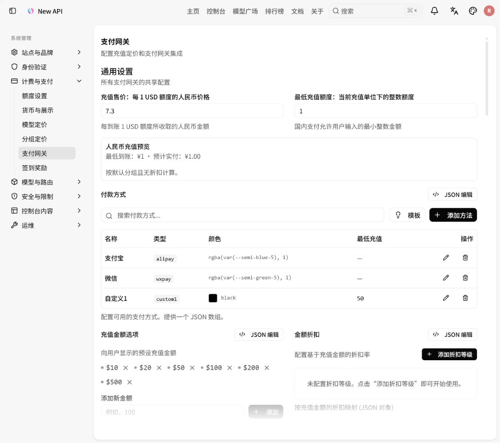
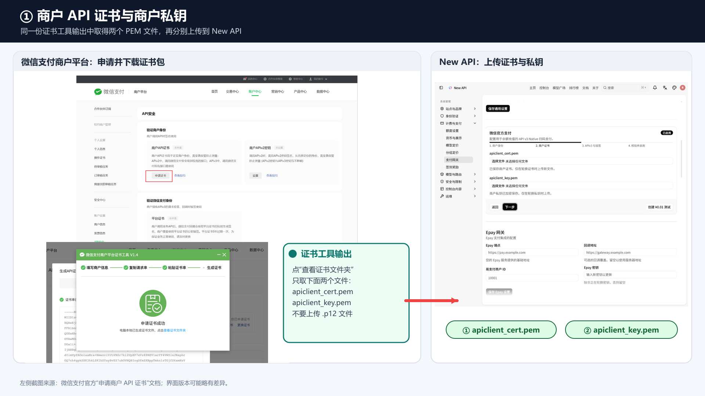
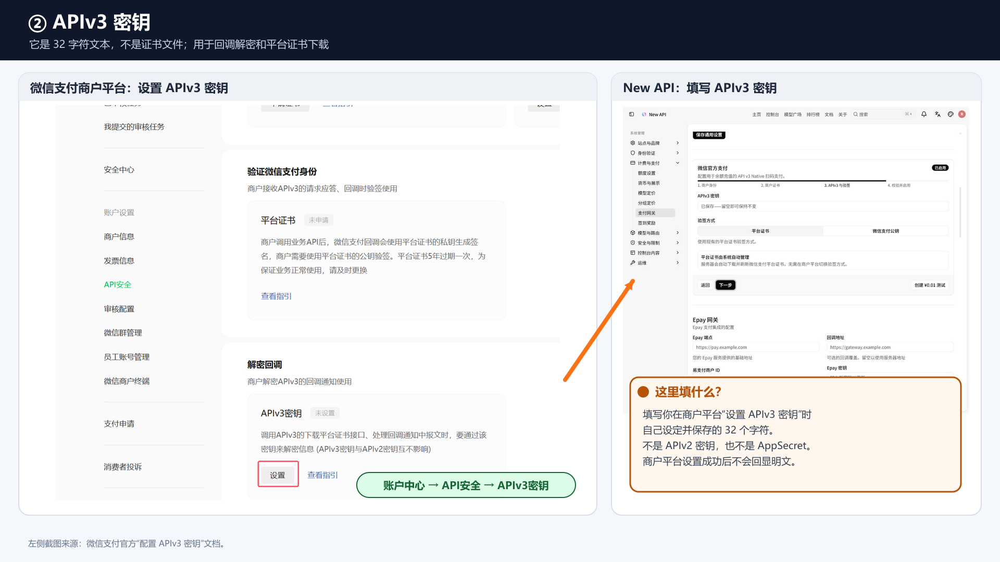
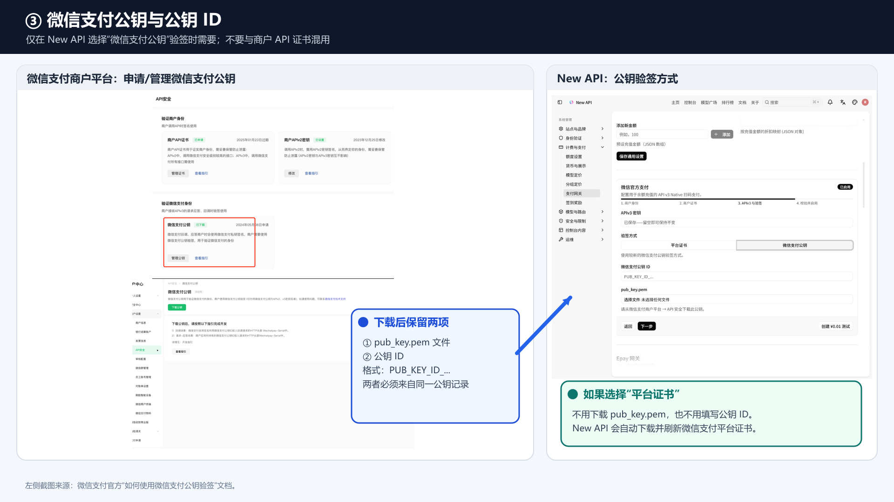

# New API 管理员配置微信官方支付教程

> 适用范围：New API 管理员为用户余额充值配置微信支付 API v3 Native 扫码支付。
>
> 本教程已按 `https://newapi.aipdd.work/` 在 2026-07-26 部署的后台界面逐项核对。实际入口、按钮和字段名称以该版本为准。文中的 AppID、商户号、密钥和证书名称仅用于说明，请勿把真实敏感凭据写入文档、截图、工单或聊天记录。

## 1. 配置完成后的效果

配置成功后，普通用户进入 **钱包 → 添加资金**，会看到 **微信支付（官方）**：

1. 用户选择或输入充值金额。
2. 系统通过微信支付 API v3 Native 接口创建订单。
3. 页面展示微信支付二维码。
4. 用户使用微信扫码并完成付款。
5. 系统收到微信支付回调并核对订单后，自动增加用户额度。

微信官方支付是独立的官方渠道，不依赖 Epay。首次启用前必须完成一次真实的 `¥0.01` 支付测试。

## 2. 配置前准备

### 2.1 New API 服务器侧

开始前确认以下条件：

- 使用管理员或超级管理员账号登录 New API。
- New API 已通过公网 HTTPS 域名访问，HTTPS 证书有效。
- **系统设置 → 站点与品牌 → 系统信息 → 服务器地址** 已填写公开访问地址，例如：

  ```text
  https://newapi.aipdd.work
  ```

- 服务器能够访问微信支付 API：

  ```text
  https://api.mch.weixin.qq.com
  ```

- 部署环境已设置固定的 `CRYPTO_SECRET`，长度至少为 32 个字符。
- 反向代理、CDN 和 WAF 允许微信支付向回调地址发送 `POST` 请求。

当前部署页面生成的回调地址为：

```text
https://newapi.aipdd.work/api/wechat-pay/notify
```

其他部署会按下面的规则生成：

```text
<服务器地址>/api/wechat-pay/notify
```

服务器地址必须使用 `https://`，不要携带查询参数或 `#` 片段。反向代理必须原样转发请求体和 `Wechatpay-*` 请求头，不要给回调路径增加登录、验证码、重定向或响应体改写。

### 2.2 固定 `CRYPTO_SECRET`

New API 使用 `CRYPTO_SECRET` 加密保存商户证书、商户私钥和 APIv3 密钥。如果页面提示 **CRYPTO_SECRET 未就绪**，请先让运维人员在部署环境中配置它，再重启服务。

可以生成一个随机值：

```bash
openssl rand -hex 32
```

建议把结果保存到密钥管理系统或仅服务器可读的环境文件中，再由 Docker Compose 引用：

```yaml
environment:
  CRYPTO_SECRET: "${CRYPTO_SECRET}"
```

注意：

- 不要把真实值提交到 Git 仓库。
- 所有 New API 实例必须使用完全相同的值。
- 保存支付凭据后不要随意更换或丢失该值，否则已有密文将无法解密，只能重新上传全部支付凭据。

### 2.3 微信支付商户侧

本功能使用普通商户的 API v3 Native 支付。请在微信支付商户平台准备以下内容：

| 材料 | 在 New API 中的用途 | 要求 |
| --- | --- | --- |
| AppID | 商户身份 | 必须已经与商户号绑定；不要填写 AppSecret |
| 商户号 `mchid` | 商户身份 | 6～32 位数字 |
| `apiclient_cert.pem` | 商户 API 证书 | 必须处于有效期内 |
| `apiclient_key.pem` | 商户 API 证书私钥 | 必须与 `apiclient_cert.pem` 配对 |
| APIv3 密钥 | 解密回调、下载平台证书 | 正好 32 个字符；不是 APIv2 密钥 |
| 微信支付公钥 ID | 公钥验签时使用 | 以 `PUB_KEY_ID_` 开头，仅公钥验签方式需要 |
| `pub_key.pem` | 公钥验签时使用 | 必须是 `PUBLIC KEY` 格式，仅公钥验签方式需要 |

先把几个容易混淆的名称认清：

| 名称 | 它是什么 | 从哪里获得 | 在 New API 中填哪里 |
| --- | --- | --- | --- |
| `apiclient_cert.pem` | 商户 API 证书 | 商户平台申请商户 API 证书后，由官方证书工具生成 | 第 2 步的 `apiclient_cert.pem` |
| `apiclient_key.pem` | 与商户 API 证书配套的商户私钥 | 与上面的证书由同一次证书工具流程生成，只保存在操作电脑的证书文件夹 | 第 2 步的 `apiclient_key.pem` |
| APIv3 密钥 | 自己设置的 32 字符文本，不是文件 | 商户平台 → 账户中心 → API 安全 → APIv3 密钥 | 第 3 步的 **APIv3 密钥** |
| `pub_key.pem` | 微信支付公钥文件 | 商户平台 → 账户中心 → API 安全 → 微信支付公钥 → 下载公钥 | 选择“微信支付公钥”后上传 |
| 微信支付公钥 ID | 和 `pub_key.pem` 配套的标识 | 下载或管理微信支付公钥时记录，格式为 `PUB_KEY_ID_...` | 选择“微信支付公钥”后填写 |
| 微信支付平台证书 | 微信支付用来签名应答和回调的平台证书 | 选择“平台证书”时由 New API 自动下载和刷新 | 不需要手工下载或上传 |

常用获取路径：

- **商户号**：微信支付商户平台 → 账户中心 → 商户信息。
- **AppID 绑定关系**：在商户平台查看商户号已绑定的 AppID；未绑定时先完成绑定。
- **商户 API 证书**：账户中心 → API 安全 → 商户 API 证书。使用官方证书工具申请并下载证书包。
- **APIv3 密钥**：账户中心 → 账户设置 → API 安全 → APIv3 密钥。设置后通常无法回看，请安全保管。
- **微信支付公钥**：账户中心 → API 安全 → 申请或管理公钥。下载 `pub_key.pem` 并记录公钥 ID。

不要上传 `apiclient_cert.p12`。New API 页面需要证书包中的 `apiclient_cert.pem` 和 `apiclient_key.pem`。

## 3. 进入支付设置页面

登录 New API 后，按下面的路径进入：

1. 在左侧管理员菜单点击 **系统设置**。
2. 展开 **计费与支付**。
3. 点击 **支付网关**。
4. 找到 **微信官方支付** 卡片。



该卡片说明为：

```text
配置用于余额充值的 API v3 Native 扫码支付。
```

配置向导共有四步：

```text
1. 商户身份
2. 商户证书
3. APIv3 与验签
4. 校验并启用
```

## 4. 先核对通用充值设置

微信官方支付会使用本页顶部的通用充值规则。在填写微信凭据前，先检查：

### 4.1 充值售价

**充值售价：每 1 USD 额度的人民币价格** 表示用户获得每 `1 USD` 额度时需要支付的人民币金额。

例如填写 `7.3`，代表在默认分组、无折扣时，获得 `1 USD` 额度需要支付 `¥7.30`。页面上的 **人民币充值预览** 会显示最低到账额度和预计实付金额。

### 4.2 最低充值额度

**最低充值额度：当前充值单位下的整数额度** 决定国内支付允许用户输入的最小整数金额。

### 4.3 充值金额选项和折扣

- **充值金额选项**：控制钱包页显示的预设金额。
- **金额折扣**：按充值金额配置折扣率。
- 修改后先点击 **保存通用设置**。

### 4.4 “微信 wxpay”与官方微信支付的区别

通用设置中付款方式列表里的 `wxpay` 是 Epay 聚合微信支付方式，不是本教程配置的官方直连渠道。

微信官方支付启用后，系统会自动向钱包页添加 **微信支付（官方）**，不需要手动添加 `wechat_native`。默认情况下，官方渠道会替代并隐藏 Epay 的 `wxpay`；如果确实需要同时展示两个入口，可在向导第 4 步开启 **同时显示 Epay 微信支付**。

## 5. 按四步向导填写

### 5.1 第 1 步：商户身份

填写：

1. **AppID**：填写已经绑定到该商户号的公众号、小程序或开放平台 AppID。
2. **商户 ID**：填写微信支付商户号 `mchid`。
3. 点击 **下一步**。

注意：

- AppID 不能包含空格，长度不能超过 32 个字符。
- 商户号必须是 6～32 位数字。
- AppID 和商户号不是同一个值。
- AppID 必须已和该商户号建立绑定关系，否则后面的 Native 预下单会失败。

### 5.2 第 2 步：商户证书

上传证书包中的两个 PEM 文件：

1. 在 **apiclient_cert.pem** 上传商户 API 证书。
2. 在 **apiclient_key.pem** 上传与证书配套的商户私钥。
3. 点击 **下一步**。



保存时系统会检查：

- 证书能否解析。
- 证书是否已经生效且未过期。
- 证书是否为 RSA 证书。
- 私钥能否解析。
- 证书公钥和私钥是否匹配。

如果页面显示“已保存商户证书”或“商户私钥已加密保存”，表示已有配置。日常查看或修改其他字段时不要重复上传；只有轮换证书时才上传新文件。轮换时应同时上传配套的新证书和新私钥。

### 5.3 第 3 步：APIv3 与验签

#### 填写 APIv3 密钥

在 **APIv3 密钥** 中填写商户平台设置的 32 字符密钥。

- 必须正好是 32 个字节。建议使用微信商户平台支持的数字和大小写字母组合。
- 这不是 APIv2 密钥，也不是 AppSecret。
- 已保存时页面会显示“已保存——留空即可保持不变”。不轮换密钥时应保持为空。



#### 选择验签方式

当前版本提供两种方式：

| 验签方式 | 还需填写什么 | 适用说明 |
| --- | --- | --- |
| **平台证书** | 无 | New API 自动下载并刷新微信支付平台证书；无需在后台上传平台证书 |
| **微信支付公钥** | 微信支付公钥 ID、`pub_key.pem` | 微信支付官方推荐的新方式；公钥 ID 必须以 `PUB_KEY_ID_` 开头 |



选择 **微信支付公钥** 时：

1. 填写 **微信支付公钥 ID**。
2. 上传对应的 `pub_key.pem`。
3. 确保文件内容头部是 `-----BEGIN PUBLIC KEY-----`，不要误传商户证书或商户私钥。

选择 **平台证书** 时，页面会提示平台证书由系统自动管理。此时不需要填写公钥 ID，也不需要上传 `pub_key.pem`。

选择完成后点击 **下一步**。

### 5.4 第 4 步：校验并启用

页面会显示自动生成的 **回调 URL**。先确认它：

- 使用公网 HTTPS。
- 域名与实际部署一致。
- 路径为 `/api/wechat-pay/notify`。
- 没有经过登录页、验证码或重定向。

页面还有两个开关：

- **启用微信官方支付**：控制是否允许创建新的官方微信支付订单。
- **同时显示 Epay 微信支付**：是否在官方入口之外继续显示 Epay 的 `wxpay` 入口。

首次配置时，**启用微信官方支付** 会保持关闭且暂时不可开启，这是正常现象。正确顺序是：

1. 保持 **启用微信官方支付** 关闭。
2. 根据需要设置 **同时显示 Epay 微信支付**。
3. 点击 **校验并保存**。
4. 等待页面提示微信支付配置已保存并通过格式校验。
5. 完成下一节的 `¥0.01` 真实支付测试。
6. 测试成功后打开 **启用微信官方支付**。
7. 再次点击 **校验并保存**。

第一次“校验并保存”只证明 AppID、商户号、证书、私钥、APIv3 密钥、公钥和回调地址在本地校验中有效，不代表真实支付链路已经打通。

## 6. 完成 ¥0.01 真实支付测试

首次保存成功后，点击 **创建 ¥0.01 测试**：

1. 系统创建一笔真实的 `¥0.01` Native 支付测试订单。
2. 页面显示微信支付二维码。
3. 使用微信扫码并实际支付 `¥0.01`。
4. 保持二维码窗口打开，等待系统查询或接收回调。
5. 支付成功后，配置状态会显示 **真实支付验证：已验证**。

注意：

- 这是实际发生的 `¥0.01` 微信支付交易，不是模拟请求。
- 测试订单只用于验证配置，不会给任何 New API 用户增加余额。
- 测试订单有效期约为 10 分钟；过期后重新创建。
- 不要连续创建多个测试订单。页面会优先复用仍有效的待支付测试单。
- 如果二维码已支付但页面长时间没有变为“已验证”，按第 9 节检查回调、验签和查单链路。

完成测试后：

1. 返回第 4 步。
2. 打开 **启用微信官方支付**。
3. 点击 **校验并保存**。
4. 卡片顶部状态应显示 **已启用**。

## 7. 用普通用户做上线验收

启用后使用普通用户账号验收：

1. 进入 **钱包 → 添加资金**。
2. 确认付款方式中出现 **微信支付（官方）**。
3. 选择一个较小的正式充值金额。
4. 点击 **继续充值**。
5. 扫码完成支付。
6. 确认二维码窗口显示支付成功。
7. 检查钱包余额和订单历史是否更新。
8. 在微信支付商户平台核对商户订单号、金额和支付状态。

验收时必须使用正式充值订单，不能用 `¥0.01` 配置测试代替余额入账测试，因为配置测试不会给用户增加额度。

## 8. 日常维护和凭据轮换

### 8.1 停用支付

关闭 **启用微信官方支付** 并保存后：

- 系统会阻止创建新的微信官方支付订单。
- 已经创建的订单回调仍会继续处理，避免已付款订单无法入账。

### 8.2 更换证书、密钥或商户身份

以下内容发生变化时，系统会把原来的真实支付验证状态清除：

- AppID。
- 商户号。
- 商户证书或商户私钥。
- APIv3 密钥。
- 验签方式。
- 微信支付公钥 ID 或 `pub_key.pem`。

轮换顺序：

1. 先关闭官方微信支付，尽量避免产生新订单。
2. 等待未完成订单支付成功或过期。普通充值订单有效期约为 15 分钟。
3. 上传或填写新凭据。
4. 点击 **校验并保存**。
5. 重新完成 `¥0.01` 真实支付测试。
6. 再次启用并保存。
7. 用小额正式充值重新验收。

如果系统提示存在未过期的微信支付订单，必须等待订单完成或过期后再更换关键凭据。这样可以避免旧订单回调到达时无法使用原凭据验签或解密。

### 8.3 退款

当前版本不会在微信商户平台退款后自动回收用户已经到账的 New API 额度。处理正式充值退款时，管理员必须同时核对用户已经消耗的额度，并按平台财务流程人工调整余额。不要把退款通知当作充值成功通知处理。

## 9. 常见问题排查

| 现象或错误 | 检查方法 |
| --- | --- |
| 页面提示 `CRYPTO_SECRET` 未就绪 | 配置至少 32 个字符的固定 `CRYPTO_SECRET`，重启服务；多实例必须一致 |
| **校验并保存**按钮不可用 | 通常是 `CRYPTO_SECRET` 未配置；先处理页面顶部红色提示 |
| AppID 格式不正确 | 去掉前后空格，确认没有换行，长度不超过 32 个字符 |
| 商户号应为 6 到 32 位数字 | 填写商户号 `mchid`，不要填写 AppID、商户名称或银行卡号 |
| APIv3 Key 必须正好是 32 个字节 | 重新核对 APIv3 密钥；不要填 APIv2 密钥、AppSecret 或复制到隐藏空格 |
| 无法解析 `apiclient_cert.pem` | 确认上传的是证书包中的 PEM 证书，不是 `.p12`、私钥或微信支付公钥 |
| 无法解析 `apiclient_key.pem` | 确认上传的是证书工具生成的商户私钥 PEM，且文件未被编辑破坏 |
| 证书与私钥不匹配 | 同时上传同一证书包中的 `apiclient_cert.pem` 和 `apiclient_key.pem` |
| 商户 API 证书尚未生效或已经过期 | 在商户平台检查证书有效期，申请新证书后按轮换流程更换 |
| 微信支付公钥 ID 格式不正确 | 使用商户平台显示的完整 ID，必须以 `PUB_KEY_ID_` 开头 |
| `pub_key.pem` 必须是 `PUBLIC KEY` 格式 | 检查文件头为 `-----BEGIN PUBLIC KEY-----`，不要上传证书或商户私钥 |
| 回调地址必须使用 HTTPS | 在系统信息中配置正确的公网 HTTPS 服务器地址，并检查反向代理协议头 |
| 微信支付预下单失败 | 核对 AppID 与商户号绑定、Native 支付权限、商户证书、APIv3 密钥、服务器出网和系统时间；再查看服务端日志中的微信支付错误 |
| `¥0.01` 已支付但仍未验证 | 检查微信能否访问回调 URL、WAF 是否拦截 `POST`、代理是否保留请求体与 `Wechatpay-*` 请求头；同时检查服务器查单是否能访问微信 API |
| 无法打开“启用微信官方支付” | 必须先保存配置并完成 `¥0.01` 真实支付测试 |
| 钱包页没有“微信支付（官方）” | 确认配置状态为已验证、已启用且无错误；刷新钱包页后重试 |
| 修改凭据时提示存在未过期订单 | 等待订单支付完成或过期，普通充值订单最长约 15 分钟 |
| 已保存的密钥或私钥没有回显 | 这是正常的安全行为；不轮换时保持输入框为空即可保留原值 |

不要通过浏览器直接访问回调 URL 来判断它是否正常。该地址只接受微信支付发送的合法通知，手工 `GET` 或伪造 `POST` 失败是正常现象。应使用页面提供的 `¥0.01` 测试验证真实链路。

## 10. 安全检查清单

上线前逐项确认：

- [ ] AppID 已与商户号绑定。
- [ ] 商户已具备 Native 支付能力。
- [ ] 商户 API 证书有效，证书与私钥匹配。
- [ ] APIv3 密钥正好为 32 个字符并已安全备份。
- [ ] 如使用微信支付公钥，公钥 ID 与 `pub_key.pem` 对应。
- [ ] `CRYPTO_SECRET` 已固定配置、妥善备份，所有实例保持一致。
- [ ] 服务器地址使用公网 HTTPS。
- [ ] 回调路径不经过登录、验证码、重定向或内容改写。
- [ ] 反向代理保留原始请求体和 `Wechatpay-*` 请求头。
- [ ] `¥0.01` 真实支付测试显示“已验证”。
- [ ] 已开启“启用微信官方支付”并再次保存。
- [ ] 普通用户钱包页出现“微信支付（官方）”。
- [ ] 小额正式充值能够正确增加用户额度。
- [ ] 已制定退款后的人工额度核对流程。

## 11. 微信支付官方参考资料

- [开发必要参数说明](https://pay.wechatpay.cn/doc/v3/merchant/4013070756)
- [申请商户 API 证书](https://pay.wechatpay.cn/doc/v3/merchant/4012072428)
- [配置 APIv3 密钥](https://pay.wechatpay.cn/doc/v3/merchant/4012072195)
- [如何使用微信支付公钥验签](https://pay.wechatpay.cn/doc/v3/merchant/4013053249)
- [Native 下单](https://pay.wechatpay.cn/doc/v3/merchant/4012791877)
- [APIv3 概述](https://pay.wechatpay.cn/doc/v3/merchant/4012081606)
