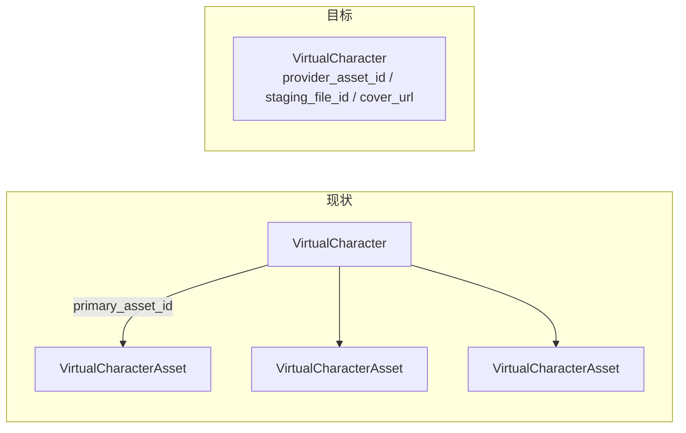

# 虚拟角色数据结构收敛为单图

## 概述

取消 `VirtualCharacterAsset` 独立表，把素材字段并回 `VirtualCharacter` 本体，使「一个角色 = 一张图」在数据结构层面直接成立；同时清理相关 API、轮询、清理任务与前端。

## 目标

一个角色就是一条记录，图片信息直接长在角色上；不再有「主素材 / 挂靠素材」概念。



## 任务清单

1. 合并素材字段进 `VirtualCharacter`，重写角色级 model 函数，去掉 `VirtualCharacterAsset`
2. 一次性迁移：主素材回填角色、非主素材入清理队列、删除旧表
3. 重写 controller 响应与上传/预览路径，删除多素材路由与 option
4. 去掉 `character_asset_id` 绑定链路与任务快照冗余字段
5. 轮询与清理改为角色级，简化 catalog 同步
6. 前端类型/API/组件收敛为单图，去掉素材管理 UI
7. 更新 Go 测试、同步 i18n、跑 typecheck 与 go build

## 一、数据模型（[`model/virtual_character.go`](../model/virtual_character.go)）

`VirtualCharacter` 增加素材字段，删除中间层与历史废弃字段：

### 新增

- `ProviderAssetID string`（`varchar(191)`，index）— 火山 asset id，替代 `VirtualCharacterAsset.ProviderAssetID`
- `StagingFileID string` — AIPDD 暂存文件，供 preview
- `AssetPollAttempts int` / `AssetNextPollAt int64`（index）— 异步转 Active 的轮询状态

### 复用已有

- `CoverURL`、`MimeType`、`FileSize`、`LastError`、`ProviderAccountID`、`ProviderGroupID`

### 删除

生产新链路不再读写；角色表中的 DB 旧列可留着不动，不做 DROP COLUMN 以保证三库兼容（一次性迁移仍通过 deprecated 字段读取）：

- `PrimaryAssetID`
- `VolcAssetID`、`AIPDDAssetID`、`AIPDDFileID`、`PublicChannelID`（deprecated；仅一次性迁移读取）

同时删除 `VirtualCharacterAsset` 结构体与 `VirtualCharacterAssetType*` 中的 Video/Audio 常量（只保留 Image 校验路径）；`VirtualCharacterAssetStatus*` 不再需要，角色状态机直接表达：

- `creating` — 已建 Group + 已提交 CreateAsset，等待 Volc 转 Active
- `active` — 可用于生成
- `failed` / `deleting` / `offline` / `blocked` — 同现状

`VirtualCharacterTask` 去掉 `CharacterAssetID`、`CharacterAssetName`，仅保留 `ProviderAssetID` 快照。

`VirtualCharacterCleanupJob` 去掉 `AssetID`（清理只按 `CharacterID` + `TargetType/TargetID`）。

## 二、model 层函数重写（[`model/virtual_character_ab.go`](../model/virtual_character_ab.go)）

### 删除

`CreateVirtualCharacterAsset`、`SetVirtualCharacterPrimaryAsset`、`BeginVirtualCharacterAssetDelete`、`ErrVirtualCharacterPrimaryAssetProtected`、`ListVirtualCharacterAssets`、`GetVirtualCharacterAssetForUser`、`CountVirtualCharacterAssetsByCharacter`、`ListVirtualCharacterAssetsToPoll`、`virtualCharacterAssetPreviewPath`

### 新增/改写（全部作用在角色行上）

- `AttachVirtualCharacterImage(characterID int64, providerAssetID, stagingFileID, mimeType string, fileSize int64) error` — 写入图片字段 + `cover_url = /api/virtual-characters/{id}/preview`，状态保持 `creating`，设首次 `asset_next_poll_at`
- `ListVirtualCharactersToPoll(now int64, limit int)` — `status = creating AND provider_asset_id <> '' AND asset_next_poll_at <= now`
- `MarkVirtualCharacterImageTerminal(characterID int64, active bool, reason string)` — Active → `status=active`；失败 → `status=failed`、释放 slot，并由清理队列回收远端资源
- `RetryVirtualCharacterImagePoll(characterID int64, attempts int, nextAt int64, reason string)`
- `CountVirtualCharacterProviderAssets()` — 统计 `provider_asset_id <> '' AND status <> deleting` 的角色数（账号级配额语义不变）
- `BeginVirtualCharacterGroupDelete` — 不再遍历 asset 表，直接依据角色行建 `volc_asset` / `aipdd_file` / `volc_group` 三类 cleanup job

`GetVirtualCharacterAssetForUser` 的调用点全部改为直接使用 `GetAccessibleVirtualCharacter` + 角色字段。

## 三、一次性迁移（[`model/virtual_character_ab.go`](../model/virtual_character_ab.go) `MigrateVirtualCharacterABData` 之后）

新增 `MigrateVirtualCharacterCollapseAssets()`，在 [`model/main.go`](../model/main.go) 的两处初始化链路中于 `MigrateVirtualCharacterABData()` 之后调用。用局部 legacy struct 读旧表：

```go
type legacyVirtualCharacterAsset struct { /* ...旧字段... */ }
func (legacyVirtualCharacterAsset) TableName() string { return "virtual_character_assets" }
```

流程（停机升级；先在事务内折叠，再在提交后删表）：

1. 表不存在（`Migrator().HasTable`）则直接返回，保证幂等
2. 每个角色选定保留素材：有效且非 Deleting 的 `primary_asset_id` Image → `is_primary = true` Image → 最早的 `Active` Image → `Processing` Image → `Failed` Image；Video/Audio 永不成为保留项
3. 回填角色：`provider_asset_id`、`staging_file_id`、`mime_type`、`file_size`；`cover_url` 若为旧 `/api/virtual-characters/*/assets/*/preview` 形式则重写为 `/api/virtual-characters/{id}/preview`，外链（官方 preset）保持不变
4. 状态对齐：保留素材为 `Processing` → 角色 `creating` 并设 `asset_next_poll_at`；`Failed` → 角色 `failed`；`Active` → 保持 `active`
5. 其余素材（含 Video/Audio）：`createCleanupJobIfAbsent` 建 `volc_asset` 与 `aipdd_file` 清理任务，交由现有 cleanup 流水线删远端
6. 无可用素材且为私有角色：标 `failed` 并释放 slot；公有目录角色标 `offline`，已有直接 provider id 的目录角色保留该 id
7. 事务提交后执行 `DB.Migrator().DropTable(&legacyVirtualCharacterAsset{})`

注意：`DropTable` 不可逆，属本次重构的既定动作。发布必须停止全部实例、完成可恢复备份，确认事务内回填与清理任务已提交后再删表；MySQL DDL 可能隐式提交，因此不宣称 DML 与删表跨数据库原子。

`MigrateVirtualCharacterABData` 内部对 `VirtualCharacterAsset` 的引用同步改写为 legacy struct 或直接写角色字段（旧 `VolcAssetID` → `ProviderAssetID` 回填）。

## 四、Controller / Router

### [`controller/virtual_character_ab.go`](../controller/virtual_character_ab.go)

- 删除 `virtualCharacterAssetResponse`；`virtualCharacterGroupResponse` 去掉 `assets`、`primary_asset_id`，改为直接暴露 `provider_asset_id`、`mime_type`、`file_size`（`cover_url`、`status` 已有）
- 删除 `UploadVirtualCharacterAsset`、`SetVirtualCharacterPrimaryAsset`、`DeleteVirtualCharacterAsset`
- `stageAndCreateVirtualCharacterImage` 只接受 Image，成功后调用 `AttachVirtualCharacterImage`；`CreateVirtualCharacter` 不再把状态提前置为 `active`
- `PreviewVirtualCharacterAsset` → `PreviewVirtualCharacter(c)`，按角色取 `staging_file_id`
- `GetVirtualCharacterABConfig` / `AdminGetVirtualCharacterABSettings` / `AdminUpdateVirtualCharacterABSettings` 去掉 `max_assets_per_character`
- `validateVolcCharacterAssetUpload` 及 `virtualCharacterPreviewContentType` 收敛为图片单一分支

### [`router/api-router.go`](../router/api-router.go)

- 删除 `POST /:id/assets`、`PUT /:id/assets/:asset_id/primary`、`DELETE /:id/assets/:asset_id`
- `GET /:id/assets/:asset_id/preview` 删除；`GET /:id/preview` 由 `VirtualCharacterGone` 改回真实 handler `controller.PreviewVirtualCharacter`

### [`router/video-router.go`](../router/video-router.go)

- 新增 API Key 接口 `POST /v1/virtual-characters`，接受与控制台一致的 multipart 字段并创建「角色 + 唯一图片」
- 新增 API Key 接口 `GET /v1/virtual-characters?scope=public|private`，分页查询公开角色或当前 Key 用户的私有角色
- 新增 API Key 接口 `GET /v1/virtual-characters/:id`，供调用方查询 `creating → active/failed` 异步状态
- 以上接口使用 `TokenAuth`，角色所有权、配额与上传限流都按 API Key 对应用户计算

### [`model/virtual_character.go`](../model/virtual_character.go) / [`model/option.go`](../model/option.go)

- 删除 `VirtualCharacterDefaultMaxAssetsPerCharacter`、`GetVirtualCharacterMaxAssetsPerCharacter`、`OptionMap["VirtualCharacterMaxAssetsPerCharacter"]`

## 五、生成链路

### [`middleware/virtual_character.go`](../middleware/virtual_character.go)

- 去掉 `CharacterAssetID` 解析与 `character_id_required` / `invalid_character_asset_id` 分支
- 校验改为：角色 `status = active` 且 `provider_asset_id` 非空 → `req.Images = ["asset://"+ProviderAssetID]`
- 二次确认（防删除竞态）改为重查角色行比对 `status` / `provider_asset_id` / `scope` / `user_id`
- 删除 `VirtualCharacterAssetContextKey` 与 `GetBoundVirtualCharacterAsset`

### 相关文件

- [`relay/common/relay_info.go`](../relay/common/relay_info.go)：删除 `CharacterAssetID` 字段
- [`relay/common/relay_utils.go`](../relay/common/relay_utils.go)：保留 `character_asset_id` 兼容白名单，但仅用于丢弃 multipart 旧字段，禁止进入 metadata 或上游
- [`controller/relay.go`](../controller/relay.go)：任务快照改为从角色取 `ProviderAssetID`

## 六、Maintenance / Catalog

### [`service/virtual_character_maintenance.go`](../service/virtual_character_maintenance.go)

- `pollVirtualCharacterAssets` → `pollVirtualCharacterAssetActivation`，遍历角色而非 asset
- `executeVirtualCharacterCleanupJob` 中 `volc_asset` 分支不再回查或删除 asset 行；仅当 target 与角色当前字段匹配时清空角色 `provider_asset_id`
- `volc_group` 清理须等待同角色 `volc_asset` / `aipdd_file` 等任务全部完成，不能只依赖延时
- cleanup worker 仅在角色状态为 `deleting` 且依赖已完成时硬删除角色；终态上传失败记录保留错误原因
- `enqueueVirtualCharacterProviderCleanup` 直接读角色字段

### [`model/virtual_character_ab.go`](../model/virtual_character_ab.go) `ApplyVirtualCharacterCatalog`

- 官方预设按 `virtual_characters.provider_asset_id` 定位，不再子查询 asset 表，也不再建 asset 行
- 新建/更新时直接写 `provider_asset_id` + `cover_url`（外链）+ `status`

## 七、前端（[`web/default/src/features/virtual-characters/`](../web/default/src/features/virtual-characters/)）

- [`types.ts`](../web/default/src/features/virtual-characters/types.ts)：删除 `VirtualCharacterAsset`、`VirtualCharacterAssetStatus`、`assets`、`primary_asset_id`、`character_asset_id`（`CharacterVideoInput` 与 `VirtualCharacterTask`）、config/settings 的 `max_assets_per_character`；`VirtualCharacter` 增加 `provider_asset_id?`、`mime_type?`、`file_size?`
- [`api.ts`](../web/default/src/features/virtual-characters/api.ts)：删除 `uploadVirtualCharacterAsset`、`setPrimaryVirtualCharacterAsset`、`deleteVirtualCharacterAsset`；`virtualCharacterAssetPreviewURL` → `virtualCharacterPreviewURL(characterId)`；`createCharacterVideo` 不再传 `character_asset_id`
- 删除 [`upload-asset-dialog.tsx`](../web/default/src/features/virtual-characters/components/upload-asset-dialog.tsx)
- [`character-detail-dialog.tsx`](../web/default/src/features/virtual-characters/components/character-detail-dialog.tsx)：只展示单图预览、状态、上游引用与元数据编辑，移除素材网格 / 上传 / 设主 / 计数
- [`generate-dialog.tsx`](../web/default/src/features/virtual-characters/components/generate-dialog.tsx)：移除素材选择器
- [`character-card.tsx`](../web/default/src/features/virtual-characters/components/character-card.tsx)：封面直接用 `cover_url`，`Manage assets` 文案改为 `Details`；`creating` 状态显示为处理中
- [`settings-dialog.tsx`](../web/default/src/features/virtual-characters/components/settings-dialog.tsx)、[`index.tsx`](../web/default/src/features/virtual-characters/index.tsx)：移除每角色素材上限配置与 `maxAssetsPerCharacter` 传参
- [`create-virtual-character-dialog.tsx`](../web/default/src/features/virtual-characters/components/create-virtual-character-dialog.tsx)：文案改为「上传一张角色图片」，去掉「创建后可继续上传更多素材」
- [`ui-bits.tsx`](../web/default/src/features/virtual-characters/components/ui-bits.tsx)：清理素材专用小组件

## 八、测试与校验

- [`model/virtual_character_ab_test.go`](../model/virtual_character_ab_test.go)：删除主素材保护/切换用例，新增单图附着与迁移折叠用例
- [`middleware/virtual_character_test.go`](../middleware/virtual_character_test.go)：JSON 与 multipart 都携带旧 `character_asset_id`，断言它被忽略且绑定角色唯一 `provider_asset_id`
- [`controller/virtual_character_ab_test.go`](../controller/virtual_character_ab_test.go)、[`model/task_cas_test.go`](../model/task_cas_test.go)：同步字段变更
- 按项目规范执行前端 i18n 同步与 `bun run typecheck`，后端 `go build ./...` 与相关包测试

## 行为变化（需知悉）

- 创建角色后状态为 `creating`，Volc 转 Active 后才变 `active`（此前会先显示 `active` 但生成会被拒）
- 角色不再支持 Video/Audio 素材
- 历史非主素材在升级后被清理，远端 Volc 资产一并删除
- 旧表 `virtual_character_assets` 在迁移成功后被删除，降级需从备份恢复
- 上传异步处理失败会保留 `failed` 角色记录和错误原因，但立即释放用户角色槽位并清理唯一图片、暂存文件和 Group
